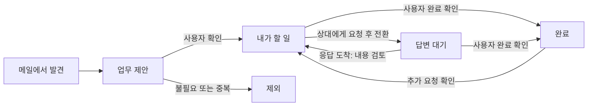
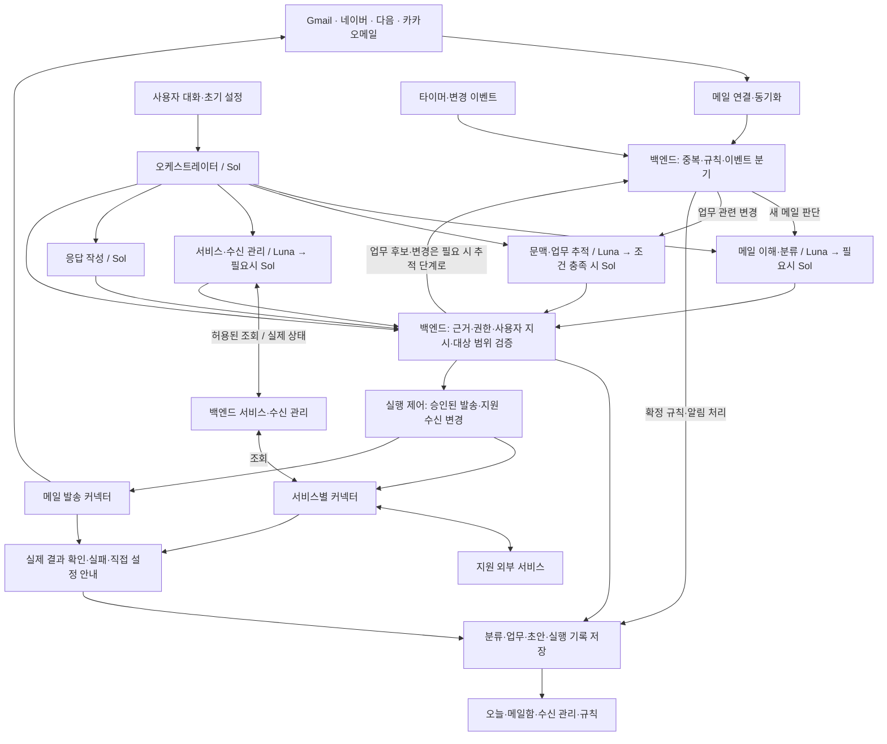
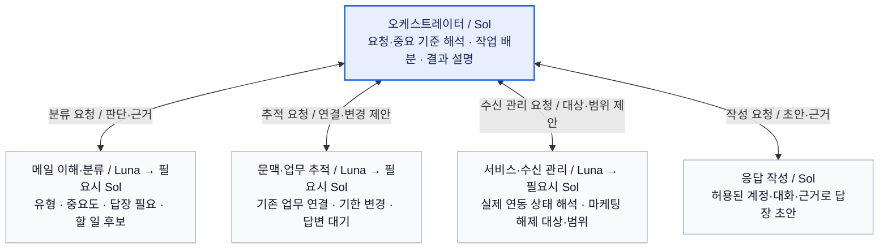
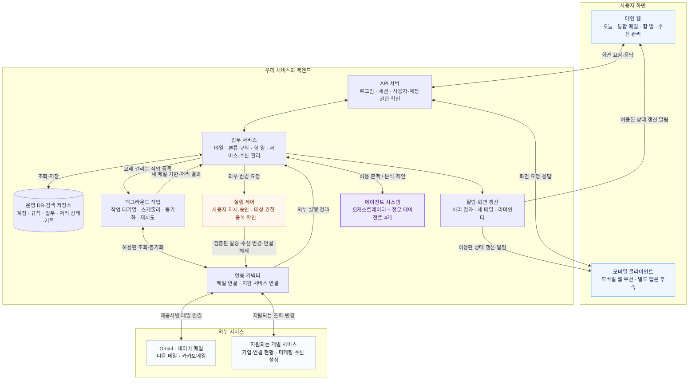

# 통합 이메일 AI 비서 웹앱 기획서 v1.5

> **여러 메일을 한곳에 모으고, 불필요한 광고 수신을 줄이며, 내가 중요하게 생각하는 메일부터 답장·후속 업무까지 챙기는 AI 비서.**
> 
- 최초 작성일: 2026-09-23
- 최신 개정일: 2026-09-28
- 문서 상태: 사용자가 선택한 5개 에이전트와 초기 모델 배분을 기준으로 정리한 기획안. Luna·Sol 및 Jev 단계별 도입 순서 유지
- 기본 시장: 한국 사용자. 해외 출시는 후속 검토
- 지원 목표: Gmail·네이버 메일·다음 메일·카카오메일(@kakao.com) 4종
- 기준 자료: 첨부된 기획서 v1 및 개정본 v1.1, 최신 시장조사 기록, 이후 대화의 사용자 결정
- 조사 범위: v1의 공식 자료·공개 화면 조사에 다우오피스 Works·ToDO+, Gmail 구독 관리, 수신 해제 표준, Google 계정 연결, 카카오메일 인증 안내를 보충
- 조사 한계: 실제 고객 인터뷰·메일 동기화·분류 정확도·외부 서비스 API·수신 해제 성공률·유료 수요는 미검증

**사용자 확정 사항은 타깃 방향, 4종 메일 지원 목표, 멀티에이전트 구조, 대화형 중요도·분류, 광고·마케팅 수신 관리, 실제 서비스 연동과 사용자 초기 설정, 상대별 말투 후순위, 요식업 보류다.** 2026-09-27에는 Luna·Sol 기준 성능 확보 → 동일한 한국어 메일로 Jev를 결과 반영 없이 비교 → 중요한 메일 누락이 늘지 않는 검증 범위부터 적용하는 순서를 추가로 채택했다. 이후 사용자는 오케스트레이터·메일 이해 및 분류·문맥 및 업무 추적·서비스 및 수신 관리·응답 작성의 5개 에이전트와 초기 모델 배분을 선택했다. 상세 화면·분류 체계·MVP 수용 기준·가격·검증 수치·역할별 계약은 기획 제안이다. 확정된 기능 목표가 모든 외부 서비스에서 이미 구현 가능하다는 의미는 아니다.

v1.5에서는 사용자 선택에 따라 처음의 5개 에이전트 구성으로 정리했다. 에이전트 상세 설계 v0.3에 서비스·수신 관리의 입력·출력·Sol 재검토 조건을 포함했다. 에이전트 구성과 초기 모델 배분은 설계 기준이며, 데이터 계약·실행 흐름·재검토 조건은 상세 초안이다. 구현·성능 검증 완료를 뜻하지 않는다.

2026-09-28 보충: 메일에서 일정을 찾고 사용자가 선택한 캘린더에 연결하는 기능의 검토 내용을 8.2.1에 추가했다. 웹만으로도 Google API 없이 iCloud에 직접 연결하는 경로를 검증할 수 있다. 캘린더는 P1 검토 대상으로 유지하며, 이번 추가로 모바일 앱 개발이나 세 제공사의 동일한 지원 수준을 확정하지 않는다. 캘린더 연동 검토 문서

기존 경쟁사 기능·가격과 법률 검토는 v1 및 2026-09-20 시장조사 기록을 바탕으로 한다. 이번에 전체 항목을 다시 검증하지 않았으며 새로 확인한 자료는 3.4장·10장·16장에 표시했다.

## 1. 제품 방향과 핵심 판단

### 1.1 제품 정의

여러 이메일 계정을 연결하는 웹앱에 하나의 AI 비서를 제공한다. 사용자는 계정마다 방문하는 대신 한곳에서 메일을 읽고 답하며, 대화로 중요 기준과 수신 선호를 설정한다. 비서는 중요한 메일을 드러내고, 지원되는 서비스의 마케팅 수신을 관리하며, 메일에서 생긴 할 일과 답변 대기를 추적한다.

핵심 흐름은 **통합 조회 → 분류·수신 정리 → 중요한 메일 확인 → 답장·업무 처리 → 후속 확인**이다. 일반 사용자는 통합 조회와 광고 관리만으로도 시작할 수 있고, 개인 업무 사용자와 초기 스타트업 구성원은 업무 추적까지 활용한다.

첫 화면의 질문은 “중요한 메일과 오늘 놓치면 안 되는 일이 무엇인가?”다. 자연어 대화와 함께 목록·버튼을 제공하며, 비서가 만든 규칙·업무·수신 해제 기록은 대화 밖에서도 확인·수정할 수 있다.

### 1.2 확정 방향과 설계 제안

| 구분 | 내용 |
| --- | --- |
| 사용자 확정 | 일반 사용자도 사용할 수 있도록 설계. 초기 핵심 타깃은 개인과 초기 스타트업 구성원 |
| 사용자 확정 | Gmail·네이버·다음·카카오메일 4종 지원을 목표로 함 |
| 사용자 확정 | 오케스트레이터가 전문 에이전트를 조율하고 사용자에게 하나의 비서로 동작 |
| 사용자 확정 | Luna·Sol로 기준 성능 확보 → Jev를 동일한 한국어 메일로 결과 미반영 비교 → 중요 메일 누락이 늘지 않는 검증 범위부터 적용 |
| 사용자 확정 | 광고 과다로 인한 중요한 메일 누락을 개선. 대화로 중요 기준을 정하고 분류를 실행 |
| 사용자 확정 | 서비스·계정별 수신 현황을 관리하고, 서비스 이용을 유지하면서 마케팅 수신만 해제할 수 있게 함 |
| 사용자 확정 | 가입·연결 서비스 현황은 실제 서비스 연동과 사용자 초기 설정을 기반으로 구성 |
| 사용자 확정 | 상대별 말투 설정은 다른 필수 기능 완료 후 고려. 초기 MVP에서 제외 |
| 사용자 확정 | 다우오피스 업무관리도 벤치마킹 대상으로 포함. 요식업 전용 서비스는 보류 |
| 기획 제안 | 개인 계정 단위로 시작하고 팀 가입·동료 초대를 요구하지 않음 |
| 기획 제안 | 기존 답장·약속한 마감·답변 대기 추적을 유지하고, 분류·수신 관리와 결합 |
| 후속 검증 | 메일 4종의 연동 품질, 실제 외부 서비스 커넥터의 조회·변경 범위, 중요 메일 보호, 유료 수요·비용 |

### 1.3 검증할 차별화 가설

메일 통합·AI 분류·초안·후속 알림·구독 관리는 기존 제품에도 존재한다. 경쟁사가 제공하지 않는 기능이라고 단정하거나 멀티에이전트 구조 자체로 우위를 주장하지 않는다.

1. **혼합 메일 관리:** 4종의 메일을 오가는 사용자의 연결·확인 부담을 줄이는가.
2. **사용자 기준의 중요도:** 대화로 정한 기준이 중요한 메일을 놓치지 않으면서 광고의 방해를 줄이는가.
3. **수신 관리:** 지원되는 실제 연동과 수신 해제 경로로 불필요한 마케팅을 줄이고 필수 안내를 보존하는가.
4. **업무 상태의 정확성:** 바뀐 약속과 이미 끝난 일을 구별하고 다음 행동을 준비하는가.
5. **낮은 설정·확인 부담:** 초기 설정, 규칙 수정, 수신 관리, 업무 처리에 드는 총시간이 기존 대안보다 줄어드는가.

## 2. 타깃과 우선 고객

### 2.1 사용할 수 있는 사람과 먼저 검증할 사람

| 구분 | 대상과 상황 | 제공 가치 | 초기 사업상 위치 |
| --- | --- | --- | --- |
| 핵심 고객 A | 고객·협력사와 메일로 일하는 개인, 프리랜서, 1인 사업자 | 견적 답변·자료 전달·수정 요청·후속 확인 누락 감소 | 개인 구독의 우선 검증 대상 |
| 핵심 고객 B | 여러 역할을 겸하는 초기 스타트업 창업자·운영·사업개발 구성원 | 여러 상대와 주고받는 약속을 자신의 업무 목록으로 정리 | 구성원 개인 사용으로 시작 |
| 일반 사용자 | 여러 계정과 광고·뉴스레터가 섞여 중요한 개인 메일을 놓치는 사용자 | 통합 조회, 중요도·광고 분류, 마케팅 수신 관리 | 사용성을 기본 보장하고 유료 수요를 별도 측정 |
| 후속 대상 | 공유 주소를 함께 처리하는 팀, 관리자 통제가 필요한 조직 | 담당자·권한·인계·감사 기록 관리 | 개인용 검증 후 별도 범위로 설계 |

초기 모집은 **서로 다른 메일 계정을 둘 이상 쓰며, 광고로 중요한 메일을 놓치거나 외부 요청·약속을 반복적으로 관리하는 사람**부터 권장한다. 이는 고객 규모를 추정한 사실이 아니라 문제를 선명하게 검증하기 위한 모집 조건이다. 계정 하나만 사용하는 사람도 제품 사용은 가능하게 한다.

스타트업 구성원의 회사 메일 연결은 회사의 외부 서비스 이용 기준에 맞아야 한다. 개인이 가입하는 구조와 회사 자료를 외부로 처리할 권한은 별개다.

### 2.2 구매자와 도입 방식

초기 구매자는 사용자 본인을 기본 가설로 둔다. 스타트업은 대표나 구성원이 먼저 자신의 메일로 가치를 확인할 수 있어야 한다. 도입 상담, 조직 생성, 팀원 초대가 첫 가치 확인의 필수 단계가 되지 않도록 한다.

개인이 구매해도 가치가 없는 제품을 회사 단위 계약으로 보완하려 하지 않는다. 반대로 초기 인터뷰에서 공유 문의함·담당자 배정이 가장 큰 문제로 반복되면, 현재 개인 비서 방향과 별도의 팀 제품 가설로 비교한다.

## 3. 웹앱 벤치마킹

### 3.1 비교 대상과 가장 큰 장점·제약

제약은 공식적으로 확인한 제한과 **이번 타깃에 대한 적합성 평가**를 구분했다. 문서에 나오지 않는 기능을 미지원으로 단정하지 않았다.

| 서비스·유형 | 확인한 강점 | 가장 큰 제약 또는 타깃상 부담 | 우리 기획에 반영할 점 |
| --- | --- | --- | --- |
| **Missive — 웹 메일·협업 앱** | 통합 메일과 업무 관리를 한곳에서 처리. 대화 전체·대화 안의 하위 작업·독립 작업을 Tasks 화면에서 관리. AI는 Gmail·Outlook·IMAP 계정을 검색 | 공식 확인: AI는 Productive·Business 요금제에서 제공하고 크레딧 또는 별도 API 키 방식 사용. 적합성 평가: 팀 공간·담당자 등은 개인 시작 화면에서 줄일 필요 | 메일과 업무의 연결, 마감·상태 표시, 원문 접근. 개인 기본 화면은 필요한 항목만 노출 |
| **Shortwave — 웹 AI 이메일 앱** | 메일을 실행할 일로 정리하는 흐름, 관련 스레드를 묶는 todo, 현재 화면을 이해하는 AI 패널, 답변 대기 후속 확인 | 공식 확인: 직접 로그인은 Gmail·Google Workspace 중심. 기본 통합 받은편지함 대신 계정 전환을 제공하며 통합은 전달·발신 별칭 설정 안내 | 받은 메일을 행동으로 바꾸는 흐름과 문맥을 유지하는 AI 도움. 4종 메일은 각 계정 직접 연결을 목표 |
| **Lindy — 웹 대화형 업무 비서** | 정기 루틴·브리핑·메일 관리·초안·여러 도구 실행을 하나의 비서 경험으로 제공 | 공식 확인: 연결 메일함 최대 5개, 크레딧 소진 시 해당 작업 중단. 적합성 평가: 범용 도구 연결·설정은 초기 고객에게 복잡할 수 있음 | 하나의 비서, 정기 브리핑, 실행 전 승인, 사용량과 중단 상태의 명확한 안내 |
| **Fyxer — 기존 메일에 붙는 비서** | 기존 Gmail·Outlook 흐름에서 자동 분류와 답장 초안을 제공해 새 메일 도구로 옮기는 부담을 낮춤 | 공식 확인: Gmail·Outlook 중심. 여러 메일함은 Professional 이상. FAQ상 직접 발송 없이 초안 작성만 제공 | 원래 메일과 병행 사용 가능한 설계, 준비된 초안, 사용자가 분류를 수정하는 경험 |
| **Spark — 앱 중심 기능 참고** | Gmail·Outlook·표준 IMAP에 AI 검색·작성·실행을 결합 | 공식 확인: AI 첨부 내용 분석은 PDF·TXT 지원. 이번 조사에서는 웹 메일 UI의 주 비교 대상으로 다루지 않음 | 다중 제공사 지원 자체가 독점적 차별성은 아니라는 기준. 제공사별 사용 경험과 정확도로 비교 |

근거: Missive Tasks, Missive AI, Shortwave Method, Shortwave AI, Shortwave 계정 관리, Lindy 기능·요금 안내, Fyxer 기능·FAQ, Spark AI FAQ.

Lindy는 메일 발송 등 외부에 영향을 주는 행동을 승인 후 실행한다고 설명한다. Fyxer의 초안 전용 방식과 구분해야 한다. 두 방식을 참고해 본 서비스는 **초안 자동 준비＋사용자의 명시적 발송**을 기본값으로 제안한다.

국내 기업용 비교는 기존 조사에서 확인한 다우오피스 AI와 Brity Copilot을 유지하며, 다우오피스 Works·ToDO+를 업무관리 설계의 주요 참고 대상으로 추가한다. 이번 기획에서는 회사 전체 업무 시스템 도입을 전제로 하는 기능을 초기 MVP에 포함하지 않는다. 한국 메일 통합과 AI 요약을 표방하는 선행 제품도 이미 확인했으므로 한국어·국내 메일 지원만으로 경쟁 우위를 단정하지 않는다. 상세 국내 비교는 기존 시장조사를 참조한다.

### 3.2 공개 화면에서 관찰한 패턴

| 관찰한 화면·자료 | 관찰 내용 | 기획상의 해석과 적용 |
| --- | --- | --- |
| Missive Tasks 공개 화면 | 왼쪽에 Inbox·Tasks·Calendars·Drafts가 있고, 업무 행에 날짜·담당자·연결 대화가 함께 표시됨 | 업무 목록에서 원문까지 이동하는 거리를 줄임. 초기 개인용은 담당자 대신 메일 계정·상대방·마감을 우선 표시 |
| Shortwave AI 정리 제안 화면 | 처리 후보들을 체크박스로 보여주고 사용자가 적용하거나 건너뛰는 선택지를 제공 | AI 판단을 즉시 확정하지 않고 선택·수정 가능하게 제시. 업무 발견 후보와 발송 승인에 적용 |
| Shortwave 화면 문맥 설명 | 사용자가 열어 둔 메일·작성 중인 답장을 기준으로 AI 도움을 제공한다고 설명 | 비서 패널에 현재 참조 중인 업무·메일을 표시해 “이 메일”의 범위를 알 수 있게 함 |
| Lindy 승인 정책 설명 | 승인된 자료의 조회와 외부 변경 행동을 구분 | 읽기·분석과 발송을 다른 권한으로 취급. “작성 중/검토 대기/발송됨”을 구분 |

화면 배치·명칭·문구·이미지를 그대로 복제하지 않고, 정보 연결과 사용자 통제 원칙을 자체 설계에 반영한다.

### 3.3 벤치마킹에서 도출한 제품 결정

- **할 일은 메일과 연결된 독립 객체로 관리한다.** 메일 한 통에 할 일이 여러 개 있을 수 있고, 하나의 일에 여러 메일이 연결될 수 있다.
- **AI 대화는 보조 진입점으로 제공한다.** 사용자가 매일 적절한 질문을 입력하지 않아도 해야 할 일과 답변 대기가 보이게 한다.
- **원문으로 돌아갈 수 있어야 한다.** AI가 제안한 마감·행동·상대방의 근거 메일을 연결한다.
- **원래 메일 서비스와 함께 써도 상태가 맞아야 한다.** 외부 앱에서 보낸 답장과 받은 답변도 추적에 반영한다.
- **필요한 초기 설정을 쉽게 만든다.** 메일 연결·분석 범위와 함께 실제 서비스 연동·목록 확인·수신 선호·중요 기준을 설정한다. 대화로 만든 규칙은 확인·수정할 수 있게 하되, 범용 자동화 프로세스 편집기·에이전트 빌더는 제공하지 않는다.

특히 Shortwave는 ‘Done’을 메일 보관 동작으로 설명한다. 본 기획의 ‘업무 완료’는 별도 상태로 두고 메일의 읽음·보관 상태와 독립적으로 관리한다. 이는 제품 의미를 명확히 하기 위한 설계 선택이다. Shortwave 상태·분류 도움말

### 3.4 이번에 추가한 업무관리·구독 관리 벤치마킹

| 대상 | 공식 자료에서 확인한 기능 | 우리 제품 적용 제안 |
| --- | --- | --- |
| 다우오피스 ToDO+ | 업무 카드, 기한·담당자·우선순위, 진행 단계 이동 | 메일에서 생긴 업무를 카드와 상태로 관리. 개인용은 상대·계정·기한을 우선 표시 |
| 다우오피스 Works | 맞춤 업무 항목·진행 단계·데이터 연결 | 업무에 원문과 자료를 연결. 거래처·프로젝트별 묶음은 후속 검토 |
| Works 변경 이력 | 데이터 수정·상태 변경 기록 | AI 변경 제안의 근거와 사용자의 확정 내역을 함께 기록 |
| ToDO+ 캘린더 | 카드의 기한을 달력에 표시 | 업무 목록 검증 후 보완할 날짜 중심 보기 |
| Gmail 구독 관리 | 구독 목록 확인과 해제, 차단과 구독 해제의 구분 | 계정·서비스·구독별 수신 관리와 실제 처리 상태 표시 |

공식 자료: ToDO+, Works, 변경 이력, 캘린더, Gmail 구독 관리. 2026-09-24 보충 확인이며 로그인 후 실사용 비교는 수행하지 않았다.

화면·문구를 복제하는 대신 정보 연결·상태·원문 접근 원칙을 자체 설계한다. 초기에는 오늘 목록·업무 상세·수신 관리에 집중하고, 보드·간트·범용 앱 제작을 필수 기능으로 추가하지 않는다. 다우오피스의 내부 멀티에이전트 구조는 이 자료로 판단하지 않는다.

## 4. 먼저 해결할 업무와 대표 시나리오

아래는 제품 동작을 설명하기 위해 만든 가상 사례다. 실제 사용자 인터뷰 결과가 아니다.

| 업무 | 현재 발생할 수 있는 문제 | 비서가 제공할 결과 | 성공 조건 |
| --- | --- | --- | --- |
| 여러 계정 확인 | 계정마다 접속해 새 메일을 확인 | 통합 메일함과 계정별 연결·동기화 상태 | 메일의 원본 계정과 답장 발신 계정이 명확함 |
| 중요한 메일 찾기 | 광고에 거래처·신청 결과가 묻힘 | 사용자 기준의 중요 표시와 메일 유형 분류 | 광고라는 이유만으로 사용자가 중요하게 지정한 메일을 숨기지 않음 |
| 대화로 분류하기 | 복잡한 필터를 직접 설정해야 함 | “A사 견적은 중요하게”를 지속 규칙으로 저장·실행 | 일회성 표시와 향후 규칙을 구분하고 적용 범위·되돌리기 제공 |
| 마케팅 수신 줄이기 | 오래전에 동의한 광고가 계속 도착 | 지원 서비스·구독의 해제 경로와 결과를 한곳에서 관리 | 주문·결제·보안 안내를 함께 차단하지 않고 불확실한 범위는 표시 |
| 가입·연결 현황 확인 | 어떤 계정으로 어떤 서비스를 쓰는지 기억하지 못함 | 실제 연동 결과와 초기 사용자 확인 목록 | 연동·수동 확인·메일 흔적의 출처와 확인 시각을 구분 |
| 요청에 답하기 | 네이버로 온 견적 요청을 읽은 뒤 Gmail의 다른 업무를 처리하다 잊음 | “견적 요청에 답하기” 카드, 요청 내용·상대·기한·원문, 답장 초안 | 읽었더라도 답하지 않은 요청이 다시 보임 |
| 내가 약속한 일 지키기 | “금요일까지 자료를 보내겠다”는 답장을 보냈지만 제출을 잊음 | “자료 보내기”를 남기고 답장 완료와 구분 | 약속을 알리는 답장을 업무 완료로 오인하지 않음 |
| 상대방 답 기다리기 | 제안서를 보낸 후 검토 답변이 오지 않아 다음 행동이 멈춤 | 기다리는 대상·질문·다시 확인할 날짜, 필요 시 후속 메일 초안 | 단순 수신 확인을 실질적인 답변 완료로 오인하지 않음 |
| 변경된 약속 반영하기 | 메일 후반에서 마감이 바뀌었는데 예전 날짜로 알림 | 이전·새 날짜와 변경 근거를 보여주고 반영 제안 | 모호한 협의 중 날짜를 확정 마감처럼 표시하지 않음 |

**초기 핵심 약속:** “여러 메일을 한곳에서 정리하고, 불필요한 수신을 줄이며, 중요한 메일과 확인한 업무의 다음 행동을 챙긴다.”

“모든 가입 서비스를 자동 발견·해제”, “모든 마케팅 수신을 즉시 중단”, “업무 누락을 100% 방지”, “모든 메일을 완벽히 이해”, “외부에서 완료된 일까지 자동 파악”은 약속하지 않는다.

## 5. 업무 데이터와 상태 설계

### 5.1 업무 카드에 필요한 정보

| 항목 | 표시·처리 원칙 |
| --- | --- |
| 행동 제목 | “답변 필요”보다 “A사 견적 요청에 답하기”처럼 구체적인 동사 사용 |
| 상대방·원본 계정 | 누구와 어떤 계정으로 진행 중인지 항상 확인 가능 |
| 원문 근거 | 원본 메시지, 관련 문장, 메시지 날짜와 대화 순서를 연결 |
| 업무 유형 | 내가 할 일 / 상대방 답변 기다림 |
| 마감일 | 메일에서 확인된 기한과 사용자가 직접 정한 기한을 구분 |
| 다시 확인할 날짜 | 상대방의 약속한 마감과 별개인 사용자 리마인더 날짜 |
| 처리 상태 | 제안 / 진행 / 답변 대기 / 완료 / 제외 |
| 검토 표시 | 마감 모호함, 변경 제안, 완료 제안, 연결 끊김 등 |
| 변경 기록 | 누가 언제 어떤 근거로 제목·기한·상태를 바꿨는지 최소한으로 기록 |

원문에 기한이 없으면 ‘마감 없음’으로 표시한다. AI가 정한 임의 날짜를 상대방과 합의한 마감처럼 보여주지 않는다. “다음 주 초”처럼 불명확하면 원문 표현을 보존하고 사용자가 정할 수 있게 한다.

### 5.2 상태와 화면 분류

| 내부 상태 | 의미 | 이동 조건 |
| --- | --- | --- |
| 제안 | AI가 찾았지만 아직 확인되지 않은 업무 후보 | 사용자가 채택·수정하면 진행/답변 대기, 거절하면 제외 |
| 진행 | 내가 수행할 일이 남아 있음 | 사용자가 완료하거나 상대방에게 다음 행동을 요청하고 답변 대기로 전환 |
| 답변 대기 | 특정 상대의 응답·자료를 기다림 | 응답 수신 후 내용을 확인해 진행 또는 완료로 전환 |
| 완료 | 사용자가 해당 업무의 완료를 확인 | 새 요청이 생기면 새 업무 또는 재개 제안 |
| 제외 | 할 일이 아니거나 취소·중복으로 분류 | 필요하면 복원 |

‘확인 필요’는 별도 업무 상태가 아니라 제안·변경·모호함 등을 모아 보여주는 화면이다. ‘오늘’도 마감과 확인 예정일로 만든 보기다. 이렇게 해야 상태와 화면 이름이 혼동되지 않는다.



### 5.3 오판을 줄이는 기본 규칙

1. 읽음·별표·보관 상태만으로 업무를 완료하지 않는다.
2. 발송 성공은 “메시지를 보냈다”는 뜻이다. 업무 완료 여부는 별도로 확인한다.
3. 자동 응답·부재중 안내·반송·“확인했습니다”를 요청 해결로 단정하지 않는다.
4. 다른 메일 계정에 같은 상대가 있다는 이유만으로 업무를 합치지 않는다. 동일 메시지 식별과 주제상 연관 추정은 구분하고, 불확실한 연결은 제안으로 남긴다.
5. 마감 변경이나 완료를 AI가 감지하면 변경 전후와 근거를 보여준다. 초기 버전에서는 사용자가 확정한다.
6. 전화·메신저·오프라인에서 처리한 일은 사용자가 완료 또는 메모로 반영할 수 있다.
7. 연결이 끊긴 계정은 “새 답변이 없음”과 구분한다. 오래된 데이터로 미응답을 확정하지 않는다.

### 5.4 메일 유형·중요도·할 일의 분리

| 축 | 예시 | 처리 원칙 |
| --- | --- | --- |
| 메일 유형 | 개인 대화 / 업무 / 광고·프로모션 / 뉴스레터 / 거래·보안 알림 / 미분류 | 사용자가 고칠 수 있는 분류. 하나의 메일에 여러 의미가 있으면 별도 표시 가능 |
| 중요도 | 중요 / 일반 / 확인 필요 | 사용자 명시 기준을 우선. 광고·뉴스레터도 중요할 수 있음 |
| 다음 행동 | 읽기 / 답장 / 업무 수행 / 상대방 답변 대기 | 광고 여부·읽음 여부와 업무 완료를 혼동하지 않음 |

광고로 분류한 메일도 전체 메일함·검색에서 확인하고 바로 복원할 수 있어야 한다. 기본 동작은 분류·알림 조정이며 자동 삭제나 무조건적인 발신자 차단이 아니다. 새 발신자의 중요 메일이 고정 발신자 규칙 때문에 누락되는 사례도 검증한다.

### 5.5 대화형 규칙

규칙에는 요청 원문, 사람이 읽을 수 있는 조건, 적용 계정·발신자·주제, 일회성/향후 적용, 기존 메일 재분류 범위, 실행 동작, 예외, 활성 여부·변경 이력을 저장한다. “이 메일이 중요해”는 해당 메일 표시를 기본으로 해석하고, “앞으로 A사 견적은 중요하게”는 지속 규칙으로 해석한다.

명확한 사용자 지시는 해당 범위의 실행 근거로 사용한다. 저장된 규칙을 새 메일마다 반복 승인받지 않는다. 모호하거나 충돌하는 조건만 좁혀 확인하며, 적용 후 조건·영향·되돌리기를 안내한다. 사용자 명시 규칙이 AI 추정보다 우선하고, 충돌 시 사용자 확정 예외·더 구체적인 범위를 우선하는 설계를 제안한다.

### 5.6 서비스·계정·구독 데이터

서비스, 사용자 메일 계정, 서비스 내 사용자 계정, 구독 목록·알림 항목을 별도 객체로 연결한다. 같은 서비스에 Gmail과 네이버 주소가 모두 있어도 해제 범위를 합치지 않는다.

| 정보 | 기준 |
| --- | --- |
| 서비스 현황 | 실제 연동에서 확인한 상태, 사용자가 확인한 상태, 메일에서 발견한 흔적을 구분 |
| 근거·최신성 | 확인 출처·시각·허용 범위·연동 오류·재확인 필요 여부 |
| 수신 선호 | 광고, 뉴스레터, 주문·결제, 보안 등 서비스에서 실제 제공하는 항목. 미제공 항목은 지원 여부 표시 |
| 지원 동작 | 현황 조회 / 마케팅 변경 / 구독 해제 / 연결 해제 / 설정 페이지 안내를 각각 표시 |
| 변경 결과 | 요청 범위·사용자 지시·요청 시각·응답·부분 성공·실패·추가 행동 |

메일이 오지 않는다는 사실만으로 가입 해제나 구독 해제를 확정하지 않는다. 삭제된 가입 확인 메일이나 오래된 메일만으로 현재 상태를 단정하지 않는다. 실제 연동 값도 확인 시각과 제공 범위를 넘어 최신·전체 상태라고 표시하지 않는다.

### 5.7 서로 다른 수신·연결 동작

| 동작 | 효과 | 구분할 점 |
| --- | --- | --- |
| 분류·알림 끄기 | 우리 앱에서 노출·알림을 조정 | 발신 서비스의 마케팅 동의를 바꾸지 않음 |
| 마케팅 수신 해제 | 확인된 구독·마케팅 항목의 발송 중단 요청 | 주문·결제·보안 안내까지 중단하는 조치로 확대하지 않음 |
| 발신자 차단 | 수신 메일을 차단·스팸 처리 | 구독 해제와 다르며 서비스 전체 안내에 영향을 줄 수 있음 |
| 로그인·데이터 연결 해제 | 지정한 서비스 접근·연결을 해제 | 회원 탈퇴·서비스 데이터 삭제·마케팅 동의 철회와 별개 |
| 회원 탈퇴 | 외부 서비스 계정을 종료 | 초기 MVP 자동 실행 범위에서 제외 |

마케팅 해제 상태는 `처리 준비 → 요청됨 → 처리 확인 / 결과 확인 필요 / 실패 / 직접 설정 필요`로 관리한다. 통신 성공만으로 실제 동의 변경을 확정하지 않으며, 서비스의 명시적 결과·허용된 상태 재조회·사용자 확인을 구분해 기록한다. 일정 기간 메일이 없다는 관찰은 보조 정보다. 이메일 해제가 SMS·앱 푸시까지 적용되는지도 서비스별로 표시한다.

## 6. 정보 구조와 핵심 화면

### 6.1 기본 메뉴

```
오늘
통합 메일함
  중요 / 전체 / 계정별 / 광고·뉴스레터 / 거래·보안 알림
  받은 메일 / 보낸 메일 / 초안
서비스·수신 관리
  서비스 목록 / 계정별 수신 / 연동·수동 확인 / 해제 처리 내역
할 일
  내가 할 일 / 답변 대기 / 확인 필요 / 완료·제외
검색
설정
  메일 연결 / 서비스 연동 / 분류 규칙 / 분석 범위 / 알림 / 데이터 / 요금·사용량

공통: 메일 쓰기, 현재 화면의 메일·업무·서비스를 참조하는 비서 패널
```

초기 화면은 오늘을 기본 제안하고 통합 메일함으로 시작하도록 사용자가 바꿀 수 있게 한다. 중요·광고 보기는 같은 메일 데이터에 대한 필터이며 상호 배타적인 저장함으로 고정하지 않는다.

### 6.2 화면별 목적과 필수 요소

| 화면 ID | 화면 | 사용자가 해결할 질문 | 필수 요소 |
| --- | --- | --- | --- |
| S1 | 시작·초기 설정 | 어떤 계정·서비스를 연결하고 무엇을 중요하게 볼까? | 4종 메일 선택, 권한·분석 범위, 실제 서비스 연동, 목록 확인, 수신 선호, 대화형 중요 기준 |
| S2 | 오늘 | 중요한 메일과 오늘 처리할 일은 무엇인가? | 중요 메일, 기한 지난 일·오늘 마감·답변 대기, 처리 실패·연결 상태 |
| S3 | 업무 목록·상세 | 무엇이 남았고 근거는 무엇인가? | 유형·상태·기한·상대·계정, 원문, 수정·완료·제외·다시 알림·이력 |
| S4 | 통합 메일함 | 계정을 옮겨 다니지 않고 어떻게 읽고 정리할까? | 계정·유형·중요도 필터, 본문·첨부, 분류 수정·규칙 만들기, 새 메일·답장·전달 |
| S5 | 답장 검토 | 이 내용과 수신자에게 보내도 되는가? | 발신·수신·참조, 제목·본문·첨부, 근거, 편집·발송. 상대별 말투 프로필 제외 |
| S6 | 검색·비서 | 말로 검색·분류·수신 관리·업무 처리를 할 수 있는가? | 현재 문맥·적용 범위, 규칙 요약, 실행 결과·되돌리기, 원문 근거 |
| S7 | 설정·연결 관리 | 무엇을 처리하며 어떻게 중단·삭제하는가? | 계정별 동기화·서비스 확인 시각, 분석 제외, 연결 해제·데이터 삭제의 구분 |
| S8 | 서비스·수신 관리 | 어떤 서비스에서 어떤 메일을 받고 무엇을 끌 수 있는가? | 서비스·계정·구독 항목, 근거·확인 시각, 실제 지원 동작, 마케팅 해제·설정 안내, 처리 상태 |
| S9 | 분류 규칙 | 내가 말한 기준이 어떻게 적용되는가? | 조건·범위·예외·향후 적용·변경 이력, 대화 또는 폼으로 수정·일시 중지·되돌리기 |

### 6.3 ‘오늘’ 화면 구성안

```
[계정 범위: 전체 ▼]                         [검색] [메일 쓰기]

오늘 확인할 일
기한 지난 일 1  |  오늘 마감 2  |  다시 확인할 답변 1
분석 범위: 이 예시에서 연결한 4개 계정 · 계정별 마지막 동기화 확인

중요한 메일
□ 지원사업 결과 안내          카카오메일 · 내가 정한 중요 기준
□ A사 견적 요청               네이버 · 답장 필요

수신 관리
선택한 마케팅 해제 2건: 요청됨 1 / 직접 설정 필요 1 [처리 내역]

해야 할 일
□ A사 견적 요청에 답하기       오늘 17:00 · 네이버
  근거: 오늘 도착한 견적 요청  [원문] [초안 준비]
□ B사에 수정 자료 전달하기    오늘 · Gmail
  근거: 내가 보낸 제출 약속    [원문] [완료로 표시]

답변 대기
□ C사 제안서 검토 답변        오늘 다시 확인 · 다음
  마지막 실질 응답: 확인 필요 [대화 보기] [후속 초안]

확인 필요
새로 찾은 업무 3건 · 마감 변경 제안 1건       [검토]

오른쪽 선택 패널
선택한 업무 → 근거 메일 → 다음 행동
[이 일의 변경 사항 요약] [답장 초안] [다시 확인할 날짜]
```

숫자와 예시는 가상이며 사용자는 필요한 계정만 연결할 수 있다. 중요 메일과 업무 영역을 나누고, 업무의 기본 정렬은 기한 경과 → 오늘 마감 → 확인 예정일 도달 → 나머지 순으로 제안한다. 사용자가 중요 표시와 순서를 바꿀 수 있다. 설명 없는 AI 점수만으로 순서를 결정하지 않는다.

### 6.4 일반 사용자도 이해할 수 있는 UX 원칙

- “오케스트레이터·추론·에이전트 실행” 대신 “확인 중·초안 준비·검토 필요”처럼 결과 중심으로 표시한다.
- 자연어 입력 없이도 버튼과 목록으로 핵심 작업을 수행할 수 있게 한다.
- 빈 화면에는 연결·동기화 중, 실제 업무 없음, 분석 실패를 구별해 안내한다.
- 분석 완료 전에는 “미처리 업무 없음”을 확정적으로 표시하지 않는다. 서비스 조회 실패·미연동을 “가입 없음”이나 “수신 해제됨”으로 표시하지 않는다.
- 데스크톱에서는 목록과 상세를 함께 보여주고 모바일 웹에서는 목록 → 상세 순으로 전환한다.
- 상태는 색상뿐 아니라 텍스트로도 구별하고 주요 동작은 키보드로 접근 가능하게 한다.

## 7. 핵심 사용자 흐름

### 7.1 처음 사용하기

1. 통합 조회·광고 수신 관리·중요 메일·업무 추적의 예시를 본다. 가상 데모 선택 가능.
2. Gmail·네이버·다음·카카오메일 중 첫 계정을 연결한다. 처음부터 여러 계정을 요구하지 않는다.
3. 수집·분석·외부 AI 처리·보관 범위를 확인한다. 최근 30일의 받은·보낸 메일 분석을 기본 제안하되 사용자가 조정할 수 있게 한다.
4. **지원 서비스의 실제 연동을 설정한다.** 서비스가 제공하는 조회·변경 범위에 맞춰 별도 인증·권한을 받고 상태를 불러온다.
5. 사용자가 서비스 목록을 확인·추가·수정한다. 실제 연동 확인, 사용자 등록·확인, 메일 기반 후보를 구분한다. 지원되지 않는 서비스는 공식 설정 안내와 사용자 확인 방식으로 관리한다.
6. 서비스·계정·구독별로 유지할 알림과 해제할 마케팅을 선택한다. 초기 선호 저장과 외부 서비스에 실제 변경 요청하는 동작을 구분한다.
7. “거래처 견적과 지원사업 결과는 중요해”처럼 중요 기준을 대화로 정한다. 비서가 적용 조건·계정·예외와 결과를 보여주고 수정할 수 있게 한다.
8. 중요한 메일·수신 정리 결과·소수의 업무 후보를 확인한다. 이후 다른 계정과 서비스를 추가할 수 있다.

초기 설정은 핵심 단계이되, 전체 서비스 목록을 완성해야만 메일을 읽을 수 있게 하지는 않는다. 서비스 연동을 나중에 하는 사용자는 진행 상태와 재진입 경로를 남긴다. 메일 분석 범위와 서비스 API 조회 범위는 별도로 안내한다.

30일은 분석 비용·사용성 검증용 제안이며 전체 과거 가입 이력의 조회 범위나 영구 보관 기간을 뜻하지 않는다. 후보를 만들기 위해 존재하지 않는 서비스·업무를 생성하지 않는다.

첫 가치 경험은 **중요한 메일 한 건을 제대로 찾음, 선택한 마케팅 해제 결과를 확인함, 유효 업무 한 건을 확인함** 중 사용자 목적에 맞는 행동으로 측정한다. 서로 다른 경험을 합쳐 단일 성공률처럼 발표하지 않는다.

### 7.2 하루 업무 처리

오늘 화면 → 중요한 업무 선택 → 근거·최신 대화 확인 → 직접 처리하거나 초안 준비 → 수정·발송 → 남은 일과 답변 대기 여부 선택.

예를 들어 “내일 자료를 보내겠습니다”를 발송했다면 ‘자료 전달’ 업무는 남는다. ‘안내 답장’과 ‘자료 전달’이 별도 업무라면 각각 상태를 관리한다.

### 7.3 답변 대기와 후속 확인

사용자가 보낸 요청에서 기다릴 내용 확인 → 다시 확인할 날짜 선택 → 새 답변 수신 시 관련 업무에 표시 → 내용에 따라 사용자에게 상태 전환 제안 → 날짜가 지나면 후속 초안 준비.

초기 버전은 후속 메일을 자동 발송하지 않는다. 브라우저를 닫아도 이미 확정된 리마인더는 서버에서 계산하며, 앱 내 알림과 선택한 브라우저 알림으로 제공한다. 브라우저 알림은 권한·기기 상태에 따라 전달되지 않을 수 있으므로 앱의 오늘 목록을 기준으로 유지한다.

### 7.4 잘못된 판단 고치기

업무가 아님 / 상대방이 할 일임 / 마감이 다름 / 이미 처리함 / 다른 업무와 중복 중 선택 → 필요한 필드 수정 → 변경 내역 저장.

업무 수정은 우선 해당 업무에만 적용한다. 메일 분류는 일회성 수정과 지속 규칙 변경을 구분한다. 사용자가 향후 기준을 명시하면 그 범위의 규칙을 저장·실행하고, 범위를 모호하게 말한 경우에만 필요한 확인을 한다. “AI가 알아서 학습했다”는 설명 대신 현재 적용 규칙을 보여준다.

### 7.5 대화로 분류 기준 만들기

“앞으로 A사에서 오는 견적은 중요하게 해줘” → 현재 계정·대화와 지시를 바탕으로 조건 구성 → 명확한 범위의 규칙 저장 → 새 메일에 적용 → 결과와 되돌리기 제공.

과거 메일도 정리하라는 요청이 있으면 허용된 기간을 다시 분류한다. “A사는 중요하지만 행사 광고는 일반으로”처럼 예외를 추가할 수 있어야 한다. 메일 유형 변경과 마케팅 수신 해제는 자동으로 서로를 실행하지 않는다.

### 7.6 마케팅 수신만 해제하기

서비스·수신 관리 또는 대화에서 대상 선택 → 계정·구독·유지할 안내·실제 지원 범위 확인 → 사용자의 명확한 해제 지시에 따라 실행 → 항목별 결과·추가 행동 표시.

명시한 대상과 범위가 분명하면 그 지시를 실행 근거로 사용하고 반복 승인을 요구하지 않는다. “이것 정리해줘”처럼 분류인지 해제인지 모호하면 동작을 먼저 확인한다. 여러 항목의 해제도 묶음 단위로 처리하되 실패·직접 설정 필요를 개별 표시한다.

표준 수신 해제나 검증된 서비스 API가 있으면 해당 경로를 사용한다. 로그인·추가 선택이 필요한 경우 공식 설정 화면으로 연결한다. 요청 성공과 최종 처리 확인을 구분하고, 전체 발신자 차단으로 마케팅 해제를 대체하지 않는다. 해제 요청은 간단한 되돌리기가 불가능할 수 있으므로 규칙 변경의 되돌리기와 구분한다.

### 7.7 서비스 현황 유지와 연결 해제

지원되는 실제 연동으로 허용된 상태를 재조회하고 확인 시각을 갱신한다. 사용자 확인 정보는 확인 날짜를 표시하며 필요 시 다시 확인한다. 메일에서 새 서비스 흔적을 발견하면 목록 추가·연동 후보로 제안한다.

사용자가 로그인·데이터 연결 해제를 요청하면 해당 대상과 효과를 확인해 지원 경로로 실행하거나 공식 관리 화면을 안내한다. 마케팅 해제 지시를 연결 해제·탈퇴로 확대하지 않는다. 우리 앱과 메일 계정의 연결 해제도 외부 서비스와의 연결 해제와 별도 항목이다.

## 8. MVP 범위와 수용 기준

P0는 첫 공개 MVP 제안 범위, P1은 핵심 사용성 검증 후 보완, 이후는 별도 확장이다. 추가 요구사항으로 범위가 커졌으므로 기간·비용은 개발 인원과 연동 검증 후 산정한다. 사용자 목표를 축소하지 않되 미구현·미검증 기능을 지원한다고 표시하지 않는다.

### 8.1 P0 — 핵심 기능

| ID | 기능 | 포함 범위 | 수용 기준 |
| --- | --- | --- | --- |
| F1 | 메일 연결·동기화 | Gmail·네이버·다음·카카오메일, 받은·보낸 메일, 재연결 | 4종 각각 수신·외부 발송 반영·재연결 시험과 마지막 동기화 표시 |
| F2 | 통합 메일 | 목록·대화·본문·첨부, 새 메일·답장·전달·읽음 | 원본 계정과 발신 계정이 명확하고 제공사별 상태 일관성 확인 |
| F3 | 업무 후보 발견 | 요청·약속·답변 대기를 본문에서 추출 | 근거 메시지와 채택·수정·제외 제공 |
| F4 | 업무 상태 관리 | 기한·확인 예정일·완료·제외·변경 제안·이력 | 읽음·보관·발송만으로 자동 완료하지 않음 |
| F5 | 오늘·답변 대기 | 중요 메일, 기한·리마인더, 새 답변·알림 묶음 | 중복 알림 억제, 새 답변 후 오래된 알림 재검토 |
| F6 | 초안·승인 발송 | 선택한 업무·대화 기반 초안, 편집·발송 | 최종 계정·수신자·본문 확인, 명시적 발송 전 미전송. 상대별 말투 프로필 제외 |
| F7 | 검색·비서 | 메일·업무·규칙·서비스 범위의 자연어 요청 | 현재 문맥·검색/실행 범위·근거·결과를 표시 |
| F8 | 통제·운영 | 권한·분석 범위·AI 중지·연결 해제·데이터 삭제·사용량·오류 | 계정·사용자 간 혼입 방지, 삭제 전파, 장애 중 불확실 상태 검증 |
| F9 | 유형·중요도 분류 | 중요·일반과 광고·업무 등 유형 분리, 수동 수정 | 중요 광고·뉴스레터와 거래·보안 메일 보호, 전체 목록에서 재확인·복원 |
| F10 | 대화형 분류 규칙 | 일회성/지속 규칙, 계정·조건·예외·과거 적용, 수정·중지 | 사용자 명시 기준이 AI 추정보다 우선, 범위·결과·되돌리기 표시 |
| F11 | 초기 설정·서비스 현황 | 실제 지원 서비스 연동, 사용자 목록 확인·보완, 수신 선호, 지원되는 연결 해제·공식 설정 안내 | 선정한 연결 대상에서 실제 권한·조회 시험 완료. 연동/수동/메일 근거를 구분하고 연결 해제와 마케팅 해제를 별도 표시 |
| F12 | 마케팅 수신 관리 | 계정·서비스·구독별 해제, 공식 설정 안내, 결과 이력 | 해제 범위·사용자 지시 기록, 필수 안내를 같이 차단하지 않음, 요청/확인/실패/직접 설정 구분 |

4종은 메일 서비스 종류이며 사용자가 모두 연결해야 한다는 뜻은 아니다. 다음·카카오메일은 별도 항목으로 검증한다. 일부만 준비된 시험판은 실제 지원 범위를 표시한다.

F11의 외부 서비스 연동 대상·API·권한 목록은 아직 정해지지 않았다. 우선 고객의 실제 서비스 조합을 기준으로 선정하고 커넥터별 조회·변경 가능 범위를 공개한다. 지원하지 않는 서비스의 설정 안내·수동 확인도 제공하되 이를 자동 연동의 구현으로 대체하지 않는다. F12의 표준 수신 해제와 서비스 API를 통한 마케팅 설정 변경은 별도 경로로 검증한다.

### 8.2 P1 — 초기 검증 후 보완

- 지원 외부 서비스 커넥터와 제공하는 수신 설정 항목 확대
- 사용자 승인 기반 캘린더 등록·수정, 업무의 보드·캘린더 보기
- PDF 등 제한된 첨부 내용 분석, 더 긴 메일 이력, 추가 메일 서비스
- 거래처·프로젝트별 묶음, 분류 규칙의 상세 예외·우선순위 편집 보완
- 원본 메일 서비스와 초안 동기화, 선택적 폴더·보관 동작 확장
- 더 정교한 알림 채널·개인별 설정

기본적인 대화형 중요도·분류 규칙은 P0다. P1의 규칙 보완과 혼동하지 않는다. P0에서도 일반 첨부 열람·다운로드·발송을 지원하되, AI 첨부 내용 이해는 별도이며 첨부 중심 요청에는 확인 필요를 표시한다.

#### 8.2.1 메일 일정 추출·선택형 캘린더 연동 — 추가 검토

메일에서 일정 후보를 찾고, 사용자가 날짜·시간·장소와 근거를 확인한 뒤 자신이 선택한 캘린더에 등록하는 기능을 검토한다. 최초 설정에서 Google·Apple·Samsung 중 선호하는 캘린더 앱과 실제 저장할 캘린더를 선택하며, 이후 기본 대상으로 사용한다. 캘린더 선택과 해당 환경의 연결 완료는 구분한다.

**웹 전용 서비스도 Google API 없이 캘린더를 연결할 수 있다. Google API는 Google Calendar 연결용이며 모든 캘린더에 필요한 공통 수단이 아니다.** 웹에서는 우리 백엔드가 해당 캘린더 서버에 연결한다. 모바일 앱을 제공하면 운영체제의 공식 기능으로 휴대전화의 캘린더에도 접근할 수 있다.

| 대상 | 모바일 앱 없이 웹만 제공할 때 | 향후 모바일 앱을 제공할 때 |
| --- | --- | --- |
| Google Calendar | Google Calendar API로 연결. Google 계정과 캘린더 권한 필요 | 서버 API 또는 기기의 연결된 캘린더를 이용 |
| Apple의 iCloud 캘린더 | CalDAV 방식으로 우리 서버가 iCloud에 직접 연결하는 경로 검증. Google 계정 불필요 | iOS EventKit으로 사용자가 선택한 쓰기 가능한 기기 캘린더에도 접근 가능 |
| 삼성 계정·휴대전화 캘린더 | 삼성 계정 캘린더를 직접 관리하는 공개 서버 API는 현재 조사에서 확인하지 못함. 웹만으로 지속적인 자동 수정·취소까지 지원한다고 확정하지 않음 | Android Calendar Provider 등을 통해 접근 가능한 캘린더에 연결. 삼성 계정·기기 로컬의 실제 접근·수정 범위는 기기 검증 필요 |

웹의 Apple 연결 예시는 `메일에서 일정 확인 → 우리 서버가 iCloud에 저장 → Apple 캘린더에 동기화`다. CalDAV 직접 연결의 기존 제품 사례가 있으나 우리 서비스의 인증·조회·등록·수정은 미검증이다. Apple의 지원 앱 대상 계정 인증 적용 가능성을 확인하고, 앱 전용 암호 경로도 검증한다. 일반 Apple 로그인만으로 캘린더 접근 권한이 생긴다고 안내하지 않는다. BusyCal의 iCloud 직접 연결 사례, Apple 제3자 앱 인증

Samsung은 Google 없이도 삼성 계정 또는 ‘내 휴대전화’ 캘린더를 사용할 수 있다. 다만 이 사용자 기능과 우리 웹 서버의 직접 접근 가능성은 별개다. 모바일 앱을 만들지 않는 경우에는 기기 연결 방식을 제공한다고 계획하지 않으며, 웹에서 지원할 수 있는 범위를 별도로 검증한다. 삼성 저장 위치·동기화 안내, Android 기기 캘린더 접근

Apple의 읽기 전용 일정 구독과 일정 파일의 수동 가져오기는 보조안이다. 파일 전달을 자동 동기화로, 구독을 기존 개인 캘린더의 양방향 편집으로 안내하지 않는다. Samsung의 파일 가져오기·구독 지원은 목표 기기에서 확인한 범위만 제공한다.

일정 분석은 기존 메일 이해·분류 에이전트가, 기존 일정 연결·변경·취소 판단은 문맥·업무 추적 에이전트가 담당하는 안을 유지한다. 실제 등록과 권한 검사·완료 확인은 백엔드 또는 기기 연결 모듈이 처리한다. 할 일의 마감과 회의 일정은 별도 객체로 연결하며, 모호한 날짜·중복·수동 수정 충돌은 확인 대상으로 남긴다.

기기 연결을 도입할 경우 PC의 요청을 휴대전화로 전달할 수 있지만, 휴대전화가 꺼져 있거나 실행이 지연되면 ‘반영 대기’로 표시한다. 서버의 작업 전송을 일정 등록 완료로 처리하지 않는다. 웹 전용 여부, 플랫폼별 지원 범위, 모바일 모듈의 개발 시점은 후속 결정 사항이다. 구체적인 연결 흐름·대안·검증 기준은 캘린더 연동 검토 문서를 따른다.

### 8.3 필수 기능 완료 후 고려 또는 별도 확장

- **상대별 말투 설정:** 사용자 결정에 따라 필수 기능 완료 이후 고려. 상대·그룹별 존댓말/반말·격식·길이·서명 프로필을 P0에 넣지 않으며, 도입 여부·시점은 다시 결정한다. 일반 초안 작성·수정은 유지한다.
- 공유 메일함, 담당자 자동 배정·인계, 팀 승인 결재선, 전사 검색, SSO·조직 관리자
- CRM 자동 갱신, 계약·결제 자율 실행, 외부 서비스 회원 탈퇴 자동화
- 회의 녹음, 범용 에이전트·업무 앱·프로세스 빌더
- 음식점·배달·발주 연동은 보류

Outlook/Microsoft 365는 다음 제공사 후보이며 고객 수요에 따라 우선순위를 재평가한다. 서비스 연결 해제는 검증된 연동 경로 또는 공식 설정 안내로 지원하되, 모든 서비스에 대한 직접 해제를 약속하지 않는다.

## 9. 멀티에이전트 및 웹·앱 시스템 구조

이 장은 세 관점을 함께 제공한다. 9.1은 기존 전체 흐름, 9.3은 에이전트만의 내부 관계, 9.4는 에이전트를 단일 시스템으로 묶은 웹·앱 운영 구조다. 두 추가 구조도는 별도 문서에서도 볼 수 있다. 상자는 논리적 책임을 표현하며 서버 수나 기술 스택을 확정하지 않는다.

### 9.1 사용자에게는 한 명의 비서

오케스트레이터가 사용자 의도와 중요 기준을 해석하고, 메일 이해·분류·문맥 및 업무 추적·서비스 및 수신 관리·응답 작성의 네 전문 에이전트를 조율한다. 새 메일과 타이머 이벤트의 경로는 백엔드가 관리한다. 2026-09-27 사용자가 선택한 총 5개 에이전트를 설계 기준으로 삼으며, 구체적인 계약과 모델 재검토 조건은 상세 초안이다.

| 구성 | 역할 | 결과·제한 |
| --- | --- | --- |
| 오케스트레이터 | 사용자 요청·중요 기준 해석, 작업 배분 | 규칙·통합 처리안·결과 설명. 실제 권한·호출 예산은 백엔드가 검사 |
| 메일 이해·분류 | 유형·중요도·답장 필요성·요청과 날짜 표현 분석 | 근거와 업무 후보. 정식 업무 생성·기한 확정은 직접 수행하지 않음 |
| 문맥·업무 추적 | 기존 업무 연결, 변경된 기한·요청·답변 대기 검토 | 연결·변경 제안. 관련 자료의 참조 제한 준수 |
| 서비스·수신 관리 | 실제 연동 상태 해석, 마케팅 해제 대상·범위 정리 | 출처·변경 대상·유지할 알림·지원 경로 제안. 조회·실행은 도구가 수행 |
| 응답 작성 | 선택한 대화·업무의 답장·후속 확인 초안 | 근거·미확인 내용 구분. 직접 발송 권한 없음 |
| 일반 프로그램 로직 | 동기화·규칙 적용·업무 저장·타이머·서비스 현황 조회·발송·수신 변경 | 사용자 권한과 서비스별 커넥터의 실제 허용 동작 강제 |



단계 완료 여부와 호출 예산은 백엔드가 관리한다. 분석 결과에 업무 후보가 있으면 추적 단계로 보내되, 같은 단계나 업무 변경을 무한히 반복하지 않는다.

### 9.2 실행 원칙

- 명확히 설정된 규칙은 일반 프로그램이 계속 적용하고, 모호한 분류·문맥·변경 판단에 필요한 에이전트만 호출한다.
- 서비스 현황 조회와 메일 조회는 별도 권한이다. 조회 허용을 마케팅 변경·연결 해제·탈퇴 권한으로 확대하지 않는다.
- 사용자의 명시적 지시로 확정한 분류·수신 변경 범위를 기록하고 같은 동작에 반복 승인을 요구하지 않는다. 대상이나 효과가 불명확하면 먼저 좁혀 확인한다.
- 수신·이벤트·재시도로 같은 업무·발송·수신 해제 요청을 중복 생성하지 않는다. 불확실한 외부 실행 결과는 재시도 전에 확인한다.
- 일반 메일 발송은 최종 계정·수신자·본문에 대한 사용자 발송 승인 후 실행한다. 승인 뒤 내용·수신자가 바뀌면 기존 승인을 재사용하지 않는다.
- 정해진 수신 해제 요청 전송은 별도로 승인된 구독 해제 동작으로 기록하며, 임의의 다른 메일 발송으로 확장하지 않는다.
- 에이전트의 무한 상호 호출을 막고 작업별 시간·호출·비용 한도를 둔다. 브리핑·알림은 저장된 상태와 날짜를 우선 사용한다.
- 메일·첨부·해제 페이지의 지시문은 처리 대상 자료이며 실행 권한을 바꾸는 시스템 지시가 아니다. 인증 정보는 에이전트·일반 로그에 전달하지 않는다.
- 수신 해제 URL은 신뢰 가능한 표준 헤더 또는 검증된 서비스 경로를 사용한다. 대상 검증 없이 임의 링크를 자동 방문하거나 로그인 정보를 보내지 않는다.
- 기능의 효과는 같은 사례를 처리하는 단순한 흐름과 비교한다. 정확도 향상 없이 비용·지연만 늘어나는 역할 분리는 줄인다.

초기 기준 모델은 Luna·Sol로 정하고, Jev는 결과를 제품에 반영하지 않는 비교 단계부터 도입한다. 구체적인 역할별 모델 배분은 9.5장과 상세 설계 초안을 따른다. 프레임워크·클라우드·배포 단위는 아직 지정하지 않는다.

### 9.3 에이전트만 표시한 내부 구조도

PNG 이미지 · 확대용 SVG 원본

사용자는 오케스트레이터와 대화한다. 사용자 선택에 따라 **오케스트레이터 1개와 전문 에이전트 4개, 총 5개**를 기준 구조로 삼는다. 전문 에이전트는 정해진 입력을 받아 판단·제안·초안을 반환하고, 백엔드가 호출 순서·권한·횟수를 관리한다. 데이터베이스·화면·연동·실행 코드는 웹·앱 운영 구조도에서 다룬다.



양방향 선은 역할 간 요청·결과 관계이며 실제 전달은 백엔드가 제어한다. 새 메일은 백엔드가 메일 이해·분류를 직접 호출할 수 있다. 업무 후보나 기존 업무와 관련된 변경이 있을 때 문맥·업무 추적을, 수신 관리 요청이나 해석이 필요한 서비스 상태 변경이 있을 때 서비스·수신 관리를 호출한다. 다섯 역할을 매번 모두 거치지 않는다.

| 에이전트 | 초기 모델 | 핵심 책임 |
| --- | --- | --- |
| 오케스트레이터 | Sol | 사용자 요청·중요 기준 해석, 작업 배분, 결과 설명 |
| 메일 이해·분류 | Luna → 필요시 Sol | 유형·중요도·답장 필요성 판단, 할 일 후보 발견 |
| 문맥·업무 추적 | Luna → 필요시 Sol | 기존 업무 연결, 기한 변경·답변 대기 추적 |
| 서비스·수신 관리 | Luna → 필요시 Sol | 실제 연동 상태 해석, 마케팅 해제 대상·범위 정리 |
| 응답 작성 | Sol | 허용된 계정·대화·근거를 이용한 답장 초안 |

예를 들어 첫 메일의 “금요일까지 견적 주세요”에서 요청을 찾는 것은 메일 이해·분류다. 후속 메일의 “다음 주 월요일로 미뤄주세요”를 기존 견적 업무에 연결하고 기한 변경을 제안하는 것은 문맥·업무 추적이다. 응답 작성은 확인된 최신 조건으로 답장을 준비한다. 날짜 계산·상태 저장·정해진 시점의 알림은 일반 프로그램이 수행한다.

“A쇼핑몰에서 네이버메일로 오는 할인 광고만 꺼줘”라는 요청은 오케스트레이터가 의도를 정리해 서비스·수신 관리에 전달한다. 이 에이전트는 도구가 조회한 실제 서비스·구독 상태를 해석해 이메일 광고와 유지할 주문·배송·보안 안내를 구분하고, 지원되는 변경 범위를 반환한다. 백엔드는 권한과 대상을 확인해 커넥터로 실행하고 실제 처리 결과를 기록한다.

‘필요시 Sol’은 규칙·업무 연결·변경 범위의 충돌 등 역할별 조건에서 재검토한다는 뜻이다. 도구 권한 부족·조회 실패·서비스 미지원은 일반 오류 처리나 사용자 안내로 다루며, 모델을 바꿔 지원 가능한 기능으로 간주하지 않는다. 상세 조건은 에이전트 상세 설계에 정의한다.

에이전트의 역할은 **판단·제안·초안 생성**이다. 실제 메일 발송·마케팅 설정 변경·연결 해제는 실행 제어와 연동 커넥터를 거친다. 전문 역할은 직접 외부 변경을 실행하거나 인증 정보를 공유하지 않는다. 상대별 말투 프로필은 계속 후순위로 유지한다.

### 9.4 에이전트를 하나로 묶은 웹·앱 시스템 구조도

PNG 이미지 · 확대용 SVG 원본

웹과 모바일 클라이언트가 같은 백엔드를 이용하고, 백엔드는 필요한 경우에만 **에이전트 시스템**에 분석·제안을 요청한다. 일반 메일 조회, 확정된 규칙 적용, 업무 상태 저장, 날짜 알림은 일반 프로그램이 처리한다.

초기 제품은 데스크톱·모바일 웹을 기준으로 한다. 별도 모바일 앱을 만들 경우 같은 API와 업무 데이터를 이용하는 구조이며, 이번 그림으로 네이티브 앱 개발을 초기 MVP에 확정하지 않는다.



상자는 기능별 책임을 구분한 것으로, 각각을 별도 서버로 배포해야 한다는 뜻은 아니다. 초기에는 API·업무 로직을 한 백엔드의 모듈로 구현하고, 지속적인 동기화와 오래 걸리는 처리를 백그라운드 작업으로 분리하는 방안을 제안한다. 에이전트 시스템의 별도 배포 여부는 이후 결정한다.

| 구성 | 맡는 일 |
| --- | --- |
| 메인 웹·모바일 클라이언트 | 화면 표시, 대화 입력, 초기 연결 설정, 분류 수정, 발송·수신 변경 지시와 결과 확인 |
| API 서버 | 로그인·세션과 요청별 사용자·계정 권한을 검사하고 화면 요청을 전달 |
| 업무 서비스 | 메일·분류·할 일·수신 관리의 상태와 규칙을 관리하고 일반 처리/AI 요청/외부 실행을 구분 |
| 운영 DB·검색 저장소 | 허용된 메일 메타데이터·캐시·색인, 규칙·업무·서비스 확인 정보·실행 상태를 저장 |
| 백그라운드 작업 | 앱이 닫혀 있어도 수신·외부 발송 반영·상태 재조회·기한 계산을 진행하고 작업을 재개 |
| 에이전트 시스템 | 백엔드가 전달한 권한 범위의 문맥을 분석해 근거·규칙·업무·초안을 반환 |
| 실행 제어 | 사용자 지시·발송 승인·실행 범위와 현재 권한을 코드로 검사하고 중복 실행을 제어 |
| 연동 커넥터 | 메일 4종과 선정한 외부 서비스의 공식 경로로 조회·발송·지원되는 수신 변경·연결 해제 수행 |
| 알림·화면 갱신 | 저장된 처리 결과·새 메일·확인 예정일을 로그인한 화면과 허용된 알림 채널에 전달 |

**일반 조회:** 웹·앱 → API → 업무 서비스 → 저장소 또는 동기화된 결과 → 화면. AI가 중단돼도 이미 저장된 메일·업무·규칙을 조회할 수 있게 설계한다.

**새 메일 처리:** 백그라운드 작업이 커넥터로 새 메일을 확인 → 업무 서비스가 저장된 규칙 적용 → 추가 판단이 필요할 때 에이전트 요청 → 결과·업무 후보 저장 → 중요한 메일·할 일·알림 갱신. 초기 분석·동기화 중인 계정은 완료된 것처럼 표시하지 않는다.

**대화로 분류 기준 설정:** 웹·앱의 사용자 지시 → API·업무 서비스 → 에이전트가 조건·범위를 해석 → 업무 서비스가 명시된 범위의 규칙 저장·적용 → 화면에 결과와 되돌리기 제공. 향후 메일에 동일 규칙을 적용할 때 매번 에이전트를 호출하거나 재승인받지는 않는다.

**발송·마케팅 수신 해제:** 사용자 지시와 필요한 발송 승인 → 업무 서비스 → 실행 제어 → 커넥터 → 외부 서비스 → 결과 저장·화면 갱신. 에이전트가 작성한 처리안을 실제 실행 권한으로 취급하지 않는다. 광고 수신을 끌 때는 사용자가 선택한 서비스·메일 계정·구독 항목·알림 방식만 변경한다. 예를 들어 ‘네이버메일로 오는 A쇼핑몰 할인 광고만 해제’하면 주문·배송·보안 안내와 문자·앱 푸시 설정은 유지한다. 회원 탈퇴나 로그인 연결 해제, 우리 앱과 메일 계정의 연동 해제까지 진행하지 않는다. 서비스가 이처럼 구분한 변경을 지원하지 않으면 해당 제약을 안내한다.

**화면을 닫은 뒤:** 동기화·등록된 작업·리마인더 계산은 서버에서 계속 진행한다. 외부 변경의 재시도도 같은 실행 제어를 다시 거치며, 시간 초과로 결과가 불확실하면 실제 처리 상태를 먼저 확인한다. 브라우저 알림은 사용자 권한·기기 상태에 따르며 앱 내 처리 상태를 기준으로 제공한다.

메일 접근과 외부 서비스 현황 조회·변경은 별도 권한이다. 연동 미지원 항목은 공식 설정 화면과 사용자 확인으로 안내한다. 로그인·연결 토큰은 별도 보호 저장소로 관리하며 에이전트에 전달하지 않는다. 본문·첨부·색인의 범위와 보관·삭제는 기획서 10장의 원칙을 따른다.

### 9.5 채택한 모델 도입 순서와 상세 에이전트 설계

2026-09-27 사용자는 **Luna·Sol 기준 성능 확보 → 동일한 한국어 메일로 Jev를 결과 반영 없이 비교 → 중요한 메일 누락이 늘지 않는 검증 범위부터 적용**하는 순서를 채택했다. 실제 성능 측정·Jev 운영 적용은 아직 수행하지 않았다.

상세 설계는 에이전트 상세 설계 v0.3에 정리했다. 사용자가 선택한 아래 5개 에이전트와 초기 모델 배분을 기준으로 한다. ‘필요시 Sol’의 구체적 호출 조건과 수용 기준은 상세 설계·평가로 검증한다.

| 에이전트 | 초기 모델 | 핵심 책임 |
| --- | --- | --- |
| 오케스트레이터 | Sol | 사용자 요청·중요 기준 해석, 작업 배분, 결과 설명 |
| 메일 이해·분류 | Luna → 필요시 Sol | 유형·중요도·답장 필요성 판단, 할 일 후보 발견 |
| 문맥·업무 추적 | Luna → 필요시 Sol | 기존 업무 연결, 기한 변경·답변 대기 추적 |
| 서비스·수신 관리 | Luna → 필요시 Sol | 실제 연동 상태 해석, 마케팅 해제 대상·범위 정리 |
| 응답 작성 | Sol | 허용된 계정·대화·근거를 이용한 답장 초안 |

새 메일마다 오케스트레이터나 모든 전문 역할을 호출하지 않는다. 백엔드가 계정 권한·AI 분석 제외·중복·확정 규칙을 확인하고 필요한 역할로 보낸다. 업무 후보를 찾는 단계와 기존 업무에 연결·반영하는 단계를 나눠 중복을 막는다. 실제 발송·수신 해제는 기존 실행 제어와 커넥터가 담당한다.

Jev 비교는 동일한 허용 입력·판단 기준으로 수행하고 평가 기록에만 저장한다. 운영 분류·업무·알림·초안에 비교 결과를 연결하지 않는다. 적용 판단은 사람의 정답, 중요한 메일 누락, 검토 비율, 재시도 포함 비용·지연을 기준으로 한다. 구체적 임계값·수용 수치는 별도 검증 대상이다.

## 10. 메일 연결과 데이터 처리 설계

### 10.1 메일 서비스별 연결 방향

| 서비스 | 연결 방향 | 기획에 반영할 제약·검증 |
| --- | --- | --- |
| Gmail·Google Workspace | OAuth와 Gmail API 우선 검토 | 공개 앱의 권한 검증·제한 권한·보안 평가, 조직 관리자의 연결 제한 |
| 네이버 메일 | IMAP/SMTP와 애플리케이션 비밀번호 | 외부 연결 활성화·2단계 인증 안내, 수신·발신·재연결 시험 |
| 다음 메일 | IMAP/SMTP 경로와 앱 비밀번호 검증 | 공식 IMAP/POP3 인증 조건, 보낸 메일·발송·실패 복구 시험 |
| 카카오메일(@kakao.com) | IMAP 수신을 우선 검증하고 SMTP 발송 설정을 별도 확인 | 공식 공지의 2단계 인증·앱 비밀번호 조건 확인. 다음 메일과 별도 계정·연결·발송 시험 |

카카오메일은 2026-09-24에 공식 IMAP/POP3 인증 공지를 보충 확인했다. 공식 외부 연결 안내가 실제 동기화 성능·서버 운영·발송 검증 완료를 뜻하지 않는다. 네이버·다음 관련 조건은 기존 조사 기록을 기준으로 한다.

네이버·카카오 간편 로그인만으로 메일 본문 접근이나 해당 계정으로 가입한 모든 서비스 목록 조회가 가능하다고 설계하지 않는다. 메일 접근, 외부 서비스 정보 조회, 수신 설정 변경은 각각 해당 공식 경로와 권한을 검증한다.

Gmail 읽기 전용 실험과 읽음 변경·발송 제품의 권한은 다르다. 기능에 맞는 최소 권한을 요청하며 영구 삭제 권한을 관성적으로 포함하지 않는다. Gmail API 권한 목록은 기존 조사 자료 참조.

### 10.2 동기화에서 반드시 확인할 것

- 받은 메일뿐 아니라 보낸 메일을 반영해 사용자 약속·외부 앱에서의 답장을 추적한다.
- 동일 메시지 중복, 제공사별 스레드·폴더 차이, 한글 본문·첨부 이름, 시간대, 재연결 후 누락을 시험한다.
- 계정별 마지막 정상 동기화 시각과 분석 진행 상태를 별도로 표시한다.
- 발송 중 연결 실패·시간 초과 시 무조건 재전송하지 않는다. “발송 확인 중”을 별도 상태로 둔다.
- 서버가 지속적으로 수신을 확인하는 운영 방식과 제공사별 제한을 검증한다. 브라우저가 켜져 있어야만 추적되는 설계는 제품 약속과 맞지 않는다.
- 모든 제공사에서 같은 ‘실시간’ 속도를 보장한다고 홍보하지 않는다. 실제 관찰한 지연과 복구 성능으로 서비스 기준을 정한다.

### 10.3 메일 저장·AI 분석·계정 연결 관리

**기능에 필요한 정보를 저장하고, 보관 범위와 기간을 정한다.**

우리 앱은 통합 조회·검색·AI 분석·할 일 관리에 필요한 정보를 저장한다. 모든 메일 본문과 첨부파일을 우리 서버에 복사해 무기한 보관하는 방식을 기본으로 채택하지 않는다. 원문은 열람·분석할 때 메일 서비스에서 가져오는 방식을 우선 검토하되, 빠른 조회와 검색에 필요한 저장은 허용한다. 실제 저장 방식과 기간은 기능 및 제공사 정책을 고려해 확정한다.

| 데이터 | 예시와 처리 방향 |
| --- | --- |
| 인증 정보 | 계정 연결에 필요한 정보. 별도 보호 저장소에 암호화하고 에이전트·일반 로그에서 제외 |
| 메일 본문·첨부 | 메일 전체 내용과 첨부파일. 사용자가 허용한 범위에서 조회·분석하고 복사본의 보관 기간을 정함 |
| 임시 저장 정보(캐시) | 최근 열어본 메일 등을 빠르게 다시 보여주기 위한 복사본. 저장 범위와 만료 시점을 정함 |
| 업무·근거·요약·검색 정보 | 할 일, 관련 메일 링크, AI 요약, 검색에 필요한 정보. 원문과 마찬가지로 보호하고 삭제 대상에 포함 |
| 외부 AI에 전달하는 정보 | 해당 작업에 필요한 자료만 전달. 사용자가 허용하지 않은 계정·자료는 함께 보내지 않음 |
| 운영 기록 | 처리 성공·실패·비용 등을 기록. 메일 원문이나 인증 정보를 불필요하게 남기지 않음 |

**메일을 가져오는 설정과 AI가 분석하는 설정을 구분한다.**

동기화는 메일 서비스에서 메일과 변경 사항을 가져와 우리 앱에 반영하는 기능이다. AI 분석은 메일을 읽고 중요도를 판단하거나 요약·할 일을 만드는 기능이다. 사용자는 계정별로 AI 분석을 끄거나 일부 자료를 분석 대상에서 제외할 수 있다. 세부 제외 단위는 별도로 확정한다.

예를 들어 개인 네이버메일은 통합함에서 직접 확인하되 AI가 분석하지 않도록 설정할 수 있다. AI 분석을 끄더라도 동기화는 계속할 수 있으며, 제외한 자료에는 AI를 이용한 분류·요약·할 일 추출 등을 적용하지 않는다. 동기화 제외는 새 자료와 변경 사항을 가져오는 범위를 줄이는 설정으로, 분석 제외와 별도로 안내한다.

**다른 계정의 자료를 답장에 사용할지는 사용자가 정한다.**

통합 홈에서는 업무용·개인용 계정의 메일과 할 일을 함께 보여줄 수 있다. 답장 초안은 기본적으로 현재 답장하는 계정과 해당 대화를 바탕으로 작성한다. 다른 계정 자료를 참고할 때는 사용자가 허용한 범위 안에서 사용하고, 어느 계정의 어떤 메일을 참고했는지 표시한다.

사용자는 ‘업무용 계정끼리는 참고 가능’, ‘개인 계정 자료는 업무 답장에 사용하지 않음’처럼 제한할 수 있다. 저장된 허용 범위 안에서 처리할 때는 매번 다시 허용을 요청하지 않는다. AI 분석에서 제외한 자료도 이 참조 과정에서 사용하지 않는다.

**계정 연결 해제와 우리 앱에 저장된 자료 삭제를 따로 설명하고, 함께 선택할 수 있게 한다.**

| 선택 | 사용자에게 안내할 효과 |
| --- | --- |
| 계정 연결 해제 | 앞으로 해당 계정의 새 메일을 가져오거나 그 계정으로 발송 등의 작업을 하지 않음 |
| 보관 데이터 삭제 | 우리 앱에 이미 저장된 해당 계정의 자료를 정해진 삭제 절차에 따라 제거 |
| 연결 해제와 삭제 함께 선택 | 앞으로의 수집·실행을 중단하고, 우리 앱에 저장된 자료도 삭제 |

여기서 보관 데이터 삭제는 우리 앱이 보관하는 자료를 대상으로 한다. Gmail·네이버 등 원래 메일 서비스의 원본 메일을 지우는 기능과 구분한다. 연결을 유지한 채 자료만 삭제할 경우 다시 수집되는 범위와 시점도 정해 안내한다.

**자료 종류별로 실제 보관 기간과 삭제 시점을 확정한다.**

삭제 정책에는 메일 본문·첨부뿐 아니라 요약·검색 정보 등 파생 데이터, 운영 기록, 복구용 백업, 외부 AI 등 처리업체가 보관하는 자료도 포함한다. 각 항목의 실제 보관 기간과 삭제 완료 시점을 출시 전에 확정하고 화면 안내와 개인정보 처리방침에 동일하게 반영한다.

메일에서 만든 할 일은 독립된 업무 정보이므로, 계정 해제·데이터 삭제 시 함께 지울 범위와 사용자가 유지 여부를 선택하는 방식을 별도로 정한다. 구체적인 저장 기간·삭제 소요 시간·업무 보존 방식은 아직 확정되지 않은 설계 항목이다.

### 10.4 실제 서비스 연동과 수신 해제 경로

초기 고객이 사용하는 서비스를 확인한 뒤 연결 대상을 선정한다. 모든 가입·로그인 서비스를 한 번에 열람하는 범용 API가 있다고 가정하지 않는다. 메일 제공사의 연결 화면도 외부 제품이 같은 정보를 API로 읽거나 변경할 수 있다는 증거는 아니다.

| 커넥터에서 확인할 항목 | 기록할 내용 |
| --- | --- |
| 인증·권한 | 공식 지원 경로, 사용자 계정, 조회·변경 권한, 토큰 갱신·철회 |
| 조회 정보 | 가입·활성·연결·마케팅 수신 중 실제 반환하는 필드, 누락·미지원 상태 |
| 변경 범위 | 서비스·메일 계정·구독 목록·채널별 선택 가능 여부, 필수 안내 영향 |
| 실행 결과 | 요청 접수와 최종 반영의 차이, 상태 재조회, 지연·오류·부분 성공 |
| 운영 조건 | 상용 이용, 호출 제한, 비용, 보관·삭제, 공식 설정 화면 대안 |

사용자의 초기 설정은 연결 대상을 고르고 부족한 정보를 확인·보완하는 과정이다. 사용자가 입력했다는 이유만으로 실제 연동 성공이나 최신 서비스 상태로 표시하지 않는다. 연동 결과와 사용자 진술이 다르면 각각의 확인 시각·범위를 보여주고 다시 확인한다.

원클릭 수신 해제는 RFC 8058의 헤더·인증 요건을 검증한 경로로 구현한다. 표준은 지정된 구독 목록의 해제를 다루며, 서비스별 마케팅 설정 API와 구분한다. 요청에 사용자 브라우저의 쿠키·인증 정보를 임의로 붙이지 않고 외부 주소 검증·실행 기록·중복 요청 방지를 적용한다.

Gmail의 구독 관리 화면은 발신자와 관련된 목록들을 묶어 해제하는 동작을 설명한다. 이것을 모든 메시지의 표준 해제와 같은 범위로 취급하지 않는다. 우리 앱은 실제로 중단할 계정·구독·채널을 표시한다. Gmail 구독 관리, Google 발신자 FAQ.

Google의 로그인·계정·데이터 접근 연결 해제는 회원 탈퇴나 마케팅 수신 해제와 다르다. 서비스별 실제 권한과 관리 경로를 확인하며, 지원하지 않는 직접 변경은 공식 설정 안내로 표시한다. Google 계정 연결 관리.

서비스 계정 식별자·수신 설정·가입 흔적·분류 규칙 역시 보호·삭제 범위에 포함한다. 우리 앱에서 연결을 끊는 효과와 외부 서비스의 설정을 바꾸는 효과를 화면에서 분리한다.

## 11. 사업 모델과 유료 수요 검증

### 11.1 수익 모델 가설

개인 월 구독을 기본 가설로 둔다. 일반 사용자의 메일 정리·광고 수신 관리 가치와 업무 사용자의 후속 업무 추적 가치를 나눠 측정한다. 초기 스타트업도 먼저 개인 좌석 단위로 가치를 검증하고, 팀 단위 결제와 공유 기능은 이후에 검토한다.

체험은 복수 계정 연결과 핵심 업무 추적을 실제로 경험할 수 있어야 한다. 다중 계정 가치를 검증하면서 무료 체험을 계정 하나로만 막으면 전환 이유를 확인하기 어렵다. 무료 영구 요금제 운영 여부는 비용과 전환 데이터를 보고 결정한다.

가격 인터뷰에서는 **월 9,900원·19,900원·29,900원**을 동일한 핵심 기능에 대한 탐색용 가격으로 비교할 수 있다. 이는 제안한 실험 가격이며 경쟁사 가격에서 산출한 적정가나 확정 출시 가격이 아니다. 가격 제시 순서를 바꾸고, 개인정보 제공에 대한 거부감과 가격 부담을 구분해 기록한다.

최종 검증은 “좋아 보인다”는 반응보다 명확한 조건에서의 실제 유료 사용과 갱신 여부로 한다.

### 11.2 사용량 제한의 제품 원칙

AI 사용량이 끝나도 사용자가 확인한 기존 업무·원문 접근·일반 메일 기능을 갑자기 숨기지 않는 방향을 제안한다. 저장된 업무의 날짜 알림과 이미 확정한 분류 규칙은 가능한 한 모델 호출 없이 유지한다. 외부 수신 변경의 진행 상태·결과도 사용량 소진으로 숨기지 않는다.

새 AI 분석이 중단되면 눈에 띄게 알리고, 오래된 분석 결과가 최신인 것처럼 보이지 않게 한다. 제한 초과로 자동 과금하는 방식은 기본값으로 두지 않는다.

### 11.3 비용 판단

```
사용자당 월 변동비
= 신규·변경 메일 분석 비용
+ 문맥 검색·검증 비용
+ 초안·비서 대화 비용
+ 동기화·저장·검색 비용
+ 외부 서비스 연동·수신 상태 확인·해제 처리 비용
+ 결제·사용자 지원 비용

사용자당 공헌이익
= 순수 구독 매출 - 사용자당 월 변동비
```

보안 평가·법률 검토·개발 인건비는 별도의 고정·준고정 비용으로 반영한다. 평균 사용자만 보지 말고 메일량이 많은 사용자와 재처리가 잦은 사용자의 비용도 측정한다.

### 11.4 초기 고객 획득 가설

프리랜서·1인 사업자 커뮤니티, 초기 스타트업·창업자 네트워크에서 실제 메일 업무 사례를 가진 사람을 모집하고, 광고 과다·여러 계정 사용으로 중요한 메일을 놓친 일반 사용자도 별도 모집하는 방식을 제안한다. 광범위한 ‘모든 사람을 위한 AI 메일’ 광고보다 **여러 계정의 광고 정리, 중요한 메일 찾기, 견적 답변, 자료 제출, 제안 후속 확인**처럼 사례가 보이는 메시지를 사용자군별로 검증한다.

본 기획 과정에서 모집 글을 게시하거나 외부 사용자에게 연락하지는 않았다.

## 12. 법적·정책적 출시 조건

사업성이 있더라도 아래 조건이 충족되지 않으면 공개 출시 범위와 일정이 달라질 수 있다. 반대로 유사 서비스가 존재한다는 사실만으로 출시 가능성이 사라지지는 않는다. 구체적 구현·계약·국가별 권리를 확인한 법률 의견은 아직 아니다.

| 쟁점 | 기획에 반영할 결정 | 출시 전 확인할 근거·산출물 |
| --- | --- | --- |
| 저작권·브랜드·특허 | 기능 원칙을 참고하되 코드·문구·이미지·브랜드를 자체 제작 | 서비스명 상표 조사, 구현이 구체화된 뒤 관련 유효 특허 청구항 검토. 독립 개발이 곧 특허 비침해를 뜻하지 않음 |
| 제3자 정보가 포함된 메일 | 계정 연결 동의만으로 메일 속 모든 사람의 정보 처리 문제가 끝난다고 가정하지 않음 | 처리 목적·법적 근거·역할·최소 범위·보유 기간과 권리 행사 절차 |
| 회사 메일과 외부 처리 | 개인 사용자라도 회사 자료 처리 조건 확인 | 고객과의 처리 역할, 위탁·재위탁 관계, 계약 종료·접근 회수 방식 |
| 해외 LLM·클라우드 | 외부 처리업체·국가·목적·보관 조건을 데이터 흐름에 표시 | 국외 이전 근거, 필요한 공개·고지·계약·안전조치. 국내 서버만으로 해결된다고 보지 않음 |
| Google 정책·검증 | 생산성 목적과 최소 권한, 제한된 데이터 사용을 유지 | OAuth 검증, 제한 권한 데이터를 서버에서 저장·전송할 때의 보안 평가, Limited Use 준수 |
| 네이버·다음·카카오메일 운영 조건 | 공식 외부 메일 경로로 연결 | 상용 운영·자동 접속·AI 처리·접속 제한 등 실제 이용 방식에 적용되는 조건 확인 |
| 외부 서비스·수신 설정 변경 | 허용된 연결과 명시한 계정·구독·채널 범위만 변경 | 서비스별 API·약관·마케팅 동의 철회 효과·연결 해제 권한·실행 증거 검토 |
| 생성형 AI 안내 | 비서 결과·초안이 AI로 생성되었다는 점을 사용자가 알 수 있게 설계 | 서비스 형태에 적용되는 고지 의무와 화면·약관 검토 |

Google은 생산성 목적의 생성형 AI 메일 요약을 허용 가능한 사례에 포함하지만, 광고·판매·허용 범위를 넘는 모델 학습 등에 데이터 사용을 제한한다. 제한 권한 데이터를 서버에 저장하거나 전송하는 서비스에는 보안 평가 요건이 있다. 이 부분은 출시 비용·일정에 반영해야 한다. Google Workspace 사용자 데이터 정책, Gmail 권한·검증 요건

개인정보의 해외 처리위탁·보관·조회도 국외 이전 검토와 관련된다. 동의만이 유일한 근거라고 단정하지 말고 실제 처리 관계에 맞는 근거를 확인한다. 개인정보위 국외 이전 안내, 생성형 AI 개인정보 처리 안내

저작권·상표·특허와 AI 고지 관련 기초 근거는 기존 시장조사 6장에 정리되어 있다. 이번 기획서 작성으로 개별 권리 조사나 적법성 검토가 완료된 것은 아니다.

## 13. 검증 지표와 실험안

### 13.1 핵심 지표

메일 정리·수신 관리에는 **중요한 메일의 누락과 사용자의 확인·정리 시간**을 우선 측정한다. 업무 추적에는 기존의 기한 내 처리 비율·건수를 유지한다. 광고를 많이 숨기거나 업무 카드를 많이 생성했다는 사실만으로 성공을 판단하지 않는다.

업무 추적의 핵심 지표는 **사용자가 유효하다고 확인한 업무 중, 정한 기한 안에 처리한 업무의 비율과 건수**로 제안한다. 기한이 없는 업무는 별도 집계한다.

‘누락을 막은 건수’는 제품 로그만으로 확정할 수 없다. 사용자 회고로 확인한 누락·지연과 작업별 기록을 함께 비교한다. 업무를 많이 만들어내는 제품이 좋은 점수를 받지 않도록 정확도와 확인 부담을 함께 측정한다.

| 지표 | 측정 방식 | 해석상 주의 |
| --- | --- | --- |
| 중요 메일 누락 | 사용자가 중요하다고 확인한 표본 중 중요 보기에 빠지거나 광고 처리된 비율 | 광고도 중요할 수 있고 새 발신자의 요청도 포함 |
| 분류·규칙 정확도 | 유형·중요도 정답, 사용자 수정량, 조건·계정·예외 적용 결과 | 명시 규칙 위반과 AI 추론 오류를 구분 |
| 수신 해제 성과 | 요청/처리 확인/실패/직접 설정 건수와 처리 시간 | 요청 성공·메일 미수신을 실제 동의 철회와 동일하게 보지 않음 |
| 서비스 연동 품질 | 지원 필드·연결 성공·상태 갱신·미지원 항목 | 연동 값과 수동 확인·메일 추정을 별도 집계 |
| 초기 설정 부담 | 단계별 소요 시간·이탈·도움 필요·첫 가치 경험 | 설정 생략과 오류를 구분하고 사용자 목적별 평가 |
| 후보 정확도 | 제시 후보 중 실제 유효 업무의 비율 | 단순 채택률만 보지 않고 일부 후보를 사용자와 재검토 |
| 누락 탐지율 | 표본 메일의 실제 업무 중 제품이 찾은 비율 | 제시된 카드만 보면 놓친 업무를 발견할 수 없음 |
| 기한·유형 정확도 | 정답 표본과 추출 결과 비교 | 기한 없음·모호함도 정답 범주에 포함 |
| 확인 부담 | 하루 검토·수정 시간, 잘못된 알림 수 | 추천이 많아져 사용자의 일이 늘어나는지 확인 |
| 상태 정확도 | 이미 끝난 일의 잔존, 끝나지 않은 일의 완료 오인 | 전화·메신저에서 처리한 경우를 구분 |
| 활성화 | 연결 후 중요 메일 확인·선택한 수신 해제 결과 확인·첫 유효 업무 확인까지의 시간·비율을 목적별 집계 | 서로 다른 첫 가치 경험을 분리하고, 해당 업무 없음과 동기화 실패를 구분 |
| 지속 사용·결제 | 주차별 실제 처리 행동, 유료 전환·갱신 | 로그인·메일 자동 수집만으로 활성 사용을 정의하지 않음 |
| 운영 품질 | 제공사별 연결 성공·지연·복구·발송 결과 | AI 정확도와 동기화 문제를 섞어서 판단하지 않음 |