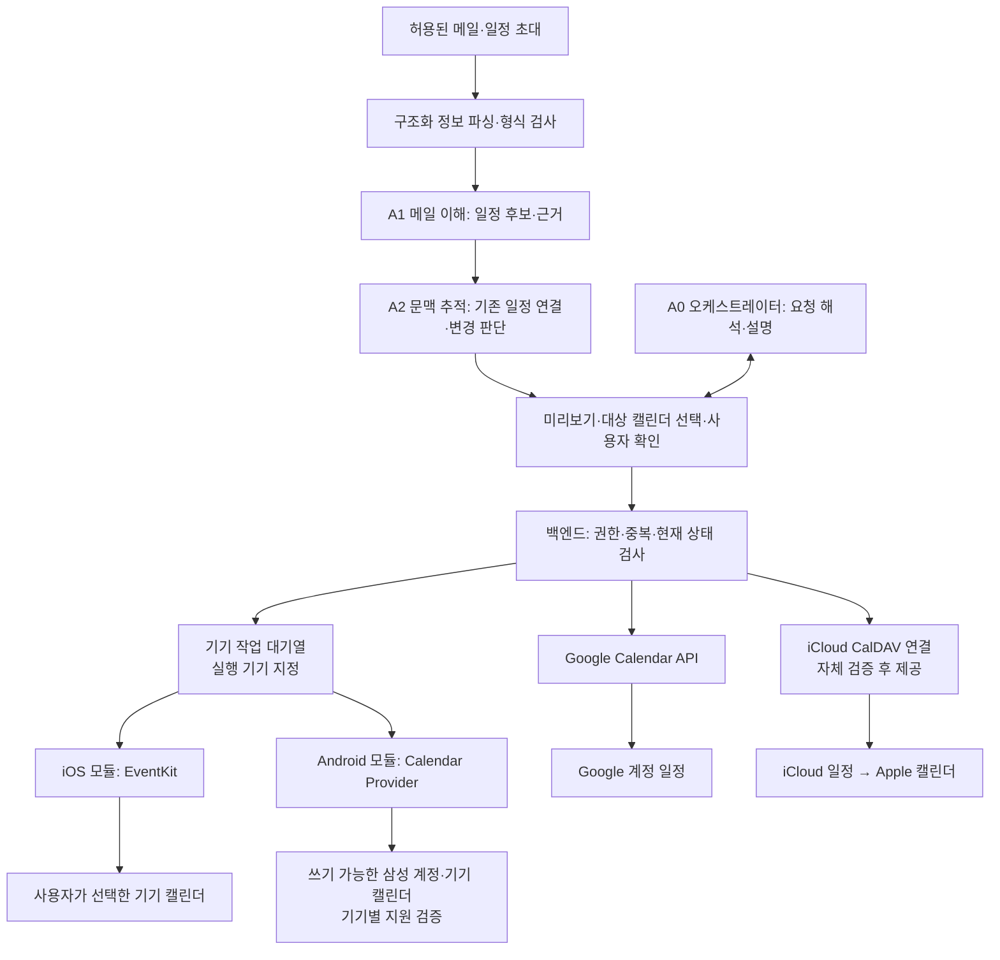

# 이메일 일정 추출·캘린더 연동 기능 검토

- 조사·작성일: 2026-09-28
- 보충 검토: Google 계정을 사용하지 않는 Apple·Samsung 사용자, 선호 캘린더 선택 흐름, 모바일 앱을 만들지 않는 웹 전용 연동 범위
- 상태: 추가 기능 검토안. 초기 MVP 편입이나 개발 일정이 확정된 문서는 아님.
- 검증 수준: 공식 개발 문서·도움말 조사. 실제 OAuth 연결, API 호출, iPhone·Galaxy 기기 검증은 수행하지 않음.
- 관련 문서: 기획서, 에이전트 상세 설계, 시스템 구조
- 기존 결정 유지: 5개 에이전트, 모바일 웹 우선, Luna·Sol 기준 성능 확보 후 Jev 비교. 내부 LLM 관련 질문은 참고 질의이며 도입 결정으로 반영하지 않음.

## 1. 판단

**메일에서 일정을 찾아 캘린더에 등록하는 기능은 구현 가능하다. 사용자는 Google·Apple·Samsung 중 선호하는 앱을 고르고, Google 계정 없이도 연결할 수 있도록 경로를 분리하는 안을 권고한다.** 사용자는 캘린더 선택 시나리오를 긍정적으로 평가하고 Google 비사용자의 해결책 분석을 요청했다. 각 연결 방식의 개발·출시 범위까지 확정된 것은 아니다.

보충 조사에 따른 권고는 **Google은 공식 API, Apple의 iCloud 일정은 서버 CalDAV 연결 검증, Samsung은 Android 기기 연결 모듈 검증**이다. Apple의 기기 캘린더 직접 접근은 iOS 모듈로 별도 지원할 수 있다. 이 문서의 9절에 계정이 없는 경우, 웹 전용 대안, 변경·취소 처리 한계를 정리했다.

Google Calendar API는 일정 생성 기능과 접근 권한 체계를 제공한다. 이 API를 이용하는 백엔드를 우리 웹앱에 연결할 수 있다. 필요한 일정 변경·조회 범위에 맞춰 권한과 동기화 기능을 추가하는 구조다. Google 일정 생성, 접근 권한

Apple·Samsung 캘린더 앱에서 Google 계정의 일정을 표시하는 경로도 있지만, Google 비사용자의 해결책을 대신하지 않는다. 해당 경로는 Google을 이미 사용하는 사람에게 제공할 선택 사항이다. **Google에 저장한 일정을 다른 앱에서 보는 것과 iCloud·삼성 계정에 저장하는 것은 다르다.** Google의 Apple 캘린더 연결 안내, Samsung의 Google Calendar 동기화 안내

제품 관점의 차별화 후보는 달력 화면 자체보다, 여러 메일 계정에서 일정을 발견하고 근거 메일·관련 업무·이후 변경 사항까지 연결하는 경험이다. 기존 제품 대비 우위나 한국어 추출 정확도는 아직 검증하지 않았다.

### 1.1 모바일 앱을 만들지 않을 때의 결론

**웹만 제공해도 Google API 없이 연동할 수 있다. Google API는 Google Calendar 연결용이며, Apple·Samsung을 포함한 모든 캘린더의 공통 필수 수단이 아니다.**

| 연결 대상 | 웹 전용 경로 | Google 계정 필요 여부 |
| --- | --- | --- |
| Google Calendar | 우리 백엔드가 Google Calendar API 호출 | 필요 |
| Apple iCloud 캘린더 | 우리 백엔드가 CalDAV로 iCloud에 직접 연결하는 방식 검증 | 불필요. iCloud 연결 인증은 필요 |
| 삼성 계정·기기 로컬 캘린더 | 웹 서버의 직접 자동 관리 경로는 현재 미확인 | Google 가입을 요구한다고 해결되는 문제가 아님. 기존 저장소의 접근 경로 확인 필요 |

Apple의 웹 전용 흐름은 `우리 웹에서 일정 확인 → 우리 서버가 iCloud에 저장 → Apple 캘린더에서 동기화 후 확인`이다. 직접 연결 사례는 확인했으며 우리 서비스의 인증·일정 관리 검증은 남아 있다. CalDAV 직접 연결 사례

Samsung에 대해서는 공개 서버 API를 확인하지 못했다는 조사 결과를 기록하며, 기술적으로 영구히 불가능하다고 단정하지 않는다. 모바일 앱을 만들지 않으면 9절의 Android 기기 연결 경로를 사용할 수 없으므로 동일한 자동 등록·수정·취소 지원을 약속하지 않는다. 수동 파일 가져오기와 읽기 전용 구독은 각각의 지원 환경을 확인한 보조 경로로 구분한다.

웹 전용 출시라면 Google과 iCloud 직접 연동을 검증 대상으로 삼고, Samsung은 실제 제공 가능한 범위를 표시하는 안이다. 이는 검토 내용을 문서에 추가한 것이며, 모바일 앱 개발 또는 웹 전용 출시를 이번 요청으로 확정한 것은 아니다.

## 2. 캘린더 앱과 저장 계정을 구분한다

| 대상 | 가능한 연결 경로 | 현재 판단·조건 |
| --- | --- | --- |
| Google Calendar | 웹 백엔드에서 Calendar API 호출 | 첫 기술 검증 대상으로 권장. 별도 캘린더 권한 동의와 쓰기 가능한 대상 캘린더 필요 |
| Apple 캘린더 앱에서 Google 일정 보기 | Apple 캘린더에 Google 계정 연결 | 가능. Google 계정의 일정을 표시하며 iCloud로 복제하는 방식은 아님 |
| Apple 기기의 iCloud·기타 쓰기 가능한 캘린더에 추가 | 향후 네이티브 앱에서 EventKit·EventKitUI 이용 | 가능 경로가 있음. 선택한 캘린더·접근 권한에 따라 범위가 달라짐. 일반 웹페이지에서 해당 네이티브 API를 직접 호출할 수는 없음 |
| 웹 백엔드에서 iCloud에 직접 연결 | CalDAV 클라이언트 구현과 앱 전용 암호 인증 검증. 지원 앱 대상 Apple 계정 인증의 적용 가능성도 별도 확인 | 기존 제품의 직접 연동 사례 확인. 우리 서비스의 인증·생성·변경·동기화 검증은 미완료이며 9절의 우선 기술 검증 후보 |
| Samsung 캘린더 앱에서 Google 일정 보기 | Galaxy에 Google 계정 연결 후 캘린더 동기화 | 가능. 기기·소프트웨어·계정 설정에 따른 동작 확인 필요 |
| Galaxy 기기 캘린더에 직접 추가 | 향후 Android 앱에서 시스템 일정 추가 화면 또는 Calendar Provider 이용 | 가능 경로가 있음. 기기에 노출되는 쓰기 가능한 캘린더가 대상이며, 기기 전용 일정은 다른 기기로 동기화되지 않을 수 있음 |
| 웹 백엔드에서 삼성 계정 캘린더에 직접 연결 | 별도 서버 API·파트너 연동 검증 | 이번 조사에서 우리 서비스가 사용할 수 있는 공개 서버 API 경로는 확인하지 못함. 불가능하다고 단정하지 않음 |

네이티브 연결의 근거는 Apple EventKit 공식 설명과 Android Calendar Provider 문서다. Apple은 지원되는 제3자 앱의 Apple 계정 인증과, 이를 지원하지 않는 경우의 앱 전용 암호 방식을 안내한다. 이 안내만으로 우리 앱의 직접 연동 자격이나 전체 구현 절차가 확인된 것은 아니다. Apple 제3자 앱 접근 안내

메일을 받은 계정과 일정을 저장할 계정은 다를 수 있다. 예를 들어 네이버 메일의 회의 내용을 사용자가 선택한 Google 업무용 캘린더에 등록할 수 있다. 이 경우 출처 메일 계정과 대상 캘린더 계정을 함께 표시하고, 기존 계정 간 정보 사용 제한을 적용한다.

## 3. 권장 사용자 흐름

최초 설정에서 `Google 캘린더 / Apple 캘린더 / Samsung 캘린더 / 나중에 설정`을 제시한다. 선택 후 해당 환경에서 가능한 연결 경로를 안내하고, 필요하면 개인·업무 등 실제 저장할 캘린더를 한 번 지정한다. 저장 대상이 확인되지 않으면 연결 완료로 표시하지 않는다. 지원하지 않는 기기에서 선택한 경우 연결할 기기 또는 대안을 안내하며, 자동으로 Google 경로로 전환하지 않는다.

다음은 실제 메일을 분석한 결과가 아닌 기능 설명용 예시다.

> 네이버 메일 수신: “10월 2일 오후 2시부터 3시까지 서울 사무실에서 미팅하겠습니다.”
> 
> 
> 비서: “미팅 일정을 찾았어요. 2026년 10월 2일 14:00–15:00, 한국 시간입니다. ‘Google 업무용’ 캘린더에 추가할까요?”
> 
1. 허용된 메일 분석 범위 안에서 일정 후보를 찾는다.
2. 제목, 날짜·시간·시간대, 장소, 관련 메일과 원문 근거를 보여준다. 예시의 연도·시간대도 실제 메일 문맥이나 사용자 설정으로 확인되어야 한다.
3. 사용자가 대상 계정·캘린더를 선택하고, 필요한 값을 수정한 뒤 추가한다.
4. 백엔드가 권한과 중복 여부를 확인하고 등록한다. 성공 응답과 외부 일정 식별자를 확보한 뒤 완료로 표시한다.
5. 해당 Google 캘린더를 표시하는 Apple·Samsung 앱에서도 동기화 후 같은 일정을 볼 수 있다.
6. 이후 “오후 3시로 변경하겠습니다”라는 메일이 오면 기존 일정과 연결해 변경안을 보여준다. 새 일정으로 무조건 추가하지 않는다.

화면에는 `일정 후보`, `확인 필요`, `등록됨`, `변경 제안`, `연동 오류`처럼 실제 상태를 구분한다. 분석 완료를 등록 완료로 표시하지 않는다.

## 4. 현재 에이전트 구조에 넣는 방법

별도의 여섯 번째 LLM 에이전트는 우선 필요하지 않다. 기존 전문 역할에 일정 관련 입력·출력을 추가하고, 실제 캘린더 작업은 백엔드 기능으로 구현하는 안을 제안한다.

| 구성 요소 | 추가 책임 |
| --- | --- |
| 사전 파서·검증 코드 | 구조화된 일정 초대가 있으면 `.ics` 등에서 명시된 값을 우선 읽고 형식을 검증. 본문과 불일치하면 확인 대상으로 전달 |
| A1 메일 이해·분류 | 본문의 일정 후보, 제목·시각·장소·참석 관련 정보, 확정·제안 여부, 원문 근거와 불확실성 추출 |
| A2 문맥·업무 추적 | 기존 후보·업무·등록 일정과 연결. 여러 메일에서 같은 일정을 언급하는지, 변경·취소인지 판단 |
| A0 오케스트레이터 | 사용자 의도·대상 캘린더·허용 범위 해석, 누락 정보 확인, 등록·변경 결과 설명 |
| 백엔드 캘린더 서비스 | 계정 인증, 접근 범위 검사, 일정 생성·수정·삭제, 중복 실행 방지, 외부 식별자·동기화 상태 관리 |
| A4 응답 작성 | 사용자가 회신을 요청한 경우에만 일정 관련 답장 초안 작성 |

A3 서비스·수신 관리의 핵심 책임은 유지한다. 캘린더 인증과 토큰 관리를 LLM의 판단에 맡기지 않는다. Luna에서 Sol로 재검토하는 후보 상황은 서로 충돌하는 날짜, 여러 일정 중 변경 대상이 불명확한 경우, 긴 대화의 취소·재확정 해석 등이다. 더 큰 모델도 빠진 사실을 확정할 수 없으므로 필요한 정보가 없으면 사용자에게 확인한다.

이 그림은 연결 경로를 포함한 설계안이며 각 모듈의 구현 완료를 뜻하지 않는다. 기기 경유 작업은 실행 결과를 돌려받아야 완료이며, 서버가 작업을 전송했다는 사실만으로 완료 처리하지 않는다.

## 5. 일정과 할 일을 구분한다

| 메일 내용 | 기본 해석 제안 |
| --- | --- |
| “10월 2일 14시에 미팅합니다” | 시각이 있는 일정 후보 |
| “금요일까지 견적서를 보내 주세요” | 마감이 있는 할 일 후보. 원하면 캘린더에도 표시 |
| “다음 주쯤 한번 만나요” | 미확정 제안. 날짜를 임의로 만들어 등록하지 않음 |
| “화요일 또는 목요일 중 가능한 시간을 알려 주세요” | 여러 제안 시간. 모두 확정 일정으로 등록하지 않음 |

할 일과 일정은 별도 객체로 두고 연결한다. 캘린더 등록으로 할 일이 자동 완료되거나, 할 일 완료로 회의가 자동 삭제되지 않게 한다. 한 메일에서 여러 일정이 발견될 수 있고, 하나의 일정에 여러 변경 메일이 연결될 수 있다.

최소 데이터 구조 제안:

- **일정 후보:** 원본 메일 계정·메시지 식별자, 근거 구절, 일정 종류, 현지 날짜·시간·시간대, 확정 여부, 누락 정보, 관련 업무·후속 메일.
- **외부 일정 연결:** 후보 식별자, 공급자·대상 계정·캘린더·일정 식별자, 마지막 반영 내용과 버전, 동기화 상태. 반복 일정·정식 초대는 공급자 및 초대의 식별 관계도 보존.
- **확인 기록:** 사용자가 승인한 대상과 내용, 실제 처리 결과. 원문 메일 전체를 캘린더 설명에 기본 복제하지 않음.

## 6. 연동 방식별 제약

**Google 웹 연동:** 메일 접근 권한이 캘린더 권한을 대신하지 않는다. 전용 보조 캘린더를 앱이 만들고 관리하는 방식과 사용자의 기존 캘린더를 선택하는 방식은 필요한 권한이 다르다. 예를 들어 `calendar.app.created`는 앱이 만든 보조 캘린더용 권한이며 임의의 기존 캘린더 접근 권한이 아니다. 선택한 방식에 필요한 최소 범위를 요청하고, 앱 내부의 대상 제한과 공급자가 부여한 OAuth 권한 범위를 구분한다. Google 권한 범위

**Apple 네이티브 연동:** iOS 17 이상에서는 EventKitUI로 내용을 채운 시스템 편집 화면을 띄워 사용자가 저장하도록 할 수 있다. 쓰기 전용 권한으로 직접 추가하는 방식도 있으나, 그 권한으로는 우리 앱이 추가한 기존 일정도 읽을 수 없다. 기존 일정 조회·변경까지 제공하려면 그에 맞는 접근 방식이 필요하다. Apple EventKit 설명

**Android 네이티브 연동:** 시스템의 일정 추가 화면을 여는 Intent 방식과 Calendar Provider에 직접 읽기·쓰기를 수행하는 방식이 있다. 전자는 사용자가 시스템 화면에서 최종 저장하며, 후자는 접근 권한이 필요하다. 화면을 열었다는 사실만으로 등록 성공을 확정하지 않는다. Android 공식 문서

**파일 내보내기·구독:** `.ics`는 일정 교환 형식이다. 파일 다운로드 후 가져오기는 당시 내용의 전달이며 이후 변경이 자동 반영되는 연결로 안내하면 안 된다. URL 구독은 별도 방식이며 Apple은 읽기 전용 구독을 지원한다. 갱신 시점은 캘린더 클라이언트에 영향을 받으므로 실시간·양방향 동기화로 약속하지 않는다. 각 기기의 파일 가져오기 동작은 별도 테스트가 필요하다. iCalendar 표준, Apple 읽기 전용 캘린더 구독

**지속적인 동기화:** 등록 후 Google에서 사용자가 직접 바꾼 내용까지 추적하려면 별도의 조회·증분 동기화가 필요하다. Google은 동기화 토큰 방식과 토큰 무효화 시 전체 재동기화 절차를 제공한다. 이는 캘린더 앱 화면에 표시되는 계정 동기화와 구별되는 우리 서비스의 구현 책임이다. Google 증분 동기화

## 7. 초기 설계에서 처리할 사례

아래 항목은 구현·평가 제안이며 동작을 검증했다는 의미가 아니다.

| 사례 | 처리 원칙 |
| --- | --- |
| 상대 날짜·시간대·종료 시각 누락 | 원본 발송 시점과 대화 문맥을 확인. “내일”을 분석 당일 기준으로 바꾸지 않음. 기본 소요 시간을 쓰면 사용자 설정에서 온 값임을 표시 |
| 시간 변경·취소·재확정 | 기존 일정과 연결해 변경 전후를 보여줌. 처음에는 사용자 확인 후 반영 |
| 정식 일정 초대·이미 등록된 일정 | 초대 식별 정보와 허용된 캘린더 조회 범위를 이용해 중복 확인. 개인 일정 추가와 초대 수락·거절을 구분 |
| 반복 일정 | 이번 회차와 전체 반복의 변경 범위를 구분. 초기 지원 밖이면 원래 캘린더에서 처리하도록 안내 |
| API 응답 지연·작업 재시도 | 동일 작업 식별자·외부 일정 조회로 이미 처리됐는지 확인. 재시도마다 새 일정 생성 금지 |
| 사용자가 캘린더에서 직접 수정 | 마지막 반영 내용과 비교하여 충돌을 확인. 새 메일만으로 사용자 수정을 덮어쓰지 않음 |
| 캘린더 조회 권한 없음 | 일정 충돌·기존 일정 중복 검사가 제한됨을 표시. 검사하지 않은 상태를 “중복 없음”으로 표시하지 않음 |
| 메일의 수신자·참석자 이름 | 개인 일정에 참석자를 자동 초대하지 않음. 개인 보관과 초대 발송·참석 응답을 별도 작업으로 취급 |
| 공유 캘린더·계정 간 이동 | 저장 대상·공유 가능성을 보여주고 최소 일정 정보만 전달. 사내 메일을 개인 캘린더로 옮기는 동작에도 기존 제한 적용 |
| 권한 철회·읽기 전용 캘린더·오프라인 | 등록 완료로 표시하지 않음. 재연결·대상 변경·재시도 상태 제공 |
| 분석 제외 메일·악의적인 본문 지시 | 기존 분석 제외 정책 적용. 메일에 적힌 지시는 실행 권한으로 취급하지 않음 |

참석자를 포함한 이벤트는 초대와 알림 동작이 발생할 수 있다. 최초 범위에서는 API의 알림 옵션만으로 초대를 억제하려 하지 말고, 개인 저장 기능에 참석자 목록을 자동으로 넣지 않는 방식을 제안한다. Google 일정 생성·참석자 안내

## 8. 도입 순서 제안

| 단계 | 검증할 기능 | 판단 기준 |
| --- | --- | --- |
| 1. 공통 기능과 연결 경로 검증 | 일정 추출·확인 화면, Google API 기준 동작, iCloud CalDAV 소규모 검증, Google 계정 없는 Galaxy 기기 검증 | 날짜·시간대 정확도와 중복 방지. Apple 인증·삼성 계정 접근의 실제 가능 범위 확인 |
| 2. 검증된 경로로 제한 출시 | Google 직접 연결, 통과 시 iCloud 직접 연결, Samsung 지원에는 최소 Android 모듈 포함. 변경·취소는 사용자 확인 | PC에서 승인 후 휴대전화 실행·결과 회신, 충돌·권한 회수 처리. 세 경로를 동일한 자동화 수준으로 광고하지 않음 |
| 3. 사용 경험 확대 | iOS 기기 직접 연결, 기기 간 복구, 반복 일정과 동기화 고도화 | 설치 부담, 초기 연결 성공률, 지연·충돌·운영 비용 |

`.ics` 내보내기는 수동 대안 후보로 별도 검증한다. 특정 공급자에 종속되지 않는 장점은 있으나, 수정 추적이나 등록 성공 확인까지 같은 수준으로 제공하는 수단은 아니다.

도입을 결정하기 전에는 확정 일정·제안 일정·마감·변경·취소·반복 초대를 섞은 한국어 평가 메일을 구성한다. 기존 중요한 메일 분류 성능도 함께 확인한다. Google 등록과 Apple·Galaxy 표시를 실제 기기에서 검증하고, 동일 계정의 일정이 여러 앱에 보이는 것을 여러 일정이 생성된 것으로 계산하지 않는다.

**현재 권고:** 별도 캘린더 LLM 에이전트 추가 없이, 기존 A1·A2와 실행 기능을 확장한다. 사용 경험은 “일정 발견 → 확인 → 선택한 캘린더에 반영”으로 통일하되, 실행 경로와 완료 조건은 플랫폼별로 구분한다. Google 비사용자까지 실질적으로 지원하려면 iCloud 서버 연결 검증과 Android 기기 모듈을 개발 범위 후보로 올리는 것이 적합하다. 이는 기존 웹 우선 계획을 보완하는 제안이며 구현·출시 확정은 아니다.

## 9. Google 비사용자 해결안

### 9.1 Google 계정 없이 이용 가능한 저장소

| 사용자 환경 | Google 없이 이용할 저장소 | 우리 서비스의 권장 접근 경로 |
| --- | --- | --- |
| iCloud 캘린더를 사용하는 Apple 사용자 | 사용자의 iCloud 계정 캘린더 | 웹 우선: 서버 CalDAV 연결 기술 검증. 이후 기기 직접 연결도 선택 가능 |
| Apple 기기에 다른 쓰기 가능한 캘린더만 있는 사용자 | 기기에 설정된 해당 캘린더. 로컬 캘린더가 실제로 제공되는 경우 로컬도 포함 | iOS 모듈에서 사용 가능한 캘린더를 확인. 로컬 저장 가능 여부를 모든 환경에 일괄 보장하지 않음 |
| 삼성 계정 캘린더 사용자 | 삼성 계정의 캘린더 | Android 모듈에서 해당 캘린더의 노출·쓰기 가능 여부 확인. 삼성의 계정 동기화는 기기 설정에 따름 |
| 삼성 계정도 사용하지 않는 Galaxy 사용자 | 휴대전화의 ‘내 캘린더’ | Android 모듈에서 기기 캘린더에 추가. 외부 계정 동기화를 제공한다고 안내하지 않음 |

삼성 공식 안내는 ‘내 캘린더’에 저장하면 휴대전화에만 남고, 다른 기기와 동기화하려면 삼성 계정 등의 캘린더에 저장하도록 설명한다. 따라서 Google 계정이 없는 것이 삼성 캘린더 사용의 장애물은 아니다. 다만 이 사용자 기능이 곧 우리 서버용 공개 API를 의미하지는 않는다. 삼성전자서비스 저장 위치·동기화 안내

### 9.2 Apple: 웹 우선 경로와 기기 경로

**A. iCloud 직접 연결 — 웹 우선 기술 검증 권고**

`우리 웹앱 → 백엔드의 CalDAV 클라이언트 → 사용자 iCloud 캘린더 → Apple 캘린더 앱`

CalDAV는 서버의 캘린더를 클라이언트가 조회·관리하는 방식이다. BusyCal의 제작사 문서는 자사 제품이 iCloud에 직접 연결하고 Apple 기본 캘린더와 같은 iCloud 일정을 동기화하는 구조를 설명한다. 이는 실제 구현 사례의 근거이며 우리 앱 구현의 검증 결과는 아니다. BusyCal 제작사의 iCloud 연결 설명

인증 시 Apple의 지원 앱 대상 계정 승인 방식이 우리 서비스에도 제공되는지 먼저 확인한다. 사용할 수 없다면 사용자가 생성한 앱 전용 암호를 이용하는 경로를 검증한다. Apple은 이 암호 사용에 이중 인증이 필요하며, 사용자가 회수하거나 기본 암호를 변경하면 재연결이 필요하다고 안내한다. 일반 ‘Apple로 로그인’을 캘린더 권한 획득으로 취급하지 않는다. Apple 제3자 앱 인증, 앱 전용 암호

제안하는 초기 연결 흐름은 Apple 선택 → 연결 방식 안내 → 인증 → 쓰기 가능한 캘린더 선택 → 연결 확인이다. 서버 연결이 검증되면 휴대전화의 우리 앱이 실행 중이지 않아도 iCloud에 변경을 반영할 수 있는 설계가 된다. 휴대전화 화면에 보이는 시점은 기기의 iCloud 동기화 상태에 따르며, 서버 저장 성공과 기기 표시 확인을 구분한다.

앱 전용 암호를 쓰는 경우 기본 Apple 암호는 수집하지 않고 연결용 자격 증명을 암호화해 보관한다. LLM·분석 로그에 전달하지 않으며 연결 해제 시 제거한다. 앱 전용 암호가 특정 캘린더 하나로 접근을 제한해 준다고 가정하지 않는다. 대상 제한은 서버에서도 검사한다. 이 방식의 가장 큰 사용자 비용은 최초 암호 생성·재연결 과정이다.

**B. iOS 기기 연결 — 계정 자격 증명을 우리 서버에 맡기지 않는 선택지**

우리 iOS 앱에 캘린더 연결 모듈을 넣어 EventKit을 통해 사용자가 선택한 쓰기 가능한 캘린더를 사용한다. 간단한 추가는 시스템 편집 화면으로 처리하고, 등록한 일정의 지속적인 수정·취소 관리가 필요하면 그에 맞는 권한과 식별자 관리가 필요하다. 기기에서 처리하는 방식이므로 PC 요청은 해당 기기가 실행할 때까지 대기할 수 있다. iOS 앱 설치와 기기 접근 권한이 필요하다. Apple EventKit

**C. 앱 설치·직접 계정 연결을 원하지 않는 경우 — 읽기 전용 구독**

우리 서비스가 승인된 일정만 담은 개인별 `.ics` 구독 주소를 제공하고 Apple 캘린더에서 구독하게 할 수 있다. Apple 앱 안에 ‘메일에서 찾은 일정’이라는 별도 캘린더가 생기는 형태다. 사용자는 기존 Apple 앱을 계속 사용하지만 해당 일정 수정은 우리 서비스에서 하며, Apple 쪽에서는 다음 갱신 후 반영된다. 기존 iCloud 개인 캘린더에 쓰는 기능이나 양방향 연동과 동일하지 않다. Apple 구독 캘린더 안내

구독 주소는 공개 게시하지 않고 충분히 긴 개인별 비밀 토큰과 회수 기능을 제공한다. 주소를 가진 클라이언트가 읽을 수 있는 범위를 승인된 최소 일정 정보로 제한한다. 취소 표시·삭제 반영·갱신 지연은 실제 클라이언트에서 검증한다.

### 9.3 Samsung: 최소 Android 연결 기능을 마련한다

`우리 웹·앱 → 승인된 작업 대기열 → 사용자 Galaxy의 우리 앱 → 기기 캘린더 → Samsung 캘린더 앱`

Samsung 캘린더를 별도 제작하거나 교체할 필요는 없다. 우리 Android 앱에 일정 등록을 위한 연결 기능을 넣는다. Android는 Calendar Provider를 통한 일정 읽기·쓰기와, 사용자에게 일정 편집 화면을 열어 주는 Intent 경로를 제공한다. 기기 로컬 캘린더를 위한 계정 유형도 정의한다. Android Calendar Provider

제안하는 연결 절차:

1. Samsung을 선택하면 호환 Galaxy 기기에서 우리 앱을 연결한다. PC에서 시작한 경우 로그인 후 확인하는 연결 링크·QR을 제공할 수 있다.
2. 관리 기능에 필요한 기기 권한을 요청하고, 접근 가능한 캘린더를 확인한다.
3. `삼성 계정의 캘린더` 또는 `내 휴대전화` 중 실제 쓰기 가능한 항목을 선택한다. 개발자가 계정 이름만 추측해 저장 대상을 정하지 않는다.
4. 등록 성공 후 기기의 일정 식별자와 반영 버전을 기록한다. 후속 변경은 같은 연결을 사용한다.

삼성 계정 캘린더가 표준 인터페이스에 노출되고 제3자 앱의 수정이 가능한지는 목표 One UI·기기에서 확인해야 한다. 노출되지 않거나 직접 쓰기가 안 되면 시스템 일정 추가 화면에서 사용자가 대상을 골라 저장하는 대안을 제공한다. 그 대안은 지속적인 자동 수정·완료 검증을 동일하게 제공한다고 약속하지 않는다. 화면을 열었거나 사용자가 돌아왔다는 사실만으로 저장 완료로 표시하지 않는다.

이번 공식 문서 조사에서는 삼성 계정 캘린더를 우리 백엔드가 직접 관리할 수 있는 공개 서버 API를 확인하지 못했다. 검색되는 Tizen TV·워치 API를 Galaxy Android 또는 삼성 클라우드 서버 API로 대신 사용한다고 설계해서는 안 된다.

**앱 설치 없이 웹만 사용하는 Galaxy 사용자:** `.ics` 파일 내보내기·가져오기는 보조 경로로 시험할 수 있으나, 이번 조사에서 삼성 전 기기의 파일 가져오기·URL 구독 지원을 확인하지 못했다. 지원 기기에서 확인된 수동 추가만 안내하고, 파일 전달을 자동 동기화로 표시하지 않는다. 설치도 직접 계정 연결도 하지 않는 사용자에게 삼성 일정의 지속적인 자동 수정·취소까지 보장할 방법은 현재 확보하지 못했다.

### 9.4 PC에서 요청하거나 휴대전화가 꺼져 있는 경우

| 연결 방식 | PC에서 승인한 뒤의 처리 | 휴대전화가 꺼져 있을 때 |
| --- | --- | --- |
| iCloud 서버 연결 | 서버가 iCloud에 반영하고 결과 기록 | iCloud 서버 반영 가능. 기기에는 다시 동기화될 때 표시 |
| Apple 읽기 전용 구독 | 서버의 구독 데이터 갱신 | 기기가 다음에 구독 데이터를 가져올 때 표시 |
| iOS·Android 기기 연결 | 작업을 대상 기기에 전달하고 실행 결과 수신 | 대기. 실행·동기화 시점을 실시간으로 보장하지 않음 |
| 파일 가져오기 | 사용자가 파일을 열고 추가 | 기기 사용자가 가져올 때까지 미반영. 이후 자동 관리 없음 |

기기 경로의 상태는 `승인됨 → 기기 반영 대기 → 반영 확인`으로 나눈다. 시스템 편집 화면에 맡긴 작업은 실제 저장을 확인할 수 없는 경우 `캘린더에서 저장 확인 필요`로 표시한다. 네트워크·절전·백그라운드 실행 제약을 고려해 알림을 통한 앱 열기와 앱 재실행 시 대기 작업 확인을 기본 복구 경로로 둔다.

같은 계정을 여러 기기에서 쓰더라도 변경 작업마다 실행 기기를 하나 지정하고 작업 식별자로 중복 실행을 막는다. 기기의 로컬 일정 ID를 다른 기기에 그대로 재사용하지 않는다. 다른 기기로 실행을 넘길 때는 이전 실행 상태와 대상 일정을 다시 확인한다. 연결 해제 시 미실행 작업을 중단하고, 등록된 일정 삭제는 별도로 선택하게 한다.

### 9.5 권장 범위와 검증 완료 조건

**권장 설계안은 ‘웹 중심 공통 서비스 + 플랫폼별 연결 기능’이다.** Google 계정을 필수 가입 조건으로 두지 않는다. Apple은 웹 사용자에게 iCloud 직접 연결을 우선 검증하고, 부담이 적은 읽기 전용 구독을 보조안으로 검토한다. Samsung의 지속적인 일정 관리를 위해서는 최소 Android 모듈을 지원 범위에 넣는 것이 현실적이다. iOS 모듈은 기기 직접 연결 수요에 따라 추가할 수 있다.

세 앱을 첫 출시부터 실질적으로 지원하는 것이 목표라면 Android 모듈을 모두 후순위로 미룰 수 없다. 웹만 먼저 출시한다면 Samsung 선택 화면에 실제 제공하는 수동 추가·기기 연결 필요 상태를 정확히 표시해야 한다. 선택 버튼만 제공하고 완전한 연동이 된 것처럼 안내하지 않는다.

| 검증 과제 | 통과 조건 |
| --- | --- |
| Google 계정 없는 Apple·Galaxy | 각각 실제 사용자 환경에서 승인한 일정의 등록 경로 확보 |
| iCloud 직접 연결 | 인증·캘린더 조회·생성·수정·삭제, 권한 회수·재연결, 기기 수동 변경 감지 검증 |
| 삼성 계정과 기기 로컬 | 두 저장소를 구분하고 실제 노출·쓰기·수정 가능 여부 및 삼성 계정 동기화 확인 |
| 기기 오프라인·권한 거절 | 완료 오표시 없이 대기·안내·재연결로 전환 |
| 같은 일정 여러 기기·재시도 | 중복 생성과 다른 일정 수정이 발생하지 않음 |
| 수동 수정·취소·반복 일정 | 원본과 현재 상태를 비교하고 충돌·이번 회차/전체 범위를 확인 |
| 구독·파일 방식 | 갱신 지연·읽기 전용·수동 추가 범위를 화면 설명과 일치시킴 |
| 지원 범위 안내 | 테스트를 통과한 OS·기기·연결 방식에 한해 기능을 노출하고 실험 중인 경로는 구분 |

위 조건은 향후 기술 검증 기준이며 아직 수행 결과는 없다. 이번 작업은 조사와 설계 문서 보완까지이며 계정 연결이나 외부 일정 변경은 하지 않았다.