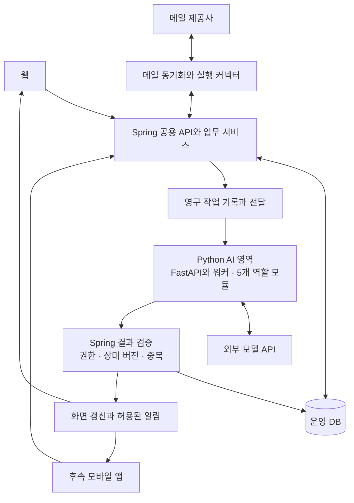

# 통합 이메일 AI 비서 기술 스택 선택 비교 보고서 v1.0

- 작성일: 2026-09-30
- 대상 프로젝트: Uteum-Mail
- 문서 목적: 기술 스택 논의의 조건, 비교 근거, 권장 구성과 후속 검증 사항을 정리한다.
- 문서 상태: 대화에 근거한 설계 검토 보고서. 기술 스택의 최종 확정, 구현 완료 또는 성능 검증 결과를 뜻하지 않는다.
- 반영 기획서: [웹앱 기획서 v1.6](07-웹앱-기획서-v1.6.md)
- 기존 기준: [에이전트 상세 설계 v0.3](01-에이전트-상세-설계-v0.3.md), [기획서 v1.5](02-웹앱-기획서-v1.5.md), [캘린더 연동 검토](04-이메일-일정-추출-캘린더-연동-기능-검토.md), [사용자 시나리오 v1.0](05-전체-사용자-시나리오-v1.0.md)

## 1. 검토 결론과 결정 상태

현재 기획에 대한 종합 권장안은 **React·TypeScript 기반 웹과 Next.js 우선 검토, Spring Boot 공용 백엔드, Python AI 실행 영역과 FastAPI, PostgreSQL**이다. 통합 메일의 상태·권한·실제 실행은 Spring이 관리하고, AI 영역은 의도 해석·분류·문맥 분석·초안 생성을 담당한다. 웹을 먼저 출시하고, 앱은 웹 결과를 확인한 뒤 같은 공용 API를 사용하는 방식으로 검토한다.

이 권고의 근거는 메일 기능과 AI 기능의 변경 주기·작업 부하를 나누고 Python 도구를 직접 활용할 수 있다는 점이다. 가장 빠르거나 가장 저렴하다는 실측 결론은 아니다. 단일 백엔드를 선택할 경우에는 Spring Boot도 충분히 경쟁력 있는 후보이며, 다른 언어로 바꿔야 할 성능상의 근거는 아직 확인되지 않았다.

| 상태 | 내용 |
| --- | --- |
| 사용자 확인 | 웹부터 진행한다. 별도 앱은 웹 결과물을 보고 후속 진행 여부를 판단한다. |
| 사용자 확인 | 안정성·성능·서비스 확장을 함께 고려한다. 규모와 운영 예산은 미정이며 단계별 확장을 기준으로 판단한다. |
| 사용자 확인 | Java·Spring에 더 익숙하지만, Python 학습 비용은 선택의 불이익으로 계산하지 않는다. |
| 사용자 확인 | 서비스 사이 데이터 형식을 맞추는 수고도 주요 불이익으로 계산하지 않는다. |
| 사용자 확인 | 실제 사용자는 짧고 간단하게 요청한다. 사용자가 상세한 처리 절차를 프롬프트로 작성한다고 가정하지 않는다. |
| 기존 기획 기준 | 4종 메일 지원 목표, 5개 에이전트 역할, 기존 Luna·Sol 배분과 Jev 비교 도입 순서를 유지한다. |
| 권장 기본안 | Spring Boot와 Python AI 영역을 분리하고, 웹·향후 앱이 Spring의 공용 API를 사용한다. |
| 조건부 앱 후보 | 웹에 React를 채택한다면 React Native와 Expo를 우선 검토한다. Flutter와 OS별 네이티브 앱도 비교 대상이다. |
| 미확정 | 최종 프레임워크·언어 버전, 작업 큐 제품, 클라우드·요금제, ORM 세부 선택, 목표 처리량·지연·월비용, 앱 출시 시점·지원 OS·기능 범위 |

사용자는 본 보고서 작성, 기획서 최신화와 GitHub 반영을 요청했다. 개별 기술을 모두 최종 확정했다는 별도 발언은 없으므로, 기획서에는 권장안과 확정된 제품 방향을 구분해 반영한다.

## 2. 대화에서 비교 기준이 정리된 과정

| 논의 단계 | 검토 내용 | 현재 해석 |
| --- | --- | --- |
| 초기 웹 스택 | Next.js·TypeScript, PostgreSQL, 별도 Node.js 워커 중심의 구성을 검토 | 웹 개발과 백그라운드 처리를 한 언어로 관리하는 초기 제안이었다. Java가 부적합하다는 판단은 아니었다. |
| 안정성과 확장 | 연결 계정 수, 메일량, 초기 동기화, 큐, 재시도, DB 연결 수, AI 비용을 검토 | 사용자 수만으로 서버 용량을 정하지 않고 실제 작업량과 병목으로 확장한다. |
| Spring 검토 | 사용자의 Java 경험과 메일·업무·권한 기능을 고려 | Spring 단일과 별도 Spring 워커 모두 가능한 대안이다. |
| Python AI 검토 | 평가 실험, LangGraph 같은 처리 흐름 도구, 모델 학습·실행 사례를 비교 | 외부 LLM API 호출만으로 Python이 필수는 아니다. 선택한 도구가 실제로 줄여 주는 개발 작업을 판단한다. |
| 장애 설명 보정 | 통신 실패와 오래된 결과 반영이 FastAPI의 고유 단점인지 재검토 | 통신 장애는 정상 구현에서도 발생할 수 있다. 중복·유실·오래된 결과의 사용자 노출은 복구와 상태 검증으로 방어한다. 비동기 상태 변경 문제는 단일 구성에도 있다. |
| 앱 확장 | 공용 API, 로컬 저장, 푸시, 구버전 호환, 기기 캘린더를 검토 | 앱 추가만으로 백엔드 언어를 바꿀 필요는 없다. 모바일 기능과 클라이언트 기술을 별도로 검증한다. |

초기에 거론한 Supabase·Render, Drizzle·pg-boss, JobRunr, Redis·BullMQ 등의 제품은 후보 검토 이력이다. 현재 권장 구성의 필수 의존성으로 일괄 채택한 목록이 아니다. 특히 Node.js용 작업 도구를 Spring·Python의 공통 실행 기반으로 자동 승계하지 않는다.

## 3. 프로젝트 요구사항과 비교 전제

우리 서비스는 Gmail·네이버·다음·카카오메일의 통합 조회·발송·동기화와 AI 비서를 함께 제공한다. 제공사별 연동 가능 범위와 실제 품질은 별도 검증한다. AI가 중단돼도 저장된 메일·업무·규칙을 조회하고, AI에 의존하지 않는 동기화·수동 발송 경로를 유지하도록 설계한다.

비교에서는 필요한 권한 검사·재시도·중복 방지·상태 검증을 모든 후보에 구현한다고 가정한다. 특정 언어에만 미흡한 구현을 가정해 안정성 우열을 정하지 않는다. 학습 비용과 초기 데이터 형식 조율은 제외하되, 배포·관찰·복구·회귀 검증의 지속적인 운영 작업은 비교한다.

이 문서의 ‘단일 구성’은 메일과 AI 기능을 같은 백엔드 배포 단위에 넣는 경우다. 복제 인스턴스가 하나라는 의미는 아니다. 같은 언어를 쓰면서 API와 AI 워커를 별도 프로세스로 실행하면, 단일 언어를 사용한 분리 구성에 해당한다.

### 3.1 짧은 요청을 처리하는 사용자 경험

사용자는 “밀린 답장 좀 써줘”, “광고 정리해줘”처럼 요청할 수 있다. 시스템이 현재 화면의 대상, 허용된 계정·검색 범위, 이전 대화와 관련 메일을 활용해 요청을 해석한다. 계정·대상·변경 효과가 모호할 때만 필요한 내용을 좁혀 확인한다. 짧은 요청을 근거로 전체 계정 조회나 임의의 외부 변경 권한을 추정하지 않는다.

인사·잡담·범위 안내·의도 확인만 하는 항목에서 새 자료 조회나 전문 에이전트 호출을 시작하지 않는 기존 정책을 유지한다. 조회·분석·초안 작성과 실제 발송·설정 변경의 권한도 구분한다. 짧은 입력을 이해하는 품질은 문맥 선택·모델·도구·평가 설계에 달려 있으며 Spring과 FastAPI 중 하나의 독점 기능이 아니다.

## 4. Spring 구성 비교

아래는 구조에 따른 비교다. 운영 성능이나 비용의 실측 순위가 아니다.

| 항목 | Spring 단일 | Spring과 별도 Spring AI 워커 | Spring과 Python AI 영역 |
| --- | --- | --- | --- |
| 외부 LLM 호출·도구 실행 | 가능. Java SDK 또는 Spring AI 활용 | 가능 | 가능. Python SDK·AI 도구 활용 |
| 내부 호출 | 같은 프로세스에서는 함수 호출 가능 | HTTP 또는 큐 통신 필요 | HTTP 또는 큐 통신 필요 |
| AI 배포·확장 | 같은 배포 단위를 함께 변경·복제 | AI 워커만 독립 변경·확장 가능 | AI 영역만 독립 변경·확장 가능 |
| 프로세스 장애 | 동일 JVM의 종료·메모리 문제 영향 공유 | 별도 JVM과 자원 제한으로 AI 프로세스 영향 격리 | 별도 프로세스와 자원 제한으로 AI 프로세스 영향 격리 |
| 유지보수 | 호출 관계와 변경을 한 프로젝트에서 추적하기 쉬움 | Java 생태계를 유지하며 실행 책임 분리 | 메일 업무와 Python AI 도구의 변경을 각각 관리 |
| 검증·관찰 | 한 실행 환경에서 재현하기 비교적 단순 | 서비스 사이 작업 상태와 호출 추적 필요 | 서비스 사이 작업 상태와 호출 추적 필요 |
| 초기 운영 | 관리할 실행 종류가 적음 | 실행·배포·복구 대상 증가 | 실행·배포·복구 대상 증가 |
| 선택 근거 | 단순한 배포와 통합 관리 | Java로 통일하면서 장애 격리·독립 확장 | 독립 확장과 Python AI 생태계를 함께 활용 |

Spring AI도 도구 호출과 실행 루프를 지원한다. Java로 에이전트를 구현할 수 없다는 전제는 사용하지 않는다. FastAPI는 Python 기능을 API로 제공하는 프레임워크이며 모델의 정확도나 추론 속도를 자체적으로 높이지 않는다. [Spring AI 도구 호출](https://docs.spring.io/spring-ai/reference/api/tools.html)

프로세스를 나눠도 같은 머신·DB·작업 큐의 장애는 공통 영향을 줄 수 있다. CPU·메모리·DB 연결 수를 제한하고, 메일의 일반 요청이 AI 완료를 기다리지 않도록 해야 한다. AI 의존성의 장애 때문에 정상적인 메일 서버까지 트래픽에서 제외하거나 재시작하지 않도록 상태 검사 기준도 구분한다. [Spring Boot 상태 검사](https://docs.spring.io/spring-boot/reference/actuator/endpoints.html#actuator.endpoints.kubernetes-probes.external-state)

## 5. 다른 언어의 단일 구성 비교

| 후보 | 유리해질 수 있는 조건 | 필요한 설계와 선택 | 이 프로젝트에 대한 평가 |
| --- | --- | --- | --- |
| TypeScript와 NestJS | 웹 UI와 백엔드를 같은 생태계에서 개발하고 외부 API·스트리밍 처리가 많음 | CPU 작업의 이벤트 루프 분리, ORM·큐 구성, Python 도구가 필요할 때의 연결 경로 | 웹 중심의 균형 잡힌 대안. 단일 구성의 자동 우승 후보는 아님 |
| Python과 FastAPI | Python AI 도구를 서비스에 직접 연결하는 일이 많음 | ORM·권한 정책·작업 큐 조합, 비동기 경로에서 블로킹 작업 분리 | AI 개발 비중이 특히 크다면 좋은 단일 후보 |
| Python과 Django | Python AI 도구와 DB 중심 업무 기능·관리 화면을 함께 구성 | 긴 AI 작업과 메일 동기화의 워커 운영, 앱용 API와 권한 설계 | Python으로 전체 서비스를 만들 때 비교할 후보 |
| Go | 동시 연결 처리와 실행 파일 배포, 측정된 서버 자원 병목을 중시 | 업무 기능·메일 연동·AI 도구를 어떤 구성 요소로 묶을지 선택 | 동기화·연결 처리의 자원 효율이 중요해질 때 검토 |
| C#과 ASP.NET Core | 정적 타입과 통합된 인증·운영·웹 API 기능을 함께 원함 | 메일·AI·작업 처리에 필요한 구성과 실제 워크로드 검증 | Spring과 함께 유력한 범용 백엔드 후보 |

NestJS에는 작업 큐 통합이 있고, Django에는 ORM과 관리 화면이 있다. ASP.NET Core도 인증·권한·로그·추적 기능을 제공한다. Go의 고루틴은 동시 작업을 구성하는 수단이다. 이 기능들은 후보의 구현 가능성을 뒷받침하며, 우리 서비스의 처리량·비용 순위를 입증하지는 않는다. [NestJS 작업 큐](https://docs.nestjs.com/techniques/queues), [Django 개요](https://docs.djangoproject.com/en/stable/intro/overview/), [ASP.NET Core 개요](https://learn.microsoft.com/en-us/aspnet/core/overview?view=aspnetcore-10.0), [Go 동시성](https://go.dev/doc/effective_go#goroutines)

## 6. 기능별 성능과 비용 판단

| 작업 | 우선 확인할 병목 | 비교 기준 |
| --- | --- | --- |
| 메일 목록·검색 | DB 쿼리·인덱스, 페이지 처리, 본문·첨부의 불필요한 로딩 | 동일 데이터·쿼리 조건의 p95·p99 응답 시간, 오류율, DB 부하 |
| 계정별 동기화 | 제공사 응답·사용량 제한, 초기 수집, 증분 동기화, 동시 연결 | 계정별 동기화 지연, 처리량, 재연결·재수집 비용 |
| AI 질문·초안 | 검색 범위, 입력 길이, 모델 호출 수, 외부 모델 응답 시간 | 결과 품질, 전체 완료 시간, 재시도 포함 비용 |
| 첨부 처리 | 파일 크기, MIME·문서 파싱, OCR, CPU·메모리 | 동시 작업 시 메일 API 영향, 자원 사용량, 실패·복구 |
| 대량 작업 | 큐 대기 시간, 작업 종류별 우선순위, DB 연결 수 | 대기열의 가장 오래된 작업, 처리 속도, 계정 간 공정성 |

Java 가상 스레드는 I/O 대기가 많은 작업의 처리량에 도움이 될 수 있으나 개별 작업의 계산·추론을 빠르게 만드는 기능은 아니다. Node.js는 이벤트 루프에서 긴 작업을 수행하지 않도록 해야 한다. FastAPI의 비동기 처리도 CPU 작업을 자동으로 병렬화하지 않으므로 별도 프로세스나 적합한 라이브러리가 필요하다. [Java 가상 스레드](https://docs.oracle.com/en/java/javase/25/core/virtual-threads.html), [Node.js 이벤트 루프](https://nodejs.org/en/learn/asynchronous-work/dont-block-the-event-loop), [FastAPI 동시성과 병렬성](https://fastapi.tiangolo.com/async/)

메일 제공사의 사용량 제한은 서버 언어를 바꿔도 없어지지 않는다. Gmail에는 프로젝트·사용자 단위 제한이 있으며, 다른 제공사는 해당 연결 방식과 제한을 각각 확인한다. [Gmail 사용량 제한](https://developers.google.com/workspace/gmail/api/reference/quota)

분리 구성은 실행 환경과 통신 비용을 추가하지만 필요한 작업만 독립적으로 확장할 기회도 제공한다. 월비용은 서버·DB·저장소·네트워크·모델 호출·재시도·관찰 도구를 합산한다. ‘서버가 두 종류이므로 비용이 두 배’ 또는 ‘Python이면 AI 비용이 감소’ 같은 수치는 근거 없이 사용하지 않는다. DB 백업과 첨부 저장소 백업은 각각 복원 범위를 확인한다.

## 7. Python 도구가 실제로 유용해지는 경우

| 사례 | 우리 서비스에 적용하는 예 | 선택에 주는 의미 |
| --- | --- | --- |
| 외부 모델 API 사용 | 요약·분류·날짜 추출·초안 요청 후 결과 검증 | Java에서도 가능. 이것만으로 Python이 필수는 아님 |
| 품질 평가·실험 | ‘회의 확정·취소·변경 제안’ 표본에서 프롬프트·모델별 정확도와 비용 비교 | Python과 Jupyter로 평가할 수 있음. 평가 도구만 Python을 쓰고 운영은 Spring으로 유지할 수도 있음 |
| 복잡한 AI 처리 흐름 | 관련 메일 검색, 요청 연결, 추가 조회, 초안 생성, 사용자 확인 후 재개 | LangGraph 등 선택한 도구가 실제 구현·변경 작업을 줄이면 Python 도입 근거가 됨 |
| 자체 모델 학습·실행 | 반복되는 메일 분류를 작은 모델로 처리할 수 있는지 비교 | Transformers·PyTorch 등을 활용할 수 있음. 학습 데이터·품질·운영비 검증이 선행돼야 함 |

Jupyter는 코드·데이터·결과를 함께 살펴보는 실험 환경이고, LangGraph는 상태 저장과 중단·재개 같은 AI 처리 기능을 제공한다. 운영에서 작업을 복구하려면 영구 저장되는 상태 관리가 필요하다. 자체 모델의 비용 절감이나 품질 향상은 아직 검증하지 않았다. [Jupyter](https://jupyter.org/), [LangGraph 중단·재개](https://docs.langchain.com/oss/python/langgraph/interrupts), [Transformers 텍스트 분류](https://huggingface.co/docs/transformers/main/tasks/sequence_classification)

5개 에이전트가 있다는 이유로 다섯 서버나 특정 에이전트 프레임워크를 도입하지 않는다. 모듈과 명시적인 작업 상태만으로 충분한 구간은 일반 코드로 구현할 수 있다. LangGraph 채택 여부도 검증 대상이다.

## 8. 통신 실패와 데이터 변경의 처리 원칙

### 8.1 통신 장애와 사용자 오류의 구분

응답 시간 초과, 배포·재시작, 일시적인 연결 문제, 부하 증가로 정상 결과를 받지 못할 수 있다. 응답이 없다는 사실만으로 상대 작업이 실행되지 않았다고 판단하지 않는다. 작업 식별자와 처리 상태를 저장하고, 재요청을 같은 작업에 연결한다. 무제한 재시도 대신 횟수·시간·비용 한도와 대기 간격을 둔다. [AWS 재시도와 중복 방지](https://aws.amazon.com/builders-library/making-retries-safe-with-idempotent-APIs/)

통신 실패 자체는 올바른 코드에서도 발생할 수 있다. 작업 유실·중복 실행·잘못된 결과가 사용자에게 드러나는 것을 방어하는 것이 구현과 운영의 책임이다. FastAPI를 사용하면 이런 사용자 오류가 필연적으로 생긴다고 평가하지 않는다. 분리 구성의 실질적인 추가 부담은 통신 구간의 검증·관찰·복구다.

Spring의 일반 DB 트랜잭션은 원격 서비스의 작업을 자동으로 함께 되돌리지 않는다. 외부 LLM 호출도 단일 Spring 구성의 DB 트랜잭션으로 취소되지 않는다. 긴 모델 호출 동안 DB 트랜잭션·연결을 계속 점유하지 않도록 작업을 나눈다. [Spring 트랜잭션](https://docs.spring.io/spring-framework/reference/data-access/transaction/declarative.html)

### 8.2 오래된 AI 결과와 중복 실행 방지

| 상황 | 처리 기준 |
| --- | --- |
| 분석 중 메일 삭제·분석 제외·연결 해제 | 결과 반영 시 현재 권한·대상·삭제 상태를 다시 검증하고 적용하지 않을 작업을 차단 |
| 분석 중 답장 완료·새 답변 도착 | 메일·대화·업무의 관련 상태 변경을 확인하고 오래된 추천·알림을 재검토 |
| 초안 생성 중 사용자 편집 | 사용자 초안을 덮어쓰지 않고 별도 제안 또는 재생성 흐름으로 처리 |
| 재시도·늦은 응답·중복 이벤트 | 같은 작업 식별자와 결과 적용 기록으로 중복 반영 방지 |
| 발송·수신 해제 결과 불명확 | 실제 처리 상태를 확인한 뒤 재시도 여부 결정. SMTP 발송을 무조건 다시 실행하지 않음 |

작업 시작 시 대상과 관련 상태 버전을 기록하고, 결과 저장 시 버전이 맞는 경우에만 조건부로 반영한다. 확인과 저장 사이의 변경도 방어해야 한다. 원본 메일 앱에서 일어난 변경이 아직 동기화되지 않은 경우에는 로컬 DB 버전 확인만으로 최신성을 보장할 수 없다. Gmail 변경 알림도 지연·누락될 수 있으므로 증분 재조회 등 보완 경로가 필요하다. [Gmail 변경 알림의 신뢰성](https://developers.google.com/workspace/gmail/api/guides/push#reliability)

### 8.3 인증과 실제 실행 책임

서비스 간 인증은 Spring과 AI 서비스가 허용된 호출자인지 확인하는 내부 절차다. 정상 흐름에 사용자용 추가 로그인 화면을 요구하는 것은 아니다. 서비스 인증과 사용자의 계정별 접근 권한은 별도로 검사한다.

AI에는 필요한 허용 문맥만 전달하고 메일 연결 토큰·비밀번호를 전달하지 않는다. 일반 메일 발송은 기존 최종 승인 정책을 따르며, AI 결과는 실행 권한이 아니다. 실제 변경과 결과 확정은 Spring의 업무 서비스·실행 제어·커넥터가 수행한다.

## 9. 권장 웹 구성과 책임 분리

다음 표와 구조도는 권장 기본안을 표현한다. 실제 프로세스 수·호스팅·작업 큐 제품은 확정하지 않는다.

| 영역 | 권장안 | 책임과 범위 |
| --- | --- | --- |
| 웹 | React·TypeScript, Next.js 우선 검토 | 반응형 화면, 메일·업무·대화·승인 UI. 핵심 업무 기능은 공용 API 사용 |
| 공용 백엔드 | Spring Boot | 계정·권한·업무 상태·실제 실행·웹과 앱 API |
| 메일 처리 | Spring의 커넥터·백그라운드 작업 | 제공사별 수신·발송·동기화·재연결. API와 별도 확장이 필요하면 워커 분리 |
| AI 영역 | Python, FastAPI API와 AI 워커 | A0~A4 역할, 모델 호출, 허용된 도구 요청, 판단·제안·초안 반환 |
| 운영 데이터 | PostgreSQL | 사용자·계정·규칙·업무·작업 상태·결과·중복 방지 기록 |
| 첨부 저장 | 객체 저장소 후보 검토 | 권한·보관 기간·삭제·백업 정책을 DB와 함께 설계 |
| 작업 전달 | 영구 저장되는 작업 큐 | 재시작 후 복구, 작업 상태, 처리량 제한, 실패·재시도 관리. 제품은 후속 선정 |
| 관찰·검증 | 로그·지표·작업 추적과 AI 평가 | 동일 작업 식별자로 요청·큐·분석·결과 반영을 연결 |

FastAPI는 HTTP 입출력을 제공하는 역할이며, 장기 작업의 저장·재시도·완료를 자동으로 보장하는 작업 큐가 아니다. FastAPI의 인프로세스 BackgroundTasks만을 재시작 복구가 필요한 메일 분석의 유일한 저장·실행 수단으로 사용하지 않는다. API와 워커는 같은 AI 프로젝트에서 관리하되 실제 배포 단위는 부하와 복구 요구로 정한다. [FastAPI 백그라운드 작업](https://fastapi.tiangolo.com/tutorial/background-tasks/)

Spring이 전체 작업의 권한·예산·상태를 관리하고 AI가 필요한 역할의 판단을 반환한다. AI 내부 라이브러리의 재시도와 바깥 작업 큐 재시도가 겹쳐 모델 호출이 증폭되지 않도록 책임을 정한다. 한 작업에 필요한 문맥을 적절한 크기로 전달하고, 대화 전체·모든 계정을 매번 넘기거나 필드마다 서버를 왕복하지 않는다.

## 10. 웹 이후 앱을 출시할 때의 차이

앱은 웹 결과를 확인한 뒤 검토한다. 아래 내용은 iOS·Android를 모두 고려한 비교 가정이며 두 OS 동시 출시를 확정한 것은 아니다. 앱의 언어와 서버의 언어는 같을 필요가 없고, 앱 추가 자체가 백엔드 분리의 필수 근거도 아니다.

| 항목 | 앱까지 제공할 때 필요한 준비 |
| --- | --- |
| 공용 API | 메일·규칙·업무·AI 작업을 웹과 앱에서 같은 권한·규칙으로 호출 |
| 연결 복구 | 앱 종료·잠금·네트워크 전환 후 작업 식별자로 진행 상태와 결과 조회 |
| 로컬 저장 | 내려받은 메일·초안의 캐시, 삭제 전파, 기기와 서버의 충돌 처리 |
| 여러 기기 | 읽음·초안·업무 상태와 알림 설정을 동기화하고 오래된 변경 적용 방지 |
| 로그인 | 앱 복귀 경로, 세션 갱신, 기기별 로그아웃과 안전한 자격 증명 보관 |
| 푸시 | 기기별 토큰·권한 관리. 푸시 접수·전달·앱 데이터 반영을 구분 |
| 버전 호환 | 구버전 앱이 사용하는 API와 데이터 형식의 지원 범위 관리 |
| 성능 | 긴 메일 목록·본문·첨부 표시, 필요한 데이터만 전송, 배터리·모바일 데이터 사용량 검증 |

메일의 상시 수집·AI 분석·리마인더 계산은 서버에서 수행한다. iOS와 Android는 백그라운드 실행을 제한하므로 앱이 계속 실행된다고 가정하지 않는다. 푸시는 유일한 동기화 경로로 삼지 않고 앱 재접속 시 서버의 최신 상태를 다시 확인한다. [Apple 백그라운드 실행](https://developer.apple.com/documentation/BackgroundTasks/choosing-background-strategies-for-your-app), [Android 백그라운드 작업](https://developer.android.com/develop/background-work/background-tasks), [FCM 전달 상태](https://firebase.google.com/docs/cloud-messaging/customize-messages/setting-message-lifespan)

### 10.1 모바일 클라이언트 후보

| 후보 | 장점 | 검증할 부분 |
| --- | --- | --- |
| React Native와 Expo | React 웹과 API 클라이언트·일부 TypeScript 로직 공유, 두 OS 개발 | 웹 DOM·CSS 화면이 자동 재사용되지는 않음. 캘린더·푸시·첨부·공유와 필요한 네이티브 모듈 검증 |
| Flutter | 두 OS의 앱 UI를 일관되게 구성하고 맞춤 화면 구현 | React 웹과의 코드 공유 범위가 작음. 일부 기능은 플랫폼 코드 필요 |
| Kotlin과 Swift | OS별 기능과 사용자 경험의 세밀한 제어 | 두 클라이언트의 기능·테스트·배포를 각각 유지 |

웹에 React를 채택한다면 React Native와 Expo를 첫 검토 후보로 둔다. Expo는 개발 빌드로 별도 네이티브 라이브러리·설정을 포함할 수 있다. 최종 선택은 실제 메일 목록·본문·초안 편집과 기기 연동을 시험한 뒤 한다. [React Native 플랫폼별 코드](https://reactnative.dev/docs/platform-specific-code), [Expo 개발 빌드](https://docs.expo.dev/develop/development-builds/introduction/), [Flutter 플랫폼 연동](https://docs.flutter.dev/platform-integration/platform-channels)

### 10.2 캘린더 지원 범위

기존 검토대로 웹에서는 Google API와 iCloud CalDAV 경로를 각각 검증한다. 앱을 제공하면 iOS EventKit과 Android Calendar Provider로 기기에 노출된 캘린더에 접근하는 경로가 추가된다. 사용자 권한과 캘린더의 쓰기 가능 여부에 따라 범위가 달라진다. 앱 개발이 모든 삼성 계정 캘린더의 서버 직접 연동을 보장하지는 않는다. [Apple EventKit](https://developer.apple.com/documentation/eventkit/accessing-the-event-store), [Android Calendar Provider](https://developer.android.com/identity/providers/calendar-provider)

기기 연결을 사용하면 ‘웹에서 승인 → 서버가 기기에 작업 전달 → 앱이 캘린더 반영 → 결과 보고’ 흐름을 검증할 수 있다. 기기가 꺼져 있거나 실행이 지연되면 반영 대기로 표시한다. 작업 전송·푸시 접수를 일정 등록 완료로 표시하지 않는다. 캘린더는 기존 P1 검토 범위를 유지한다.

## 11. 단계별 진행 기준

| 단계 | 진행할 일 | 다음 단계 판단 근거 |
| --- | --- | --- |
| 웹 초기 검증 | 제공사별 연결·동기화, 공용 API, 권한·작업 상태, 짧은 요청과 핵심 AI 결과 검증 | 실제 지원 범위, 중요한 메일 보호, 작업 복구, 사용자 확인 부담 |
| 웹 출시와 관찰 | API·동기화·AI 대기 시간 및 오류·비용을 각각 관찰 | 병목이 있는 영역과 허용할 지연·비용이 확인됨 |
| 처리량 확대 | API·메일 동기화·AI 워커를 필요에 따라 독립 확장하고 작업 종류·계정별 처리량 제어 | 처리량 개선과 메일 응답·비용 영향 측정 |
| 앱 검토 | 웹 결과를 바탕으로 기기 저장·푸시·로그인·캘린더·첨부를 실제 기기에서 시험 | 앱의 추가 가치와 플랫폼별 구현 범위 확인 후 출시 범위 결정 |

특정 사용자 수에 도달했다는 이유만으로 Redis·Kafka·Kubernetes 등을 도입하지 않는다. 초기 수집과 실시간 작업의 대기열, DB 연결·검색·저장소, AI 호출 예산 중 실제 병목과 복구 요구를 근거로 선택한다. 백업·복원 범위와 허용 가능한 중단·데이터 손실 목표도 운영 환경 선정 시 정한다.

## 12. 구현 전후 검증 항목

현재 완료된 것은 문서 검토다. 아래 항목은 앞으로 수행할 검증 계획이며 통과 결과가 아니다. p95·p99는 각각 요청의 95%·99%가 완료되는 지연 경계를 뜻한다.

| 검증 | 방법 | 확인할 결과 |
| --- | --- | --- |
| 일반 API 성능 | 동일 메일 데이터·DB·인덱스·서버 자원으로 목록·검색 비교 | p95·p99 지연, 오류율, CPU·메모리·DB 연결 사용량 |
| AI와 메일 동시 부하 | 초기 수집·분류·대화·일반 조회를 함께 실행 | AI 작업 증가가 메일 조회·동기화에 주는 영향 |
| 서버와 모델 지연 분리 | 모델 응답을 고정한 시험과 실제 모델 시험을 별도로 수행 | 서버 통신·큐 비용과 실제 AI 품질·비용을 구분 |
| 프로세스·통신 장애 | AI 워커 종료·재시작, 시간 초과, 늦은 응답을 재현 | 기본 메일 경로 유지, 저장된 작업 재개, 중복 반영 방지 |
| 상태 변경 | 분석 중 삭제·답장·새 메일·초안 편집·권한 해제를 재현 | 오래된 결과의 적용 차단과 사용자 수정 보존 |
| 외부 실행 | 제공사별 발송 결과 불명확·재연결·중복 이벤트를 시험 | 재발송을 무조건 반복하지 않고 실제 상태를 확인 |
| AI 품질 | 정답 표본과 짧은 요청, 확정·취소·제안·중요 광고 등을 평가 | 중요 메일 누락, 잘못된 업무·알림, 수정 부담, 재시도 포함 비용 |
| 복원·앱 | DB·첨부 복원, 후속 앱의 연결 복구·구버전 API·푸시 누락을 시험 | 복원 범위·소요 시간, 서버와 클라이언트 상태 일치 |

평가 데이터·목표 수치·동시 계정 수·예산은 미정이다. 공개된 단순 HTTP 벤치마크나 임의 사용자 수를 우리 서비스의 검증된 수용량으로 제시하지 않는다. Python 평가 도구를 사용한다는 사실도 FastAPI 운영 도입의 필수 조건으로 해석하지 않는다.

## 13. 기획서 반영 범위와 후속 결정

[기획서 v1.6](07-웹앱-기획서-v1.6.md)에 웹 우선·앱 후속 검토, 짧은 요청 UX, 권장 스택과 책임 분리, 작업 복구·상태 검증, 공용 API와 앱 준비, 운영 검증 항목을 반영한다. 4종 메일 지원 목표, 5개 에이전트, 초기 모델 배분·Jev 비교 순서, P0·P1의 기존 구분은 이 보고서로 변경하지 않는다.

후속 결정은 다음과 같다.

1. Spring 단일 또는 Spring과 Python 분리 구성의 최종 채택과 유지보수 책임
2. 지원 기간·라이브러리 호환성을 확인한 언어·프레임워크 버전
3. 작업 상태의 소유자, 큐 제품, 전달·완료·재시도 계약과 배포 단위
4. DB·첨부 저장소·호스팅·관찰 도구, 백업·복원과 가용성 목표
5. 실제 제공사 연동 시험, 처리량·지연·AI 품질·비용 수용 기준
6. 웹 결과를 바탕으로 한 앱 출시 여부·시점·OS·프레임워크·캘린더 범위

본문의 공식 자료는 대화 중 확인한 기능·동작의 근거이며 2026-09-30 기준으로 정리했다. 공식 도구의 지원 기능과 우리 프로젝트에서의 추천·설계 추론을 구분했다. 특정 클라우드 가격·법률·스토어 정책·모델 성능을 새로 검증한 보고서는 아니다.
