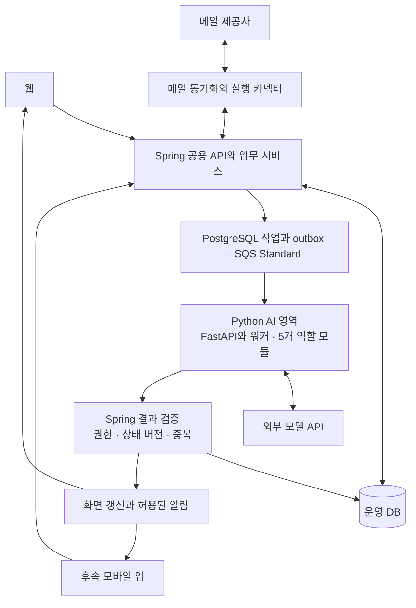

# 통합 이메일 AI 비서 기술 스택 선택 비교 보고서 v1.0

- 작성일: 2026-09-30
- 최신 개정일: 2026-10-03
- 대상 프로젝트: Uteum-Mail
- 문서 목적: 기술 스택 논의의 조건, 비교 근거, 권장 구성과 후속 검증 사항을 정리한다.
- 문서 상태: Spring·FastAPI 분리와 버전 기준, SQS·초기 운영 목표, C안과 화면 프로토타입 우선 진행의 사용자 선택을 반영한 보고서. 남은 세부 선택과 구현·실측 결과는 구분한다.
- 반영 기획서: [웹앱 기획서 v1.6](07-웹앱-기획서-v1.6.md)
- 기존 기준: [에이전트 상세 설계 v0.3](01-에이전트-상세-설계-v0.3.md), [기획서 v1.5](02-웹앱-기획서-v1.5.md), [캘린더 연동 검토](04-이메일-일정-추출-캘린더-연동-기능-검토.md), [사용자 시나리오 v1.0](05-전체-사용자-시나리오-v1.0.md)

## 1. 검토 결론과 결정 상태

2026-10-01 사용자 선택으로 **Spring Boot 공용 백엔드와 Python/FastAPI AI 영역의 분리 구성, Next.js·React·TypeScript 웹, PostgreSQL 운영 DB를 확정**했다. Temurin Java 25 LTS·Spring Boot 4.1.x, Python 3.14.x·FastAPI 0.142.x와 초기 기준 0.142.2, Next.js 16.x·Node.js 24 LTS를 채택한다. 필수 의존성의 Java 25 호환 문제가 확인되면 Java 21 LTS를 사용한다. PostgreSQL 18.x를 초기 검증 기준으로 삼는다. 통합 메일의 상태·권한·실제 실행은 Spring이 관리하고 AI 영역은 의도 해석·분류·문맥 분석·초안 생성을 담당한다. 웹을 먼저 출시하며 앱의 상세 선택은 보류한다.

이 선택의 근거는 메일 기능과 AI 기능의 변경 주기·작업 부하를 나누고 Python 도구를 직접 활용할 수 있다는 점이다. 가장 빠르거나 가장 저렴하다는 실측 결론은 아니다. 아래의 Spring 단일·다른 언어 비교는 선택 근거와 대안 검토 이력으로 남긴다.

| 상태 | 내용 |
| --- | --- |
| 사용자 확인 | 웹부터 진행한다. 별도 앱은 웹 결과물을 보고 후속 진행 여부를 판단한다. |
| 사용자 확인 | 안정성·성능·서비스 확장을 함께 고려한다. 규모와 운영 예산은 미정이며 단계별 확장을 기준으로 판단한다. |
| 사용자 확인 | 수요가 적은 초기에는 고정비를 줄이는 대안을 검토한다. 대체 방식의 개발·유지보수·이전 부담도 비교하며, RDS는 수요와 운영 요구가 커질 때 전환을 검토한다. |
| 사용자 확인 | Java·Spring에 더 익숙하지만, Python 학습 비용은 선택의 불이익으로 계산하지 않는다. |
| 사용자 확인 | 서비스 사이 데이터 형식을 맞추는 수고도 주요 불이익으로 계산하지 않는다. |
| 사용자 확정 | 운영 DB는 PostgreSQL을 사용한다. MySQL에 더 익숙하지만 PostgreSQL 학습을 수용하고 선택했다(2026-10-01). |
| 사용자 확인 | 실제 사용자는 짧고 간단하게 요청한다. 사용자가 상세한 처리 절차를 프롬프트로 작성한다고 가정하지 않는다. |
| 기존 기획 기준 | 4종 메일 지원 목표, 5개 에이전트 역할, 기존 Luna·Sol 배분과 Jev 비교 도입 순서를 유지한다. |
| 사용자 확정 | Spring Boot와 Python/FastAPI AI 영역을 분리하고 Next.js·React·TypeScript 웹을 사용한다. Python 3.14.x, FastAPI 0.142.x, Next.js 16.x, Node.js 24 LTS를 채택한다. |
| 사용자 확정 | Temurin Java 25 LTS·Spring Boot 4.1.x를 사용하고 빌드·메일·DB 드라이버·테스트·APM·필수 플러그인을 검증한다. Java 25 호환 문제 발생 시 Java 21 LTS로 전환한다. |
| 사용자 승인 | PostgreSQL 18.x 검증과 로컬 개발 → 무료 관리형 DB 우선 비교 → 수요·운영 요구에 따른 유료 확장 또는 RDS 이전 검토. 초기 VM·Docker 배포와 현재 저장소 내 Spring·AI·웹 책임 분리 |
| 사용자 확정 | SQS Standard, Spring이 PostgreSQL에서 작업 최종 상태 관리, outbox 기반 발행과 결과 확정 후 메시지 삭제 원칙 |
| 사용자 승인 | pgvector는 관련 메일 검색부터 제한 검증. 읽음·답장·권한·날짜는 SQL과 원본으로 확인. AI는 일반 Python 역할 모듈로 시작하고 복잡한 중단·재개가 필요할 때 실행 라이브러리 비교 |
| 사용자 승인 | 비공개 S3 첨부 저장, CloudWatch 기본 로그·지표, 필요한 구간부터 OpenTelemetry 추적. 백업 7일·DB RPO 5분·RTO 1시간·베타 API 월 99.5%·정식 월 99.9% 목표와 복원 시험 |
| 사용자 승인 | 제공사별 시험, 초기 API·AI 지연·부하·AI 품질·비용 기준. 수치와 조건은 기획서 13.2에 기록하며 실측 통과와 구분한다. |
| 사용자 승인 | 에이전트별 비용 관찰, 판단과 추출·생성의 논리적 분리, 선택적인 화면용 요약 지연 처리, 확률 구간별 실제 오류 기록(2026-10-02). 설계 기준은 9.3에 기록한다. |
| 사용자 확정 | C안: 기존 Luna·Sol 운영 경로를 유지하고 Jev는 합성 자료부터 결과 미반영 평가. 실제 자료는 처리 조건을 갖춘 뒤 평가하고 검증된 범위부터 적용(2026-10-03) |
| 사용자 확정 | 첫 프로토타입은 가상 데이터·정해진 응답으로 S1~S9 전체 핵심 여정의 화면·상호작용 검증. 밝고 간결한 업무형, Next.js·React·TypeScript와 Tailwind CSS·shadcn/ui 사용(2026-10-03) |
| 사용자 보류 | 앱의 출시 여부·시점·OS·프레임워크·캘린더 확대. React Native·Expo 등은 후속 비교 후보로만 유지한다. |
| 사용자 보류 | 시험 조건·요금 정책과 인프라 고도화의 세부 결정. 기획서 정리와 프로토타입을 먼저 진행하고 필요 시점에 재개 |
| 미확정 | DB·VM 사업자·지역·자원·월 예산, 검색 세부 범위·임베딩 모델, 큐 계약의 세부 값, 보관·삭제·백업 구현과 관찰 범위, 유지보수 담당자 |

2026-10-01 후속 결정 1.1~1.7의 추천안을 승인받아 해당 기술과 운영 기준을 반영했다. 구체적인 사업자·예산·임베딩 모델처럼 추천안에서 특정하지 않은 값은 별도 선택한다. 2번 시험 조건·요금 정책과 3번 앱·고도화의 세부 선택은 보류했다. [Java 버전과 AWS 비용 검토](08-Java-버전과-AWS-비용-검토-v1.0.md), [후속 결정 목록](10-후속-결정-목록-v1.0.md)

## 2. 대화에서 비교 기준이 정리된 과정

| 논의 단계 | 검토 내용 | 현재 해석 |
| --- | --- | --- |
| 초기 웹 스택 | Next.js·TypeScript, PostgreSQL, 별도 Node.js 워커 중심의 구성을 검토 | 웹 개발과 백그라운드 처리를 한 언어로 관리하는 초기 제안이었다. Java가 부적합하다는 판단은 아니었다. |
| 안정성과 확장 | 연결 계정 수, 메일량, 초기 동기화, 큐, 재시도, DB 연결 수, AI 비용을 검토 | 사용자 수만으로 서버 용량을 정하지 않고 실제 작업량과 병목으로 확장한다. |
| Spring 검토 | 사용자의 Java 경험과 메일·업무·권한 기능을 고려 | Spring 단일과 별도 Spring 워커 모두 가능한 대안이다. |
| Python AI 검토 | 평가 실험, LangGraph 같은 처리 흐름 도구, 모델 학습·실행 사례를 비교 | 외부 LLM API 호출만으로 Python이 필수는 아니다. 선택한 도구가 실제로 줄여 주는 개발 작업을 판단한다. |
| 장애 설명 보정 | 통신 실패와 오래된 결과 반영이 FastAPI의 고유 단점인지 재검토 | 통신 장애는 정상 구현에서도 발생할 수 있다. 중복·유실·오래된 결과의 사용자 노출은 복구와 상태 검증으로 방어한다. 비동기 상태 변경 문제는 단일 구성에도 있다. |
| 앱 확장 | 공용 API, 로컬 저장, 푸시, 구버전 호환, 기기 캘린더를 검토 | 앱 추가만으로 백엔드 언어를 바꿀 필요는 없다. 모바일 기능과 클라이언트 기술을 별도로 검증한다. |
| 운영 DB 선택 | MySQL 사용 경험, PostgreSQL·pgvector의 활용과 비용을 검토 | 사용자가 PostgreSQL 학습을 수용하고 운영 DB로 확정했다(2026-10-01). |
| 최종 구성 선택 | Spring·FastAPI 분리, 버전·비용·운영 기준을 검토 | Java 25와 호환 문제 시 21 전환, Boot 4.1.x, PostgreSQL 18.x 검증, SQS·VM·Docker·검색 검증·저장·관찰·복구 목표를 채택했다. 앱·고도화·시험 세부 조건·요금 정책은 보류한다(2026-10-01). |

초기에 거론한 Supabase·Render, Drizzle·pg-boss, JobRunr, Redis·BullMQ 등의 제품은 후보 검토 이력이다. 현재 권장 구성의 필수 의존성으로 일괄 채택한 목록이 아니다. 특히 Node.js용 작업 도구를 Spring·Python의 공통 실행 기반으로 자동 승계하지 않는다.

## 3. 프로젝트 요구사항과 비교 전제

우리 서비스는 Gmail·네이버·다음·카카오메일의 통합 조회·발송·동기화와 AI 비서를 함께 제공한다. 제공사별 연동 가능 범위와 실제 품질은 별도 검증한다. AI가 중단돼도 저장된 메일·업무·규칙을 조회하고, AI에 의존하지 않는 동기화·수동 발송 경로를 유지하도록 설계한다.

비교에서는 필요한 권한 검사·재시도·중복 방지·상태 검증을 모든 후보에 구현한다고 가정한다. 특정 언어에만 미흡한 구현을 가정해 안정성 우열을 정하지 않는다. 학습 비용과 초기 데이터 형식 조율은 제외하되, 배포·관찰·복구·회귀 검증의 지속적인 운영 작업은 비교한다.

이 문서의 ‘단일 구성’은 메일과 AI 기능을 같은 백엔드 배포 단위에 넣는 경우다. 복제 인스턴스가 하나라는 의미는 아니다. 같은 언어를 쓰면서 API와 AI 워커를 별도 프로세스로 실행하면, 단일 언어를 사용한 분리 구성에 해당한다.

### 3.1 짧은 요청을 처리하는 사용자 경험

사용자는 “밀린 답장 좀 써줘”, “광고 정리해줘”처럼 요청할 수 있다. 시스템이 현재 화면의 대상, 허용된 계정·검색 범위, 이전 대화와 관련 메일을 활용해 요청을 해석한다. 계정·대상·변경 효과가 모호할 때만 필요한 내용을 좁혀 확인한다. 짧은 요청을 근거로 전체 계정 조회나 임의의 외부 변경 권한을 추정하지 않는다.

인사·잡담·범위 안내·의도 확인만 하는 항목에서 새 자료 조회나 전문 에이전트 호출을 시작하지 않는 기존 정책을 유지한다. 조회·분석·초안 작성과 실제 발송·설정 변경의 권한도 구분한다. 짧은 입력을 이해하는 품질은 문맥 선택·모델·도구·평가 설계에 달려 있으며 Spring과 FastAPI 중 하나의 독점 기능이 아니다.

## 4. Spring 구성 비교

아래는 구조에 따른 비교다. 운영 성능이나 비용의 실측 순위가 아니다.

| 항목 | Spring 단일 | Spring과 별도 Spring AI 워커 | Spring과 Python AI 영역 |
| --- | --- | --- | --- |
| 외부 LLM 호출·도구 실행 | 가능. Java SDK 또는 Spring AI 활용 | 가능 | 가능. Python SDK·AI 도구 활용 |
| 내부 호출 | 같은 프로세스에서는 함수 호출 가능 | HTTP 또는 큐 통신 필요 | HTTP 또는 큐 통신 필요 |
| AI 배포·확장 | 같은 배포 단위를 함께 변경·복제 | AI 워커만 독립 변경·확장 가능 | AI 영역만 독립 변경·확장 가능 |
| 프로세스 장애 | 동일 JVM의 종료·메모리 문제 영향 공유 | 별도 JVM과 자원 제한으로 AI 프로세스 영향 격리 | 별도 프로세스와 자원 제한으로 AI 프로세스 영향 격리 |
| 유지보수 | 호출 관계와 변경을 한 프로젝트에서 추적하기 쉬움 | Java 생태계를 유지하며 실행 책임 분리 | 메일 업무와 Python AI 도구의 변경을 각각 관리 |
| 검증·관찰 | 한 실행 환경에서 재현하기 비교적 단순 | 서비스 사이 작업 상태와 호출 추적 필요 | 서비스 사이 작업 상태와 호출 추적 필요 |
| 초기 운영 | 관리할 실행 종류가 적음 | 실행·배포·복구 대상 증가 | 실행·배포·복구 대상 증가 |
| 선택 근거 | 단순한 배포와 통합 관리 | Java로 통일하면서 장애 격리·독립 확장 | 독립 확장과 Python AI 생태계를 함께 활용 |

Spring AI도 도구 호출과 실행 루프를 지원한다. Java로 에이전트를 구현할 수 없다는 전제는 사용하지 않는다. FastAPI는 Python 기능을 API로 제공하는 프레임워크이며 모델의 정확도나 추론 속도를 자체적으로 높이지 않는다. [Spring AI 도구 호출](https://docs.spring.io/spring-ai/reference/api/tools.html)

프로세스를 나눠도 같은 머신·DB·작업 큐의 장애는 공통 영향을 줄 수 있다. CPU·메모리·DB 연결 수를 제한하고, 메일의 일반 요청이 AI 완료를 기다리지 않도록 해야 한다. AI 의존성의 장애 때문에 정상적인 메일 서버까지 트래픽에서 제외하거나 재시작하지 않도록 상태 검사 기준도 구분한다. [Spring Boot 상태 검사](https://docs.spring.io/spring-boot/reference/actuator/endpoints.html#actuator.endpoints.kubernetes-probes.external-state)

## 5. 다른 언어의 단일 구성 비교

| 후보 | 유리해질 수 있는 조건 | 필요한 설계와 선택 | 이 프로젝트에 대한 평가 |
| --- | --- | --- | --- |
| TypeScript와 NestJS | 웹 UI와 백엔드를 같은 생태계에서 개발하고 외부 API·스트리밍 처리가 많음 | CPU 작업의 이벤트 루프 분리, ORM·큐 구성, Python 도구가 필요할 때의 연결 경로 | 웹 중심의 균형 잡힌 대안. 단일 구성의 자동 우승 후보는 아님 |
| Python과 FastAPI | Python AI 도구를 서비스에 직접 연결하는 일이 많음 | ORM·권한 정책·작업 큐 조합, 비동기 경로에서 블로킹 작업 분리 | AI 개발 비중이 특히 크다면 좋은 단일 후보 |
| Python과 Django | Python AI 도구와 DB 중심 업무 기능·관리 화면을 함께 구성 | 긴 AI 작업과 메일 동기화의 워커 운영, 앱용 API와 권한 설계 | Python으로 전체 서비스를 만들 때 비교할 후보 |
| Go | 동시 연결 처리와 실행 파일 배포, 측정된 서버 자원 병목을 중시 | 업무 기능·메일 연동·AI 도구를 어떤 구성 요소로 묶을지 선택 | 동기화·연결 처리의 자원 효율이 중요해질 때 검토 |
| C#과 ASP.NET Core | 정적 타입과 통합된 인증·운영·웹 API 기능을 함께 원함 | 메일·AI·작업 처리에 필요한 구성과 실제 워크로드 검증 | Spring과 함께 유력한 범용 백엔드 후보 |

NestJS에는 작업 큐 통합이 있고, Django에는 ORM과 관리 화면이 있다. ASP.NET Core도 인증·권한·로그·추적 기능을 제공한다. Go의 고루틴은 동시 작업을 구성하는 수단이다. 이 기능들은 후보의 구현 가능성을 뒷받침하며, 우리 서비스의 처리량·비용 순위를 입증하지는 않는다. [NestJS 작업 큐](https://docs.nestjs.com/techniques/queues), [Django 개요](https://docs.djangoproject.com/en/stable/intro/overview/), [ASP.NET Core 개요](https://learn.microsoft.com/en-us/aspnet/core/overview?view=aspnetcore-10.0), [Go 동시성](https://go.dev/doc/effective_go#goroutines)

## 6. 기능별 성능과 비용 판단

| 작업 | 우선 확인할 병목 | 비교 기준 |
| --- | --- | --- |
| 메일 목록·검색 | DB 쿼리·인덱스, 페이지 처리, 본문·첨부의 불필요한 로딩 | 동일 데이터·쿼리 조건의 p95·p99 응답 시간, 오류율, DB 부하 |
| 계정별 동기화 | 제공사 응답·사용량 제한, 초기 수집, 증분 동기화, 동시 연결 | 계정별 동기화 지연, 처리량, 재연결·재수집 비용 |
| AI 질문·초안 | 검색 범위, 입력 길이, 모델 호출 수, 외부 모델 응답 시간 | 결과 품질, 전체 완료 시간, 재시도 포함 비용 |
| 첨부 처리 | 파일 크기, MIME·문서 파싱, OCR, CPU·메모리 | 동시 작업 시 메일 API 영향, 자원 사용량, 실패·복구 |
| 대량 작업 | 큐 대기 시간, 작업 종류별 우선순위, DB 연결 수 | 대기열의 가장 오래된 작업, 처리 속도, 계정 간 공정성 |

Java 가상 스레드는 I/O 대기가 많은 작업의 처리량에 도움이 될 수 있으나 개별 작업의 계산·추론을 빠르게 만드는 기능은 아니다. Node.js는 이벤트 루프에서 긴 작업을 수행하지 않도록 해야 한다. FastAPI의 비동기 처리도 CPU 작업을 자동으로 병렬화하지 않으므로 별도 프로세스나 적합한 라이브러리가 필요하다. [Java 가상 스레드](https://docs.oracle.com/en/java/javase/25/core/virtual-threads.html), [Node.js 이벤트 루프](https://nodejs.org/en/learn/asynchronous-work/dont-block-the-event-loop), [FastAPI 동시성과 병렬성](https://fastapi.tiangolo.com/async/)

메일 제공사의 사용량 제한은 서버 언어를 바꿔도 없어지지 않는다. Gmail에는 프로젝트·사용자 단위 제한이 있으며, 다른 제공사는 해당 연결 방식과 제한을 각각 확인한다. [Gmail 사용량 제한](https://developers.google.com/workspace/gmail/api/reference/quota)

분리 구성은 실행 환경과 통신 비용을 추가하지만 필요한 작업만 독립적으로 확장할 기회도 제공한다. 월비용은 서버·DB·저장소·네트워크·모델 호출·재시도·관찰 도구를 합산한다. ‘서버가 두 종류이므로 비용이 두 배’ 또는 ‘Python이면 AI 비용이 감소’ 같은 수치는 근거 없이 사용하지 않는다. DB 백업과 첨부 저장소 백업은 각각 복원 범위를 확인한다.

## 7. Python 도구가 실제로 유용해지는 경우

| 사례 | 우리 서비스에 적용하는 예 | 선택에 주는 의미 |
| --- | --- | --- |
| 외부 모델 API 사용 | 요약·분류·날짜 추출·초안 요청 후 결과 검증 | Java에서도 가능. 이것만으로 Python이 필수는 아님 |
| 품질 평가·실험 | ‘회의 확정·취소·변경 제안’ 표본에서 프롬프트·모델별 정확도와 비용 비교 | Python과 Jupyter로 평가할 수 있음. 평가 도구만 Python을 쓰고 운영은 Spring으로 유지할 수도 있음 |
| 복잡한 AI 처리 흐름 | 관련 메일 검색, 요청 연결, 추가 조회, 초안 생성, 사용자 확인 후 재개 | LangGraph 등 선택한 도구가 실제 구현·변경 작업을 줄이면 Python 도입 근거가 됨 |
| 자체 모델 학습·실행 | 반복되는 메일 분류를 작은 모델로 처리할 수 있는지 비교 | Transformers·PyTorch 등을 활용할 수 있음. 학습 데이터·품질·운영비 검증이 선행돼야 함 |

Jupyter는 코드·데이터·결과를 함께 살펴보는 실험 환경이고, LangGraph는 상태 저장과 중단·재개 같은 AI 처리 기능을 제공한다. 운영에서 작업을 복구하려면 영구 저장되는 상태 관리가 필요하다. 자체 모델의 비용 절감이나 품질 향상은 아직 검증하지 않았다. [Jupyter](https://jupyter.org/), [LangGraph 중단·재개](https://docs.langchain.com/oss/python/langgraph/interrupts), [Transformers 텍스트 분류](https://huggingface.co/docs/transformers/main/tasks/sequence_classification)

5개 에이전트가 있다는 이유로 다섯 서버나 특정 에이전트 프레임워크를 도입하지 않는다. 모듈과 명시적인 작업 상태만으로 충분한 구간은 일반 코드로 구현할 수 있다. LangGraph 채택 여부도 검증 대상이다.

## 8. 통신 실패와 데이터 변경의 처리 원칙

### 8.1 통신 장애와 사용자 오류의 구분

응답 시간 초과, 배포·재시작, 일시적인 연결 문제, 부하 증가로 정상 결과를 받지 못할 수 있다. 응답이 없다는 사실만으로 상대 작업이 실행되지 않았다고 판단하지 않는다. 작업 식별자와 처리 상태를 저장하고, 재요청을 같은 작업에 연결한다. 무제한 재시도 대신 횟수·시간·비용 한도와 대기 간격을 둔다. [AWS 재시도와 중복 방지](https://aws.amazon.com/builders-library/making-retries-safe-with-idempotent-APIs/)

통신 실패 자체는 올바른 코드에서도 발생할 수 있다. 작업 유실·중복 실행·잘못된 결과가 사용자에게 드러나는 것을 방어하는 것이 구현과 운영의 책임이다. FastAPI를 사용하면 이런 사용자 오류가 필연적으로 생긴다고 평가하지 않는다. 분리 구성의 실질적인 추가 부담은 통신 구간의 검증·관찰·복구다.

Spring의 일반 DB 트랜잭션은 원격 서비스의 작업을 자동으로 함께 되돌리지 않는다. 외부 LLM 호출도 단일 Spring 구성의 DB 트랜잭션으로 취소되지 않는다. 긴 모델 호출 동안 DB 트랜잭션·연결을 계속 점유하지 않도록 작업을 나눈다. [Spring 트랜잭션](https://docs.spring.io/spring-framework/reference/data-access/transaction/declarative.html)

### 8.2 오래된 AI 결과와 중복 실행 방지

| 상황 | 처리 기준 |
| --- | --- |
| 분석 중 메일 삭제·분석 제외·연결 해제 | 결과 반영 시 현재 권한·대상·삭제 상태를 다시 검증하고 적용하지 않을 작업을 차단 |
| 분석 중 답장 완료·새 답변 도착 | 메일·대화·업무의 관련 상태 변경을 확인하고 오래된 추천·알림을 재검토 |
| 초안 생성 중 사용자 편집 | 사용자 초안을 덮어쓰지 않고 별도 제안 또는 재생성 흐름으로 처리 |
| 재시도·늦은 응답·중복 이벤트 | 같은 작업 식별자와 결과 적용 기록으로 중복 반영 방지 |
| 발송·수신 해제 결과 불명확 | 실제 처리 상태를 확인한 뒤 재시도 여부 결정. SMTP 발송을 무조건 다시 실행하지 않음 |

작업 시작 시 대상과 관련 상태 버전을 기록하고, 결과 저장 시 버전이 맞는 경우에만 조건부로 반영한다. 확인과 저장 사이의 변경도 방어해야 한다. 원본 메일 앱에서 일어난 변경이 아직 동기화되지 않은 경우에는 로컬 DB 버전 확인만으로 최신성을 보장할 수 없다. Gmail 변경 알림도 지연·누락될 수 있으므로 증분 재조회 등 보완 경로가 필요하다. [Gmail 변경 알림의 신뢰성](https://developers.google.com/workspace/gmail/api/guides/push#reliability)

### 8.3 인증과 실제 실행 책임

서비스 간 인증은 Spring과 AI 서비스가 허용된 호출자인지 확인하는 내부 절차다. 정상 흐름에 사용자용 추가 로그인 화면을 요구하는 것은 아니다. 서비스 인증과 사용자의 계정별 접근 권한은 별도로 검사한다.

AI에는 필요한 허용 문맥만 전달하고 메일 연결 토큰·비밀번호를 전달하지 않는다. 일반 메일 발송은 기존 최종 승인 정책을 따르며, AI 결과는 실행 권한이 아니다. 실제 변경과 결과 확정은 Spring의 업무 서비스·실행 제어·커넥터가 수행한다.

## 9. 채택한 웹 구성과 책임 분리

다음 표와 구조도는 채택한 웹·Spring·Python/FastAPI·PostgreSQL과 운영 기준을 표현한다. 실제 프로세스 수·호스팅 사업자·큐 계약의 세부 값은 후속 결정한다.

| 영역 | 선택·권장안 | 책임과 범위 |
| --- | --- | --- |
| 웹 | Next.js 16.x·React·TypeScript, Node.js 24 LTS(확정). 화면 프로토타입에 Tailwind CSS·shadcn/ui 적용(2026-10-03 확정) | 반응형 메일·업무·대화·승인 UI. 첫 화면 체험은 가상 자료 접근, 실제 서비스는 공용 API 사용 |
| 공용 백엔드 | Temurin Java 25 LTS·Spring Boot 4.1.x(확정) | 계정·권한·업무 상태·실제 실행·웹과 앱 API. Java 25 호환 문제 시 21 LTS 전환 |
| 메일 처리 | Spring의 커넥터·백그라운드 작업 | 제공사별 수신·발송·동기화·재연결. API와 별도 확장이 필요하면 워커 분리 |
| AI 영역 | Python 3.14.x·FastAPI 0.142.x(초기 기준 0.142.2)와 AI 워커(확정) | A0~A4 역할, 모델 호출, 허용된 도구 요청, 판단·제안·초안 반환 |
| 운영 데이터 | PostgreSQL 18.x 초기 검증 기준(승인) | 사용자·계정·규칙·업무·작업 상태·결과·중복 방지 기록. 로컬 개발 후 무료 관리형 우선 비교 |
| 관련 메일 검색 | pgvector 제한 검증(승인) | 의미가 유사한 메일 후보 검색. 상세 색인 범위·임베딩 모델은 별도 선택 |
| 첨부 저장 | 비공개 S3(초기 기준 승인) | 접근 권한·보관 기간·삭제·백업 세부 정책을 DB와 함께 설계 |
| 작업 전달 | SQS Standard·PostgreSQL 작업 상태·outbox(승인) | Spring이 최종 상태 관리. 결과 검증·확정 뒤 메시지 삭제, 중복·재시도·실패 복구 |
| 관찰·검증 | CloudWatch 기본 로그·지표와 필요한 구간의 OpenTelemetry(승인) | 동일 작업 식별자로 요청·큐·분석·결과 반영을 연결. 수집 범위·보관량·비용은 별도 설정 |
| 초기 배포 | VM·Docker, 현재 저장소의 Spring·AI·웹 책임 분리(승인) | AI 장기 작업과 HTTP 처리 자원 분리. VM 사업자·규모·담당자는 후속 선택 |

채택한 버전 계열을 기준으로 구현하고 정확한 패치·의존성 조합은 지원 상태와 호환성을 검증해 고정한다. Java 빌드 도구·메일 라이브러리·DB 드라이버·테스트·APM, Boot 지원 범위와 필수 플러그인을 함께 확인한다. Java 25 호환 문제가 확인되면 승인된 대응에 따라 21 LTS로 전환하고 근거·결과를 기록한다. 그 외 버전 계열 변경은 근거와 영향을 제시하고 사용자 선택을 받는다. 현재는 실행 코드·의존성 조합이 없어 빌드·연동 검증 완료를 뜻하지 않는다.

FastAPI는 HTTP 입출력을 제공하는 역할이며, 장기 작업의 저장·재시도·완료를 자동으로 보장하는 작업 큐가 아니다. FastAPI의 인프로세스 BackgroundTasks만을 재시작 복구가 필요한 메일 분석의 유일한 저장·실행 수단으로 사용하지 않는다. API와 워커는 같은 AI 프로젝트에서 관리하되 실제 배포 단위는 부하와 복구 요구로 정한다. [FastAPI 백그라운드 작업](https://fastapi.tiangolo.com/tutorial/background-tasks/)

Spring이 전체 작업의 권한·예산·상태를 관리하고 AI가 필요한 역할의 판단을 반환한다. AI 내부 라이브러리의 재시도와 바깥 작업 큐 재시도가 겹쳐 모델 호출이 증폭되지 않도록 책임을 정한다. 한 작업에 필요한 문맥을 적절한 크기로 전달하고, 대화 전체·모든 계정을 매번 넘기거나 필드마다 서버를 왕복하지 않는다.

### 9.1 pgvector 검색과 임베딩 사용 방식

**승인 범위:** 관련 메일 검색부터 pgvector를 제한적으로 검증하며, 업무 사실은 SQL과 원본 상태로 확인한다. 아래의 세부 색인 범위·임베딩 모델·검색 조합은 이 프로젝트에 대한 추가 추천이며 사용자 선택 전이다.

임베딩 모델은 메일이나 질문을 의미 비교에 사용할 숫자 배열로 변환한다. pgvector는 그 배열을 PostgreSQL에 저장하고 가까운 배열을 검색한다. 답장 초안은 검색한 원문을 근거로 생성 모델이 작성한다. pgvector의 기능은 벡터 저장과 유사도 검색이며 임베딩 생성은 별도 모델이 맡는다. [pgvector 공식 문서](https://github.com/pgvector/pgvector), [OpenAI 임베딩 설명](https://developers.openai.com/api/docs/guides/embeddings)

일반적인 검색 후 생성 방식은 다음과 같다. 검색한 자료를 모델의 입력 근거로 사용하는 방식을 RAG라고 부른다.

1. **색인 준비:** 분석이 허용된 메일의 제목·본문에서 반복 인용·서명을 정리한다. 짧은 메일은 하나의 단위로, 긴 본문은 문맥이 유지되는 부분으로 나눠 임베딩한다. 원문은 보존하고 메일·대화 ID, 본문 버전, 임베딩 모델·차원을 함께 관리한다.
2. **검색:** 질문도 같은 모델·차원으로 변환한다. Spring이 확인한 사용자·계정 권한과 삭제·분석 제외 조건을 검색 쿼리에 적용하고, 키워드·발신자·기간 조건과 의미 검색을 조합해 후보를 찾는다.
3. **근거 보강:** 후보의 앞뒤 대화·최신 메일·보낸 메일·업무 상태를 확인한다. 정확한 날짜·금액·계정·권한은 원문과 구조화된 값으로 검증한다.
4. **응답 생성:** 필요한 원문과 확인된 상태를 AI에 전달해 답변·초안을 만들고 근거 메일을 연결한다. 실제 상태 반영과 외부 발송은 기존 Spring 검증·사용자 승인 규칙을 따른다.

| 초기 세부 범위 추천 | 적용 방식 | 범위·비용 판단 |
| --- | --- | --- |
| 관련 메일 찾기 | “견적 이야기한 메일”, “배송이 늦어진 건”처럼 표현이 달라도 관련 후보 검색 | 제목·본문 우선. 한국어 고유명사·제품 번호는 키워드 검색으로 보완 |
| 답장 초안의 문맥 찾기 | 현재 대화를 직접 조회하고, 필요한 경우 관련된 과거 대화를 검색 | 현재 대화만으로 충분하면 추가 벡터 검색을 생략 |
| 후속 요청 확인 | 업무·대화 상태로 대상을 조회하고 관련 메일을 보강 | 상위 유사 메일 몇 건만으로 전체 미답변 요청을 빠짐없이 찾았다고 판단하지 않음 |
| 후속 확장 후보 | 첨부 문서 텍스트·OCR·넓은 과거 이력 | 파싱·색인·재처리 비용을 확인한 뒤 확대. 초기 세부 범위 선택 시 별도 판단 |

예를 들어 “거래처 요청 중 아직 답하지 않은 것 찾아줘”는 관련 거래처·업무와 동기화 범위를 먼저 확인한다. 보낸 메일이 있어도 일부 요청이 해결되지 않았을 수 있으므로 대화 내용과 업무 상태를 함께 판단한다. 수집되지 않은 외부 답장이나 전화 처리까지 알 수 없으면 확인 필요로 표시한다. 의미 검색의 유사도만으로 미답변 여부를 확정하지 않는다.

작은 표본은 정확 검색을 기준으로 품질을 확인하고, 검색 지연이 문제가 될 때 HNSW 같은 근사 인덱스를 비교하는 안을 추천한다. pgvector는 정확 검색과 근사 검색을 지원하며, 근사 인덱스는 속도와 검색 누락 사이의 절충이 있다. 권한·계정 필터를 적용한 상태에서 결과 수와 품질을 검증한다. [pgvector 검색·필터·인덱스](https://github.com/pgvector/pgvector#filtering)

| 임베딩 후보 | 방식 | 이 프로젝트에 대한 판단 |
| --- | --- | --- |
| OpenAI `text-embedding-3-small` | API 호출, 기본 1,536차원 | 프로토타입의 첫 비교 기준으로 추천. 모델 서버를 운영하지 않고 시작할 수 있음. 호출 비용·외부 본문 전송·한국어 메일 검색 품질을 확인해야 하며 아직 채택 전 |
| BAAI `bge-m3` | 직접 실행하는 다국어 모델, 1,024차원 | 외부 임베딩 API 의존성을 줄이는 대안. 모델 로딩·CPU/GPU 자원·처리량·배포·Python 의존성 관리가 추가되므로 무료 운영을 보장하지 않음 |

모델 사양 근거: [OpenAI 기본 차원](https://developers.openai.com/api/docs/guides/embeddings#how-to-get-embeddings), [BGE-M3 공식 모델 카드](https://huggingface.co/BAAI/bge-m3). 한국어 업무 메일에서 어느 모델이 더 정확한지는 아직 측정하지 않았다. 모델·차원 또는 전처리 방식을 바꾸면 기존 벡터의 재생성·전환을 계획해야 하며, 서로 다른 모델의 벡터를 그대로 섞어 비교하지 않는다. 신규·변경 본문 중심으로 임베딩하고 삭제·분석 제외 시 검색 대상과 관련 벡터에 함께 반영한다.

### 9.2 AI 실행 도구와 작업 책임

**사용자 승인:** 처음에는 일반 Python 함수·모듈로 5개 역할을 구현한다. FastAPI는 HTTP 입출력, 별도 AI 워커는 장기 작업, SQS는 전달, Spring과 PostgreSQL은 업무 상태·최종 완료를 담당한다. 모델 호출 SDK와 입력·출력 검증을 조합하는 구현으로 시작할 수 있으며, 5개 역할을 구현하기 위해 에이전트 프레임워크를 반드시 추가할 필요는 없다.

LangGraph는 여러 단계의 상태를 저장하고 중단 후 재개하거나 사용자 확인을 기다리는 흐름이 복잡해질 때 비교할 후속 도구다. 공식 기능에는 체크포인트를 통한 상태 저장·재개가 포함된다. 도입하더라도 내부 실행 상태와 Spring의 업무 최종 상태를 구분하고 재시도·완료 책임을 다시 검증한다. 특정 실행 라이브러리는 현재 채택하지 않는다. [LangGraph 상태 저장](https://docs.langchain.com/oss/python/langgraph/persistence)

### 9.3 AI 판단·추출과 비용·품질 관찰

2026-10-02 사용자가 다음 네 가지를 승인했다. 일반 Python 역할 모듈과 기존 작업·관찰 구성을 기준으로 구현하며, 초기 Luna·Sol 배분과 Jev 비교 도입 순서는 유지한다.

**판단과 추출·생성의 분리:** A1의 유형·중요도·답장 필요성·업무 요청 신호와, 요약·행동 언급 후보를 구분해 입력·출력 책임과 검증 기준을 정의한다. 논리적 구분은 매번 두 번의 API 호출이나 별도 서비스 배포를 뜻하지 않는다. 초기 Luna 호출에서 두 결과를 함께 받아 기준선을 만들 수 있고, 조건부 추가 호출은 같은 품질 조건에서 비용·지연을 비교한다. 광고라는 유형이나 중요하지 않다는 판단만으로 업무 요청 분석을 생략하지 않는다. A2의 복수 업무 연결·복수 변경 제안과 Spring의 권한·근거·최신 상태 검증은 기존 상세 설계를 따른다.

**선택적인 요약 지연 처리:** 사용자가 허용한 분석 범위에서 화면 표시용 요약은 해당 내용을 볼 때 생성할 수 있다. 업무 요청·기한·답변 대기 분석은 초기 수집과 새 메일 처리 중 백그라운드에서 진행하며 화면 열람을 조건으로 삼지 않는다. 필수 판단이 모호하면 기존 재검토·검토 필요 처리로 넘긴다. 선택적인 요약의 생성 상태와 필수 분석의 완료 상태를 구분해, 요약을 기다리는 동안에도 이미 확인된 중요 메일·업무 후보를 표시한다.

**에이전트별 비용 관찰:** A0~A4 역할과 판단·추출·초안 등 호출 목적별로 다음을 기록하고, 기존 CloudWatch와 필요한 구간의 OpenTelemetry 추적에 연결한다.

- 작업 ID·역할·호출 목적·호출 시도, 실제 제공사·모델 ID·버전과 적용 단가 기준을 연결한다. 운영 호출과 결과 미반영 비교 호출은 분리 집계한다.
- 제공사가 반환하는 입력·출력·캐시 읽기·쓰기 등의 사용량과 재시도 비용을 기록한다. 추론 토큰 등 하위 항목은 제공사의 과금 정의에 맞춰 중복 합산을 피한다. 제공되지 않은 값은 0으로 처리하지 않고 미확인·추정으로 구분한다.
- Sol 재검토 사유·전환 건수·호출 수, 큐 대기·모델 호출·결과 검증 시간과 최종 성공·실패 상태를 기록한다. 재검토율은 각 역할의 판단 대상 고유 작업 중 Sol 재검토로 넘어간 작업의 비율로 계산하고, 재시도 호출 수·비용은 별도 집계한다.

비용·품질 관찰용 로그에는 메일 본문·전체 프롬프트·인증 토큰을 넣지 않고, 접근이 통제된 작업·평가 기록의 식별자를 연결한다. 수집률·보관 기간·경보·비용 한도는 후속 결정한다. 문서의 가정 비용과 실측 비용을 구분하며, 모델 교체 효과와 재검토율 변경 효과를 각각 비교한다.

**확률 구간별 실제 오류 기록:** 제공사가 반환한 확률·confidence의 종류와 모델·판단 결과를 평가 기록에 남기고, 구간별 표본 수·실제 오류·중요 메일 누락·재검토율을 함께 집계한다. 높은 확률로 중요하지 않다고 분류한 결과도 표본 검사한다. 제공하지 않는 확률을 임의로 만들거나 서로 다른 모델의 점수를 같은 정답률로 해석하지 않는다. 규칙 적용 여부·메일 유형·길이에 따른 차이를 구분하고, 기존 조정용·평가용 표본 분리 원칙을 따른다. 확률은 기존 문맥 부족·규칙 충돌·근거 불일치 재검토 조건을 보완하는 신호로 사용한다.

2026-10-03 사용자는 **C안**을 확정했다. 실제 서버·AI 연결 단계에서는 A0·A4 Sol, A1~A3 Luna와 조건부 Sol 재검토로 기준 성능을 측정한다. Jev는 합성 자료부터 결과 미반영 평가를 수행하며 운영 응답이 비교 호출을 기다리지 않게 한다. 실제 베타 메일을 보내기 전에 해당 처리의 계약·공개·안내·국외 이전 근거를 확인한다. 중요한 메일 누락·전체 업무 성공·재검토 포함 총비용·전체 지연을 비교하고 적용 범위·임계값·예산은 사용자 선택을 받는다. Decisions API는 실제 접근·기능·가격을 확인한 뒤 비교 후보로 검토하며 일정의 전제 조건으로 두지 않는다.

**공통 어댑터와 점수 처리:** 판단·근거·모델·버전·사용량은 공통으로 연결하되, 공급자별 점수 제공 여부와 의미를 보존한다. 점수가 없는 결과에 임의의 확률을 채우지 않는다. 재검토 정책은 어댑터 밖의 코드로 관리하고 임계값·보정은 모델과 업무별 평가에 따른다. 동일 출력 형식만으로 같은 확률이나 설정 변경만으로 운영 전환이 가능하다고 판단하지 않는다.

**logprobs의 위치:** enum은 출력 선택지를 제한하고 logprobs는 출력 토큰의 확률 정보를 제공한다. 이를 실제 업무 정답률이나 Jev의 확률·confidence와 동일하게 취급하지 않는다. logprobs는 선택적 실험 항목으로 두고 모델·엔드포인트·추론 설정·구조화 출력의 조합을 확인한다. 2026-10-03 확인한 공식 안내는 추론 수준이 `none`이 아닐 때 logprobs 관련 매개변수를 제거하도록 명시한다. [OpenAI 토큰 확률 설명](https://developers.openai.com/api/docs/guides/advanced-usage#token-log-probabilities), [모델 매개변수 호환 안내](https://developers.openai.com/api/docs/guides/latest-model#gpt-6-astra-update-api-and-model-parameters)

첫 화면 프로토타입은 가상 결과를 사용하므로 위 AI 비용·품질을 측정하지 않는다. 대화에서 제시된 25~27%·29% 절감, 절감 효과의 95% 확보, 사용자당 월 $6 차이는 확정 성과로 채택하지 않는다. 기존 비용 계산에는 Sol 재검토율 감소 등 가정이 포함돼 있으므로 실제 모델 비교에서 구조 변경·모델 교체·재검토율 변경의 효과를 분리해 검증한다.

Jev 도입형의 역할별 책임, 제한된 업무 경로 선택, 기존 LLM 경로 복귀와 전체 업무 검증은 [에이전트+결정모델 세부 구조](12-에이전트+결정모델-세부-구조-v1.0.md)에 별도 설계안으로 정리한다. 이 절은 두 구성에 공통으로 적용할 판단·추출·관찰 기준이다.

## 10. 웹 이후 앱을 출시할 때의 차이

앱의 상세 결정은 2026-10-01 사용자 요청으로 보류했다. 아래 내용은 후속 검토를 위한 비교 이력이며 두 OS 동시 출시를 확정한 것은 아니다. 재개 조건과 남은 선택은 [후속 결정 목록](10-후속-결정-목록-v1.0.md)에 모았다. 앱의 언어와 서버의 언어는 같을 필요가 없다.

| 항목 | 앱까지 제공할 때 필요한 준비 |
| --- | --- |
| 공용 API | 메일·규칙·업무·AI 작업을 웹과 앱에서 같은 권한·규칙으로 호출 |
| 연결 복구 | 앱 종료·잠금·네트워크 전환 후 작업 식별자로 진행 상태와 결과 조회 |
| 로컬 저장 | 내려받은 메일·초안의 캐시, 삭제 전파, 기기와 서버의 충돌 처리 |
| 여러 기기 | 읽음·초안·업무 상태와 알림 설정을 동기화하고 오래된 변경 적용 방지 |
| 로그인 | 앱 복귀 경로, 세션 갱신, 기기별 로그아웃과 안전한 자격 증명 보관 |
| 푸시 | 기기별 토큰·권한 관리. 푸시 접수·전달·앱 데이터 반영을 구분 |
| 버전 호환 | 구버전 앱이 사용하는 API와 데이터 형식의 지원 범위 관리 |
| 성능 | 긴 메일 목록·본문·첨부 표시, 필요한 데이터만 전송, 배터리·모바일 데이터 사용량 검증 |

메일의 상시 수집·AI 분석·리마인더 계산은 서버에서 수행한다. iOS와 Android는 백그라운드 실행을 제한하므로 앱이 계속 실행된다고 가정하지 않는다. 푸시는 유일한 동기화 경로로 삼지 않고 앱 재접속 시 서버의 최신 상태를 다시 확인한다. [Apple 백그라운드 실행](https://developer.apple.com/documentation/BackgroundTasks/choosing-background-strategies-for-your-app), [Android 백그라운드 작업](https://developer.android.com/develop/background-work/background-tasks), [FCM 전달 상태](https://firebase.google.com/docs/cloud-messaging/customize-messages/setting-message-lifespan)

### 10.1 모바일 클라이언트 후보

| 후보 | 장점 | 검증할 부분 |
| --- | --- | --- |
| React Native와 Expo | React 웹과 API 클라이언트·일부 TypeScript 로직 공유, 두 OS 개발 | 웹 DOM·CSS 화면이 자동 재사용되지는 않음. 캘린더·푸시·첨부·공유와 필요한 네이티브 모듈 검증 |
| Flutter | 두 OS의 앱 UI를 일관되게 구성하고 맞춤 화면 구현 | React 웹과의 코드 공유 범위가 작음. 일부 기능은 플랫폼 코드 필요 |
| Kotlin과 Swift | OS별 기능과 사용자 경험의 세밀한 제어 | 두 클라이언트의 기능·테스트·배포를 각각 유지 |

웹에 React를 채택한다면 React Native와 Expo를 첫 검토 후보로 둔다. Expo는 개발 빌드로 별도 네이티브 라이브러리·설정을 포함할 수 있다. 최종 선택은 실제 메일 목록·본문·초안 편집과 기기 연동을 시험한 뒤 한다. [React Native 플랫폼별 코드](https://reactnative.dev/docs/platform-specific-code), [Expo 개발 빌드](https://docs.expo.dev/develop/development-builds/introduction/), [Flutter 플랫폼 연동](https://docs.flutter.dev/platform-integration/platform-channels)

### 10.2 캘린더 지원 범위

기존 검토대로 웹에서는 Google API와 iCloud CalDAV 경로를 각각 검증한다. 앱을 제공하면 iOS EventKit과 Android Calendar Provider로 기기에 노출된 캘린더에 접근하는 경로가 추가된다. 사용자 권한과 캘린더의 쓰기 가능 여부에 따라 범위가 달라진다. 앱 개발이 모든 삼성 계정 캘린더의 서버 직접 연동을 보장하지는 않는다. [Apple EventKit](https://developer.apple.com/documentation/eventkit/accessing-the-event-store), [Android Calendar Provider](https://developer.android.com/identity/providers/calendar-provider)

기기 연결을 사용하면 ‘웹에서 승인 → 서버가 기기에 작업 전달 → 앱이 캘린더 반영 → 결과 보고’ 흐름을 검증할 수 있다. 기기가 꺼져 있거나 실행이 지연되면 반영 대기로 표시한다. 작업 전송·푸시 접수를 일정 등록 완료로 표시하지 않는다. 캘린더는 기존 P1 검토 범위를 유지한다.

## 11. 초기 진행과 고도화 문서

먼저 [웹 프로토타입 기획서](14-웹-프로토타입-기획서-v1.0.md)와 [구현 계획서](15-웹-프로토타입-구현-계획서-v1.0.md)에 따라 가상 자료로 화면·상호작용을 검증한다. React 공통 상태·버전이 있는 localStorage·비동기 가상 자료 접근을 사용하며 실제 인증·메일·모델·DB·큐 연결은 이 단계에 포함하지 않는다. 화면 검토 이후 제공사별 연결·동기화, 공용 API, 권한·작업 복구와 Luna·Sol 기준 성능을 검증한다. 출시 후 API·동기화·AI 대기·오류·비용을 각각 관찰한다.

실제 서버를 연결하는 초기 구성은 VM·Docker와 SQS Standard를 기준으로 진행한다. DB는 PostgreSQL 18.x 로컬 개발 후 무료 관리형을 우선 검증하고, 실제 수요·용량·복구 요구에 따라 유료 확장이나 RDS 이전을 비교한다. 무료 한도만으로 운영 적합성을 판단하지 않고 승인된 백업·가용성 목표를 검증한다. 사업자·운영 예산은 별도 선택하며 무료 한도·유휴 비용·유지보수 차이는 [Java 버전과 AWS 비용 검토](08-Java-버전과-AWS-비용-검토-v1.0.md)에 기록한다.

RDS 이전·ECS/Fargate·Multi-AZ·자동 확장·검색·관찰 도구 확장 등은 사용자 요청에 따라 [인프라 고도화 계획](09-인프라-고도화-계획-v1.0.md)으로 분리했다. 백업·복원과 기본 관찰은 초기 운영에서도 구체화하고, 후속 제품의 도입은 실제 병목·복구 요구·예산을 확인한 뒤 선택한다.

## 12. 구현 전후 검증 항목

2026-10-01 사용자가 제공사 시험과 성능·AI 품질·비용 기준 및 백업·복구·가용성 목표를 승인했다. 아래는 검증 방법이며 수치 목표는 [기획서 13.2](07-웹앱-기획서-v1.6.md#132-기술-구성과-앱-확장의-검증-기준)에 기록한다. 시험 환경·표본·요금 정책의 세부 결정은 기획서 정리와 프로토타입 이후로 보류했다. 아직 구현·시험 통과 결과는 없다. p95·p99는 각각 요청의 95%·99%가 완료되는 지연 경계를 뜻한다.

| 검증 | 방법 | 확인할 결과 |
| --- | --- | --- |
| 일반 API 성능 | 동일 메일 데이터·DB·인덱스·서버 자원으로 목록·검색 비교 | p95·p99 지연, 오류율, CPU·메모리·DB 연결 사용량 |
| AI와 메일 동시 부하 | 초기 수집·분류·대화·일반 조회를 함께 실행 | AI 작업 증가가 메일 조회·동기화에 주는 영향 |
| 서버와 모델 지연 분리 | 모델 응답을 고정한 시험과 실제 모델 시험을 별도로 수행 | 서버 통신·큐 비용과 실제 AI 품질·비용을 구분 |
| 프로세스·통신 장애 | AI 워커 종료·재시작, 시간 초과, 늦은 응답을 재현 | 기본 메일 경로 유지, 저장된 작업 재개, 중복 반영 방지 |
| 상태 변경 | 분석 중 삭제·답장·새 메일·초안 편집·권한 해제를 재현 | 오래된 결과의 적용 차단과 사용자 수정 보존 |
| 외부 실행 | 제공사별 발송 결과 불명확·재연결·중복 이벤트를 시험 | 재발송을 무조건 반복하지 않고 실제 상태를 확인 |
| AI 품질 | 정답 표본과 짧은 요청, 확정·취소·제안·중요 광고 등을 평가 | 중요 메일 누락, 잘못된 업무·알림, 수정 부담, 재시도 포함 비용 |
| AI 비용·확률 구간 | 9.3의 역할별 호출·사용량·재검토 사유와 구간별 정답·오류를 연결 | 높은 확률의 중요 메일 누락, 재검토율 변화에 따른 비용·품질, 선택적인 요약 지연의 효과 |
| 복원·앱 | DB·첨부 복원, 후속 앱의 연결 복구·구버전 API·푸시 누락을 시험 | 복원 범위·소요 시간, 서버와 클라이언트 상태 일치 |

목표 수치는 승인됐지만 서버·DB 자원, 평가 표본의 구성, 대화 길이·동시 AI 수, 동시 계정 수와 월 예산은 구체화해야 한다. 공개된 단순 HTTP 벤치마크나 제안한 부하 시나리오를 우리 서비스의 검증된 수용량으로 제시하지 않는다. Python 평가 도구를 사용한다는 사실도 FastAPI 운영 도입의 필수 조건으로 해석하지 않는다.

## 13. 기획서 반영 범위와 후속 결정

[기획서 v1.6](07-웹앱-기획서-v1.6.md)에 채택한 스택·버전 계열과 승인된 검증 목표를 반영했다. 2026-10-02 승인한 판단·추출 분리, 선택적인 요약 지연, 역할별 비용·확률 구간별 오류 관찰도 해당 절에 반영했다. 4종 메일 지원 목표, 5개 에이전트, 초기 모델 배분·Jev 비교 순서, P0·P1의 기존 구분은 유지한다.

앞으로 결정할 항목만 [후속 결정 목록](10-후속-결정-목록-v1.0.md)에 추천안·대안·선택 시점과 함께 관리한다. 확정한 기술과 책임은 이 보고서 1·9장, 제품 방향과 승인된 검증 목표는 기획서의 해당 절에 반영한다. Java와 SQS·RDS의 판단 근거는 [Java 버전과 AWS 비용 검토](08-Java-버전과-AWS-비용-검토-v1.0.md), 나중에 적용할 확장 구성은 [인프라 고도화 계획](09-인프라-고도화-계획-v1.0.md)을 따른다. 앱 결정은 보류 상태다.

2026-10-01 사용자 지정 진행 방식: 위 항목과 이후 추가되는 결정 사항은 필요한 시점에 추천안·추천 이유·주요 대안과 차이·관련 영향을 함께 제시하고 사용자에게 질문한다. 사용자가 검토하거나 추가로 조사·질문한 뒤 선택하면 확정한다. 여러 항목은 현재 단계에서 필요한 순서로 다루며, 이 방식은 [프로젝트 지침](../AGENTS.md)에 기록한다.

구성 비교의 공식 자료는 2026-09-30 기준이다. 2026-10-01 버전·가격 확인의 출처와 가정은 별도 비용 검토 문서에 기록했다. 공식 지원 기능·가격과 프로젝트 추천·추정치를 구분하며, 법률·스토어 정책·모델 성능 전체를 이번 개정에서 재검증한 것은 아니다.
