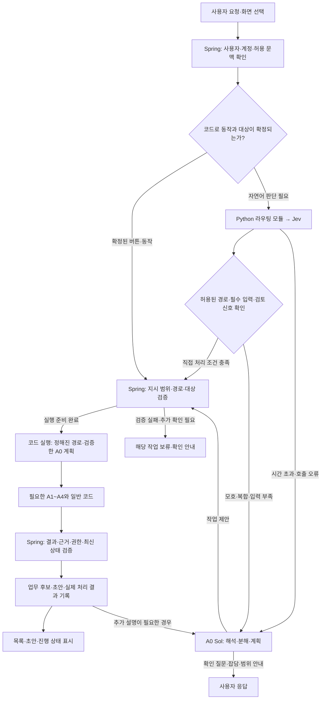
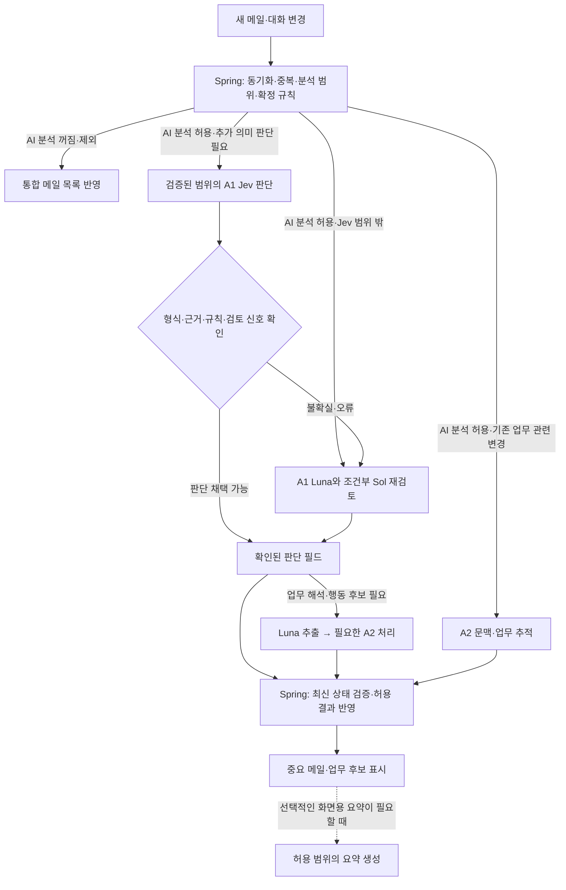

# 통합 이메일 AI 비서 — 에이전트+결정모델 세부 구조 v1.0

- 작성일: 2026-10-02
- 최신 개정일: 2026-10-06
- 문서 목적: 일반 LLM 기반 멀티에이전트를 기준으로, Jev의 제한된 판단·라우팅과 생성 LLM을 결합하는 구조를 정리한다.
- 문서 상태: **C안이 확정된 Jev 도입형 상세 설계안. 기존 Luna·Sol 운영 경로와 결과 미반영 평가를 구분하며, 실제 적용 경로는 검증 후 선택한다.**
- 구현·검증 상태: 실제 API 호출·한국어 평가·운영 적용 전. 성능·정확도·비용 절감의 달성을 주장하는 문서가 아니다.
- 관련 문서: [일반 LLM 기반 에이전트 상세 설계 v0.3](01-에이전트-상세-설계-v0.3.md), [기술 스택 보고서](06-기술-스택-선택-비교-보고서-v1.0.md), [웹앱 기획서](07-웹앱-기획서-v1.6.md), [후속 결정 목록](10-후속-결정-목록-v1.0.md), [Jev와 외부 AI 개인정보 검토](11-Jev와-외부-AI-개인정보-검토-v1.0.md)

## 1. 설계 목적과 결정 상태

일반 LLM형은 A0 Sol이 사용자 요청을 해석·분해하고, A1~A4가 정해진 역할을 수행하는 기준 구성이다. Jev 도입형은 이 역할 안에서 선택지가 정해진 판단과 업무 경로 선택을 Jev에 맡기는 구성을 비교한다. 복잡한 요청의 해석·계획은 A0, 요약·행동 후보·답장 생성은 생성 LLM, 실제 상태 변경과 실행은 Spring이 담당한다.

두 구성은 동일한 메일·업무 서비스, 권한 검사, 작업 기록과 전문 역할을 공유한다. 모델별 어댑터와 적용 설정으로 비교하며, 서로 다른 제품이나 별도 업무 DB를 만드는 구성을 전제로 하지 않는다.

| 상태 | 내용 |
| --- | --- |
| 사용자 확정 | Luna·Sol 기준 성능 확보 → 동일한 허용 자료로 Jev 결과 미반영 비교 → 중요한 메일 누락이 늘지 않는 검증 범위부터 적용 |
| 사용자 확정 | C안으로 진행. Jev 비교는 합성 자료부터 시작하며 실제 베타 자료는 처리 조건을 갖춘 뒤 사용. 화면·상호작용 프로토타입 검토 후 실제 서버·AI 연결(2026-10-03) |
| 사용자 확정 | A0 오케스트레이터·A4 응답 작성은 Sol. A1 메일 이해·분류, A2 문맥·업무 추적, A3 서비스·수신 관리는 Luna 기본과 조건부 Sol 재검토 |
| 사용자 확정 | Spring Boot 공용 백엔드와 Python/FastAPI AI 영역 분리. PostgreSQL·SQS Standard와 Spring의 작업 최종 상태 관리 |
| 사용자 승인 | 에이전트별 비용 관찰, 판단과 추출·생성의 논리적 분리, 선택적인 화면용 요약 지연, 확률 구간별 실제 오류 기록(2026-10-02) |
| 사용자 문서화 요청 | 지금까지 검토한 Jev 도입형 아키텍처를 기존 원문과 구분한 새 문서로 정리(2026-10-02) |
| 사용자 요청 반영 | A0 기능별 계약·관찰과 계층형 비교를 구체화. Sol 기준선, Luna 기본안, 결정 모델 게이트 안의 비교이며 운영 전환은 평가 후 선택(2026-10-06) |
| 설계·비교 제안 | 제한된 업무 경로 선택으로 일부 A0 호출 생략, 불확실한 라우팅의 A0 Sol 복귀, 역할 내부의 선택형 판단 보조 |
| 미정 | 실제 적용할 경로·모델별 임계값·입출력 명세·시간 및 비용 한도·제공사 호출 경로·운영 전환 범위 |

이 문서의 라우팅 경로와 내부 필드명은 구현·평가를 위한 설계안이다. 기존의 A1 첫 비교 범위는 유지하고, 라우팅을 추가 비교할 범위와 운영 전환은 측정 근거를 바탕으로 선택한다. 원문에 있는 Jev 비교 모델 `jev-1.13.0`을 출발점으로 검토하되, 연결 시 해당 고정 버전의 접근 가능 여부와 계약을 확인한다. Luna·Sol의 실제 호출 모델 ID·엔드포인트·추론 설정도 구현 시 고정·기록한다.

첫 [화면 프로토타입](14-웹-프로토타입-기획서-v1.0.md)은 가상 자료와 정해진 응답으로 사용자 경험을 확인하며 모델 어댑터를 호출하지 않는다. 그 이후 실제 모델 기준선과 Jev 평가를 수행한다. Decisions API는 실제 접근·기능·가격을 확인한 뒤 비교 후보로 검토하며 출시를 기다리는 일정 의존성을 만들지 않는다.

## 2. 일반 LLM형과 Jev 도입형의 차이

| 항목 | 일반 LLM형 기준 구성 | Jev 도입형 설계안 |
| --- | --- | --- |
| 자연어 요청 진입 | A0 Sol이 의도·대상·작업 순서를 해석 | 제한된 업무 경로는 Jev로 선택하고, 준비된 입력으로 실행 가능한 경우 A0 호출 생략 검토 |
| 복합·모호한 요청 | A0가 요청 항목과 의존 관계를 구성 | A0가 동일한 역할 수행. 정해진 복합 업무 경로에 완전히 들어맞는 경우만 직접 연결 검토 |
| A1 판단 | Luna가 필요한 분류·업무 신호를 판단 | 검증된 판단 필드를 Jev가 담당하고 불확실한 경우 기존 Luna·Sol 경로로 복귀 |
| 추출·생성 | Luna의 요약·행동 후보, Sol의 답장 초안 | 동일한 생성 역할 사용. 선택적인 화면용 요약만 필요 시 지연 |
| A2·A3 | Luna가 문맥·서비스 조건을 해석하고 필요시 Sol 재검토 | 이미 준비한 후보 중 선택 등 좁은 판단만 후속 비교 |
| 버튼·동기화·기한 이벤트 | 코드가 이미 정해진 경로를 실행 | 동일한 코드 경로 사용. 라우팅이 필요 없는 이벤트에 Jev를 추가하지 않음 |
| 실행·업무 상태 | Spring이 권한·최신 상태·중복을 검사해 확정 | 동일한 책임. Jev 출력은 실행 권한이나 업무 완료의 증거가 아님 |
| 관찰·평가 | 역할별 비용·지연·품질 기록 | Jev 비용·선택 경로·복귀 사유·경로 오류와 전체 업무 결과를 추가 비교 |

여기서 **에이전트·업무 경로 라우팅**은 어떤 역할과 처리 순서를 사용할지 고르는 것이다. **모델 라우팅**은 같은 판단에 Luna 또는 Sol을 사용할지 고르는 것이다. **작업 계획**은 새로운 요청을 나누고 의존 관계를 만드는 것으로, A0의 책임이다. 세 기능의 비용과 오류를 따로 집계한다.

## 3. 전체 구조와 배치

### 3.1 사용자 요청의 처리 구조

아래는 검증을 통과한 범위에 적용할 후보 흐름이다. 결과 미반영 비교 단계에서는 Jev의 선택을 평가 기록에만 남기며, 실제 사용자 처리는 기존 경로로 진행한다.



선택된 경로가 허용 목록에 있다는 사실만으로 사용자의 의도와 일치한다고 확정하지 않는다. 입력 부족·결과 충돌은 실행 전에 걸러내고, 의미상 잘못된 경로 선택은 실제 업무 결과 평가로 확인한다. 결과 설명을 위해 A0를 다시 호출하면 해당 비용·지연도 전체 처리에 포함한다.

### 3.2 시스템 책임과 배포 단위

| 구성 | 책임 |
| --- | --- |
| 웹·후속 앱 | 사용자 입력, 현재 선택한 메일·업무, 진행 상태·초안·확인 UI |
| Spring | 사용자·계정 권한, 문맥 접근, 허용 경로·입력 검증, 메일·업무·규칙의 최종 상태, 실제 실행 |
| Python/FastAPI·AI 워커 | A0~A4, Jev 요청 구성·응답 검증, 생성 모델 호출, 판단·제안 반환 |
| Jev 어댑터 | 허용된 상태와 제한된 질문 전달, 선택·확률·사용량의 제공사별 차이 정리 |
| PostgreSQL·SQS | Spring의 영구 작업 기록과 outbox, 작업 전달·재전달·완료 기록 |
| 관찰·평가 기록 | 역할·호출·모델·경로·비용·오류를 작업 ID로 연결. 운영 데이터와 비교 결과의 적용 경계 유지 |

Jev 판단은 기존 Python 역할 모듈에서 호출한다. FastAPI는 HTTP 입출력을 제공하고 장기 분석은 AI 워커에서 처리한다. 각 역할이나 Jev 호출마다 별도 서비스를 배포할 필요는 없다. 초기 VM·Docker 및 이후 확장 기준은 [스택 보고서](06-기술-스택-선택-비교-보고서-v1.0.md)와 [인프라 고도화 계획](09-인프라-고도화-계획-v1.0.md)을 따른다.

## 4. 역할별 책임과 결정 모델 적용 범위

| 역할 | Jev가 맡을 수 있는 판단 | 생성 LLM과 코드에 남는 책임 | 비교 우선순위 |
| --- | --- | --- | --- |
| A0 오케스트레이터 | 지원하는 업무 경로 선택, 현재 요청이 직접 처리 후보인지 판단 | 복합 요청 분해·문맥 해석·예외 조건·규칙 작성·추가 질문·결과 설명은 Sol. 허용 경로와 실제 호출은 코드 | 제한된 라우팅의 추가 비교 후보 |
| A1 메일 이해·분류 | `mail_type`, `importance`, `needs_reply`, `task_signal`, 제시된 근거 구간 선택 | 요약·행동 언급 후보 추출은 Luna. 규칙 충돌·문맥 부족·근거 불일치 등은 기존 Sol 재검토. 날짜·ID·중복은 코드 | 기존 첫 비교 대상 |
| A2 문맥·업무 추적 | 준비된 관련 업무 후보와 변경 종류 중 제한된 선택 | 문맥 해석·부분 답변·변경 값 추출·다중 업무 연결은 Luna와 필요시 Sol. 최신 업무 상태와 저장은 Spring | A1·라우팅 검증 이후 후보 |
| A3 서비스·수신 관리 | 준비된 서비스·알림 유형 후보의 구분 | 유지할 알림·해제 범위의 해석은 Luna와 필요시 Sol. 실제 서비스 상태 조회·변경은 Spring 커넥터 | 처리량·효과를 확인한 뒤 검토 |
| A4 응답 작성 | 별도 Jev 작성 역할을 두지 않음 | 허용된 대화·업무 근거로 Sol이 초안 작성. 서버 검증 후 사용자가 확인·발송 | 생성 모델 역할 유지 |

Jev의 선택형 판단은 업무 제목·요약·답장·임의의 도구 인자를 생성하는 역할과 구분한다. 경로만 골랐지만 발신 계정·대상 메일·새 기한 등을 추가 해석해야 한다면 기존 역할에 연결한다. 그 추가 호출을 비용 계산에서 제외하지 않는다.

A2의 출력은 기존 `changes[]` 구조처럼 한 메일의 여러 업무·여러 변경을 표현할 수 있어야 한다. 후보 하나나 변경 종류 하나만 고르게 해 기존 기능을 축소하지 않는다. 후보 검색에서 누락된 업무는 선택 모델이 복구할 수 없으므로 검색 누락과 판단 오류도 구분한다.

A0의 초기 모델은 Sol이며, 기능별 배분 후보는 [기획서 9.5.1](07-웹앱-기획서-v1.6.md#951-a0-기능-분리와-계층형-비교)을 따른다. 대화 판정·입력 추출·규칙 작성·응답과 설명을 구분해 관찰하되 한 호출에서 함께 처리할 수 있다. Luna의 판정·추출과 Sol 승격을 별도 결정 모델 게이트 구성과 함께 비교하며, 게이트의 추가 호출을 필수로 두지 않는다. 혼합·모호·규칙 요청은 Sol 우선 비교 대상이지만 단일 요청의 긴 문맥·예외도 평가한다.

계층형 비교에서 일반 Luna 경로는 지속 규칙 저장으로 연결할 수 없도록 Spring이 허용 동작·결과 계약을 제한한다. 규칙 생성·변경 제안은 Sol 규칙 전용 작업으로 연결하고 사용자 지시·대상·예외를 검증한 뒤 Spring이 저장한다. 모델 이름이나 점수가 저장 승인을 대신하지 않으며, Sol이 잘못 만든 규칙과 게이트가 놓친 규칙 요청도 평가 대상이다.

## 5. 제한된 라우팅의 계약안

### 5.1 입력 구성

다음은 우리 백엔드 내부 계약의 항목 제안이며, TypeSafe API 필드명을 그대로 옮긴 명세가 아니다. 권한 정보는 서버가 정하고 모델 입력에는 판단에 필요한 최소 설명만 전달한다.

| 항목 | 구성 기준 |
| --- | --- |
| 요청·대화 문맥 | 현재 사용자 발화와 필요한 이전 대화. 짧은 지시의 대상이 될 현재 화면·선택 정보 포함 |
| 허용된 대상 | 서버가 확인한 계정·메일·업무의 참조와 버전. 선택 의미를 이해하는 데 필요한 설명을 함께 제공 |
| 업무 경로 목록 | 지원하는 경로의 ID·의미·필수 입력·적용 조건. 처리 불가·A0 해석 필요 선택지 포함 |
| 준비된 입력 | 서버 상태에서 확인 가능한 계정·대상·조회 범위와 누락된 항목 |
| 판단 질문 | 경로 선택과 남은 요청·문맥 부족 같은 제한된 보조 판단. 서로 독립적인 질문은 같은 허용 상태로 묶어 호출 가능 |
| 내부 실행 정보 | 작업 ID·운영/평가 모드·경로 정의 버전·규칙 버전·잔여 한도. 제공사에 보낼 값과 내부 기록을 구분 |

최초 라우팅을 위해 전체 메일함·본문·첨부를 일괄 조회하지 않는다. 메일 내용을 제공해야 하는 단계에서는 분석 제외·계정 간 참조 제한을 먼저 적용한다. 메일에 적힌 명령문을 사용자의 요청이나 시스템 권한으로 취급하지 않는다.

### 5.2 출력과 서버 판정

| 항목 | 의미와 처리 주체 |
| --- | --- |
| 제안 경로 | Jev가 허용 후보 중 선택한 경로. 실제 실행 경로와 별도 기록 |
| 원래 확률·confidence | 제공사가 반환한 종류와 값을 보존. 없는 값을 만들어 채우지 않음 |
| 보조 판단 | 요청 일부가 남았는지, 문맥이 부족한지 등. 기존 서버 검사와 평가를 보완하는 신호 |
| 실제 처리 경로 | 서버가 경로·입력·정책 검사 후 선택한 경로 또는 A0 복귀·보류 |
| 복귀·보류 사유 | 낮은 확실성, 미지원 경로, 필수 입력 부족, 판단 충돌, 호출 실패, 오래된 상태 등 |
| 호출 기록 | 모델·질문·입출력 계약·경로 정의 버전, 시간·실제 사용량·비용·시도 정보 |

Choice는 제시한 후보 선택, Score는 정한 수준의 평가, Noul은 명제의 참일 확률에 사용한다. Noul과 Choice·Score의 confidence를 같은 값으로 취급하지 않는다. 모델 점수를 실제 정답률이나 실행 승인으로 해석하지 않는다. [TypeSafe 질문과 응답](https://docs.typesafe.ai/primitives)

공통 어댑터는 판단 결과·근거·모델·버전·사용량을 연결하되, 점수의 종류·제공 여부·원래 값을 보존한다. 모든 모델에 `probs`·`confidence`를 필수로 강제하거나 없는 점수를 만들어 채우지 않는다. 재검토 정책은 어댑터 바깥에서 관리하고 임계값·보정은 모델·업무별 평가에 따른다. 출력 모양만 같게 만든 뒤 동일 임계값으로 교체하지 않는다.

enum·yes/no 출력만으로 추론이 불필요하다고 판단하지 않는다. 서버 검사를 통과해도 허용된 다른 대상을 잘못 고르거나 요청 일부를 누락할 수 있다. 높은 확률의 잘못된 단순 요청 판정도 평가하고, Structured Outputs의 형식 준수를 의미 정확성이나 요청 전체 처리의 보장으로 사용하지 않는다. [OpenAI 구조화 출력의 오류 처리](https://developers.openai.com/api/docs/guides/structured-outputs#handling-mistakes)

Luna의 enum·logprobs 조합은 선택적인 실험 항목이다. 토큰 확률은 업무 정답률이나 Jev의 선택지 확률·confidence와 동일하지 않으며, 한 JSON에서 순서대로 생성한 필드를 Jev의 독립 질문과 같은 계산으로 취급하지 않는다. 실제 모델·엔드포인트·추론 설정·구조화 출력의 호환성을 확인한 뒤 평가한다. 공정한 비교에는 같은 허용 사실·판단 기준·최종 업무 품질을 사용한다. [토큰 확률 설명](https://developers.openai.com/api/docs/guides/advanced-usage#token-log-probabilities), [호환성 검토 기준](06-기술-스택-선택-비교-보고서-v1.0.md#93-ai-판단추출과-비용품질-관찰)

한 호출에 묶은 질문은 같은 상태를 독립적으로 평가한다. 근거 선택 질문이 다른 질문의 판단 결과를 자동으로 알고 있다고 가정하지 않는다. 앞선 결과로 새 자료나 후보를 구성해야 하면 별도 단계가 필요하며, 이 호출도 비용·지연에 포함한다. [질문 간 의존 관계](https://docs.typesafe.ai/primitives#when-one-question-depends-on-another)

### 5.3 업무 경로 후보

아래 ID와 범위는 초기 비교를 위한 예시다. 실제 지원 목록과 필수 입력의 명세는 라우팅 프로토타입 전에 선택한다.

| 경로 후보 | 필요한 입력과 조건 | 연결할 처리 |
| --- | --- | --- |
| `draft_selected_thread` | 선택한 대화·발신 계정과 요청 범위가 명확함 | 허용 문맥 준비 → 필요시 A2 → A4 초안 → 서버 검증·표시 |
| `find_unanswered_requests` | 계정·조회 대상·기간 등 검색 범위가 준비됨 | Spring의 상태 조회 → A2의 요청·답변 관계 분석 → 미답변 후보 표시 |
| `find_unanswered_and_draft` | 위 검색 범위와 초안 대상 기준이 명확하고 정해진 절차로 처리 가능 | 미답변 후보 확인 → A4 초안 → 서버 검증·표시 |
| `plan_with_a0` | 모호한 지시, 미지원·복합 요청, 추가 조건 해석, 잡담·범위 안내 등 | A0의 기존 요청 항목별 처리 |

**추천 초기 비교 범위:** 선택한 대화의 초안 작성부터 시작하고, 입력이 준비된 미답변 확인·초안 경로를 확장 후보로 둔다. 버튼에서 동작과 대상이 확정된 요청은 두 비교 구성 모두 코드로 직접 연결해, 기존에도 필요 없던 호출을 Jev의 절감 효과로 계산하지 않는다.

“고마워, 그리고 이 메일 답장도 써줘”처럼 인사와 업무가 섞이면 업무 요청이 남는지 확인한다. 한 발화를 잡담이나 단일 작업으로 고른 결과만으로 나머지 요청을 버리지 않는다. 준비한 경로가 요청 전체를 처리하지 못하거나 항목 간 의존 관계를 새로 정해야 하면 A0의 `request_items[]` 처리로 복귀한다.

## 6. 직접 처리와 복귀 기준

### 6.1 직접 처리의 조건

직접 처리는 다음 조건을 모두 확인할 수 있는 검증 범위에 한정한다.

1. 지원하는 업무 경로이고, 서버가 해당 사용자에게 허용한 기능이다.
2. 필수 입력과 대상이 준비돼 있으며 최신 권한·버전 검사를 통과한다.
3. 사용자의 요청 범위를 경로가 충족하고 남은 요청·문맥 부족·판단 충돌 신호가 없다.
4. 해당 모델·업무·입력 범위에서 평가한 적용 기준을 충족한다.
5. 작업의 시간·비용 한도 안에서 기존 실행 절차로 처리할 수 있다.

이 검사는 의미상 오분류가 없다는 보장이 아니다. 높은 점수로 잘못 연결된 요청도 최종 결과 평가에 포함한다. 사용자에게 미답변 요청이 없다고 잘못 알리거나 필요한 역할을 생략하는 오류를 별도로 센다.

### 6.2 판단 위치별 복귀

| 판단 위치·상황 | 복귀 경로 |
| --- | --- |
| 사용자 요청 라우터의 불확실·입력 부족·미지원·오류 | A0 Sol이 원래 요청과 허용된 문맥을 해석. 필요하면 사용자 확인 |
| A0 Luna 비교 경로의 의도·대상 해석 모호함 또는 의미 충돌 | 정해진 작업 한도 안에서 원래 요청·허용 문맥을 Sol로 재해석하거나 사용자 확인. Luna 결과만으로 원문을 대체하지 않음 |
| A1 Jev 판단의 불확실·범위 이탈 | 기존 A1 Luna 처리로 복귀하고 관찰 가능한 조건에서 Sol 재검토 |
| A2·A3의 제한된 선택 실패 | 해당 역할의 기존 Luna·Sol 처리로 복귀 |
| 모델과 무관한 권한·대상·최신 상태 검사 실패 | 실행 보류 또는 필요한 자료 재조회. 더 강한 모델의 판단으로 검사 실패를 우회하지 않음 |
| 기본 LLM 경로도 처리 불가 | 해당 작업을 검토 필요·실패 상태로 남기고 기존 메일 기능 유지 |

사용자 규칙 충돌·문맥 부족·긴 인용의 현재 요청 구분·근거 불일치 등 기존 재검토 사유는 계속 사용한다. Jev의 확률만으로 Sol 재검토를 해제하거나 목표 재검토율을 맞추기 위해 임계값을 낮추지 않는다.

Luna·Sol 중 어떤 모델을 먼저 사용할지 고르는 별도 Jev 판단은 후속 비교 대상이다. 이미 분명한 코드 조건에는 추가 모델을 호출하지 않고, 기존 검사 신호와 추가 호출 비용을 함께 평가한다.

## 7. 대표 실행 흐름

### 7.1 새 메일 수신과 A1 판단



유형·중요도·답장 필요성·업무 신호는 별도 판단 필드다. 광고이거나 중요하지 않다는 이유만으로 업무 분석을 끝내지 않는다. 규칙이 분류 일부를 결정했더라도 남은 판단과 업무 추출 필요성을 따로 확인한다. 이미 진행 중인 업무와 관련된 답장은 새 업무 신호가 없더라도 A2 호출 대상이 될 수 있다.

판단과 추출의 논리적 분리는 매번 두 번 호출한다는 뜻이 아니다. 일반 LLM 기준선에서는 필요한 필드를 Luna 한 번으로 함께 받을 수 있다. Jev 비교에서도 경계 사례 재확인과 행동 후보 추출이 겹치면 같은 Luna 호출에서 처리 가능한지 검토하고, 동일 작업의 추출을 중복 호출·계산하지 않는다.

판단 필드의 저장과 해당 작업의 필수 분석 완료를 구분한다. 업무 추출·문맥 확인이 남아 있으면 이미 확인된 결과를 먼저 표시하더라도 전체 분석을 완료 상태로 처리하지 않는다.

### 7.2 선택한 메일의 답장 초안

사용자가 메일을 선택하고 “이거 정중하게 답장 초안 만들어줘”라고 요청한다. Jev가 초안 경로를 제안하면 서버가 대화·발신 계정·지시 범위를 확인한다. 필요한 문맥을 A4에 전달하고, 업무 조건 확인이 필요하면 기존 A2를 거친다. A4 Sol이 작성한 초안을 서버가 검증해 화면에 보여준다. 발송은 사용자가 최종 내용을 확인한 뒤 기존 절차로 처리한다.

A0 생략 여부는 요청 해석부터 최종 표시까지의 전체 호출로 확인한다. 결과 설명을 위해 A0를 다시 호출한 경우에는 초입의 라우팅 호출만 줄었다는 사실과 최종 비용을 함께 기록한다.

### 7.3 미답변 요청 확인과 초안 작성

“아직 답하지 않은 요청을 찾아서 초안 만들어줘”가 준비된 계정·조회 범위의 정해진 절차로 처리 가능하면 해당 업무 경로를 선택한다. Spring이 허용된 상태·대화 자료를 조회하고 A2가 실제 요청·부분 답변·남은 답변을 판단한다. 확인한 후보에 대해 A4가 초안을 작성한다. 조회 범위나 예외 조건이 불분명하면 A0로 연결한다.

벡터 상위 검색 결과만으로 전체 미답변 요청을 찾았다고 결론내리지 않는다. 답장이 있다는 사실과 필요한 답을 모두 받았다는 판단도 구분한다. 여러 업무와 요청별 초안은 각각의 근거·대상과 연결한다.

### 7.4 복합 요청과 대화 이어가기

“A사와 B사 요청을 비교해서 급한 것부터 처리하되 지난번에 거절한 조건은 제외해줘”처럼 조건을 새로 해석해야 하면 A0가 요청 항목과 의존 관계를 만든다. “그건 빼고 다시”처럼 짧은 후속 요청은 기존 대상과 허용된 대화 문맥을 확인한다. 확인이 필요한 항목에 의존하는 작업은 보류하고, 독립적으로 처리 가능한 다른 요청은 기존 대화 정책에 따라 진행한다.

### 7.5 초기 분석과 선택적인 요약

사용자가 허용한 과거 범위의 업무 요청·기한·답변 대기 분석은 화면을 열지 않아도 백그라운드에서 진행한다. 이미 확인된 중요 메일과 업무 후보부터 표시한다. 선택적인 화면용 요약은 해당 내용을 볼 때 생성할 수 있고, 요약 대기와 필수 분석의 진행 상태를 구분한다. 기존에 확정된 기한 알림은 스케줄러가 처리한다.

## 8. 작업 상태와 장애 복구

Spring이 PostgreSQL의 최종 작업 상태를 소유하고, outbox로 SQS에 전달한다. AI 워커는 정해진 입력을 처리해 판단·추출·생성 결과를 반환한다. Spring이 결과의 권한·근거·현재 버전·중복을 검증하고 완료를 확정한 뒤 메시지를 삭제한다. Jev 호출 성공은 이 작업 완료나 외부 변경 성공을 뜻하지 않는다.

| 상황 | 처리 기준 |
| --- | --- |
| Jev 시간 초과·오류 | 정해진 호출 한도 안에서 해당 위치의 기존 LLM 경로로 복귀. 요청 라우터는 A0, A1 판단은 A1의 기존 경로 사용 |
| Jev 장애가 반복됨 | Jev 호출을 일시 중단하고 기존 경로로 처리하는 회로 차단·복구 확인을 설계. 시간·횟수 값은 실측 후 선택 |
| 복귀로 Sol 부하·비용이 증가함 | 큐 대기·동시 호출·작업 예산을 함께 제한하고 진행 상태 제공. 예산 부족을 정상 완료로 처리하지 않음 |
| 분석 중 삭제·답장·규칙 변경·연결 해제 | 입력의 대상·권한·버전을 재검사하고 오래된 결과를 보류·폐기하거나 필요한 단계부터 재처리 |
| 큐 재전달·워커 재시작 | 영구 작업 기록과 중복 방지로 이미 반영한 결과를 재적용하지 않음. 발송 등 외부 실행은 기존 실제 상태 확인 절차 사용 |
| 복귀 경로도 불확실함 | 무한 재검토 대신 검토 필요 상태·확인 질문·실패 안내로 종료 |

재시도·회로 차단·복귀도 같은 작업 ID로 추적한다. Python 내부 재시도와 SQS 재전달의 책임을 정해 호출 비용이 중복 증폭되지 않도록 한다. 숨김 시간·재시도 한도·취소·만료·인증의 세부 값은 [후속 결정 목록 1.3](10-후속-결정-목록-v1.0.md#13-작업-전달과-복구의-세부-계약)에서 다룬다.

## 9. 데이터 접근과 실행 경계

Jev로 보내는 요청·대화 요약·메일 구간도 외부 AI 처리 대상이다. C안의 평가는 합성 자료부터 시작한다. 실제 베타 메일을 보내는 평가 단계에 들어가기 전에 TypeSafe 처리의 계약·공개·안내·국외 이전 근거를 확인하며, 운영 도입 때까지 이 준비를 미루지 않는다. 베타 참여자 한 사람의 동의만으로 메일 속 다른 정보주체의 처리 조건까지 충족했다고 보지 않는다. 조건이 마련되지 않은 자료는 합성·허용된 평가 자료로 대체한다. 제공사·호출 경로를 바꾸면 전송 대상과 계약 조건을 다시 확인한다. 상세 검토는 [Jev와 외부 AI 개인정보 문서](11-Jev와-외부-AI-개인정보-검토-v1.0.md)를 따른다.

발신자·거래처 정보는 개인화 규칙과 업무 연결의 근거일 수 있다. 식별자를 일괄 삭제해도 품질이 같다고 가정하지 않는다. 필요한 관계 설명·내부 참조로 대체하는 방식을 비교하고, 실제 주소와의 연결 정보는 서버에서 관리한다.

모델은 계정 접근·메일 연결 토큰·허용 도구·업무 완료 권한을 새로 만들 수 없다. Spring이 발송·삭제·수신 해제·규칙 변경의 사용자 지시·최신 대상·지원 경로·중복을 검증한다. 선택된 ID가 실제로 존재하는지와 그 대상이 요청에 맞는지는 각각 확인한다. 평가 경로에는 운영 상태나 외부 서비스를 변경할 권한을 부여하지 않는다.

## 10. 비용·지연·품질 관찰

### 10.1 기록 항목

| 구분 | 기록할 내용 |
| --- | --- |
| 공통 | 작업·역할·호출 목적·시도, 운영/비교 모드, 제공사·모델·질문·스키마·경로 정의 버전 |
| 비용 | 실제 입력·출력·캐시 읽기·쓰기 등 사용량과 단가 기준, 임베딩·추출·재시도·복귀·최종 설명 호출 비용 |
| 경로 | Jev 제안 경로, 서버가 사용한 실제 경로, A0 생략 여부, 복귀·보류 사유, 필수 입력 누락 |
| 지연 | 큐 대기·라우팅·자료 조회·역할 실행·최종 검증과 전체 완료 시간, 실패·시간 초과 건수 |
| 품질 | 잘못된 경로, 누락한 요청·역할, 잘못된 대상·인자, 중요 메일 누락, 사용자 수정과 최종 업무 성공 |
| 확률 | 모델별 원래 점수와 구간별 표본 수·오류·누락·재검토율. 높은 점수의 오분류도 검사 |

Jev 결정 호출은 담당 역할과 호출 목적으로 기록하고, 이를 일반 에이전트 호출 비용에 다시 더해 중복 계산하지 않는다. Sol 재검토율은 역할별 판단 대상 고유 작업 중 재검토로 넘어간 작업 비율로 계산한다. A0로 복귀한 라우팅과 A1~A3의 Sol 재검토는 별도 집계한다.

A0 호출에는 대화 판정·입력 추출·규칙 작성·직접 응답·결과 설명의 기능을 표시한다. 한 호출이 여러 기능을 수행하면 실제 사용량·비용은 한 번만 집계하고, 제공되지 않은 기능별 토큰량을 임의로 나누지 않는다. Sol 직접 분기와 Luna 처리 후 Sol 승격을 구분하고, 승격률은 Luna로 시작한 고유 요청 중 Sol로 넘어간 요청의 비율로 기록한다. 전체 요청·핵심 요청 기준 Sol 처리 비율도 각각 분모와 함께 기록해 비용 가정의 비율과 혼동하지 않는다.

잡담의 첫 사용자 응답, 요청 해석 완료, A1~A4와 서버 검증을 포함한 전체 업무 완료 시간을 나눠 측정한다. 게이트·Luna·Sol이 직렬로 실행되는 요청은 모든 구간을 포함하며 직접 처리·승격 경로별 p50·p95와 실패·시간 초과를 함께 보고한다. Sol 승격률은 비용·품질 관찰값이며 목표 비율을 맞추기 위해 필요한 재검토를 생략하지 않는다.

비용·품질 관찰용 로그에는 메일 본문·전체 프롬프트·인증 토큰을 넣지 않고 접근이 통제된 작업·평가 기록의 참조를 연결한다. 누락된 사용량을 0으로 처리하거나 실제 캐시 적중을 가정하지 않는다. 제공사 과금 정의에 따라 하위 토큰 항목의 중복 합산을 피한다.

### 10.2 비교할 비용과 성능

다른 처리 비용이 같을 때의 라우팅 절감액은 다음과 같이 비교할 수 있다.

```text
라우팅 절감액
= 실제로 생략한 LLM 호출 비용
− Jev 호출·추가 입력 추출·복귀·재시도 비용
```

실제 평가는 두 구성의 전체 비용과 성공한 업무당 비용도 함께 비교한다. 요청을 누락하거나 처리를 일찍 종료해 저렴해진 결과를 절감 성과로 계산하지 않는다. Jev를 거쳐 항상 A0를 호출하는 경로, Jev 선택 후 인자 해석을 추가 호출하는 경로, 최종 설명에 A0를 다시 호출하는 경로를 구분한다.

공개 라우팅 벤치마크의 분류 지연·분류 비용 절감은 우리 서비스의 전체 지연·총비용과 구분한다. 현재의 월 절감률·정확도·지연 개선 예상치는 한국어 실측 결과로 검증해야 할 가정이다. 모델 교체 효과와 Sol 재검토율 감소 효과를 분리하고 같은 절감을 두 번 더하지 않는다. [LiteLLM 실험 범위와 비용 경계](https://docs.litellm.ai/blog/jev-auto-router-benchmark)

C안 선택은 대화에서 제시된 25~27%·29% 절감, 절감 효과의 95% 확보, 사용자당 월 $6 차이를 성과로 승인한 것이 아니다. 기존 비용 계산에는 재검토율 감소 등 가정이 포함된다. 판단·추출 분리와 모델 교체, 재검토율·문맥·캐시 변화의 효과를 나눠 측정한다. 화면 프로토타입의 가상 응답·지연은 이 비교의 실측값으로 사용하지 않는다.

A0 계층형의 월 약 $0.20 및 전체 AI 비용 $1.46·누적 43% 절감도 사용량·토큰·캐시·Sol 비율과 A1·A2 절감을 전제한 조건부 계산이다. 게이트에서 바로 Sol로 분기하는 경우와 Luna를 거쳐 승격하는 경우의 비용을 구분한다. 추론 토큰·캐시 쓰기·추가 설명·재시도를 실제 과금 정의에 맞춰 반영하고, 1~1.5초 응답 등 제시된 지연 예상치는 실측 전 가정으로 둔다.

## 11. 비교 검증과 적용 순서

### 11.1 동일 조건의 비교

일반 LLM형의 기준 성능을 먼저 기록하고 기존 A1 판단 필드를 첫 Jev 비교 대상으로 삼는다. 라우팅은 별도 과제로 분리해 다음 비교안을 검토한다. 두 제품을 따로 구축하지 않고 같은 처리 경로·자료 조회·권한 검사·출력 기준을 사용한다.

| 비교안 | 확인할 질문 |
| --- | --- |
| 기존 A0 Sol 처리 | 현재 구조의 전체 업무 성공·비용·지연은 어느 수준인가? |
| Luna의 대화 판정·구조화 추출과 Sol 승격 | 같은 호출에서 경로·입력을 해석하고 짧은 응답을 처리할 때, 요청 누락·대상 오류와 승격 비용은 어느 수준인가? |
| 결정 모델 게이트와 필요한 Luna 처리·Sol 복귀 | Jev 등의 게이트가 준비된 경로를 고르거나 Luna·Sol로 연결할 때, Luna 기본안보다 같은 업무 품질에서 총비용·지연을 줄이는가? |

Luna 라우터는 비교 후보이며 초기 A0 모델 배분을 변경하는 결정이 아니다. 관련 연구에서도 저렴한 생성 LLM 구성이 경쟁력 있는 과제가 보고돼, 강한 모델만 사용하는 구성과의 비교만으로 Jev의 우위를 확정하지 않는다. [REFLEX 연구](https://arxiv.org/html/2609.26532v1)

각 비교에는 동일한 허용 사실·선택 대상·이전 대화·업무 경로 목록을 제공한다. 한쪽의 판단이나 해설을 다른 쪽 입력으로 주지 않는다. 문맥 길이 한도 때문에 자료를 줄이면 같은 정보 조건으로 비교하거나 비교 불가로 기록한다. 경로 정답뿐 아니라 필요한 역할·최종 결과와 요청 누락도 사람이 검수한다.

기능별 계약·로그 분리 때문에 Sol 기준선의 한 호출을 여러 호출로 늘리지 않는다. 코드로 확정된 버튼 경로와 템플릿으로 충분한 결과 설명은 모든 비교안에 동일하게 적용한다. Sol 기준선 기록과 같은 평가 세트의 후보 실행으로 비교를 시작할 수 있으며, 수개월의 운영 이력을 일률적으로 요구하지 않는다. 결과 미반영·자료 처리 조건과 기존 A1 첫 Jev 비교 순서는 유지한다.

### 11.2 반드시 포함할 상황

- “고마워, 그리고 답장도 써줘”처럼 인사·업무·범위 밖 요청이 섞인 입력.
- “이번에는 초안만 만들고, 앞으로 이런 메일은 먼저 알려줘”처럼 단일 작업과 지속 규칙 설정이 섞인 입력.
- “그건 빼고 다시”, “다음 주로 미뤄줘”처럼 짧고 이전 문맥에 의존하는 입력.
- 여러 거래처·여러 요청·부분 답변·변경된 기한이 포함된 대화.
- 높은 확률로 잘못 선택한 경로, 중요하지 않다고 판단한 중요 메일.
- 필수 입력 부족·관련 업무 검색 누락·오래된 선택 대상·권한 해제.
- 형식·권한 검사를 통과했지만 허용된 다른 메일을 선택하거나 요청 일부를 누락한 Luna 결과.
- Jev 시간 초과·장애·복귀 집중·재전달과 기본 LLM 경로도 실패하는 경우.

조정용·평가용 자료를 분리하고 사용자·대화가 두 집합에 섞이지 않도록 한다. 전체 정확도와 함께 요청 누락·잘못된 대상·필수 역할 생략·최종 업무 성공·총비용·전체 지연을 본다. 분류에는 기존 중요 메일 재현율 98%·정밀도 90% 목표를 적용하되, 이를 라우팅 정확도의 기준으로 그대로 치환하지 않는다. 라우팅 수용 수치와 표본 세부 구성은 추가 결정 대상이다.

A0는 정답 기준상 재해석·확인 질문이 필요한 요청 중 이를 거치지 않고 처리한 비율, 요청 항목 누락률, 잘못된 대상 선택률, 서버 검사 통과 후 의미 오류율을 기록한다. Luna 처리 건의 사용자 수정률과 Sol 승격률을 함께 보되, 사용자 수정이 없다는 사실을 정답으로 보지 않는다. 기대 요청 항목·대상·질문·실행 범위는 사람이 검수한 기준으로 평가하고 Sol 응답과의 일치만으로 정답을 정하지 않는다. 평가 세트의 해당 사례 수와 각 지표의 분모를 명시하며, 의미 오류율은 사람이 검수한 검사 통과 결과를 분모로 집계한다.

### 11.3 결과 미반영 비교와 제한 적용

1. **기준선:** 일반 LLM형의 코드 경로·역할·결과를 고정하고 사용량·품질을 측정한다.
2. **결과 미반영 비교:** 합성 자료부터 시작하고 처리 조건을 갖춘 뒤 제한된 실제 베타 자료로 확대한다. 허용된 동일 입력에서 Jev 판단을 평가 기록에만 저장한다. 운영 응답은 비교 호출의 완료를 기다리지 않는다.
3. **전체 업무 검증:** 선택한 라우팅이 필요한 역할과 최종 결과를 보존하는지 격리된 평가 환경에서 검증한다. 선택형 판단 비교만으로 끝내지 않는다.
4. **제한 적용 검토:** 검증된 업무·입력 범위와 임계값, 복귀 비용·지연을 제시하고 사용자 선택을 받는다.
5. **관찰과 복귀:** 적용한 범위의 오류·누락·비용을 계속 관찰하고 문제가 확인되면 기존 경로로 복귀할 수 있게 한다.

## 12. 남은 선택과 관련 문서

현재 단계에서는 [화면 프로토타입 기획서](14-웹-프로토타입-기획서-v1.0.md)와 [구현 계획서](15-웹-프로토타입-구현-계획서-v1.0.md)에 따라 가상 자료로 화면·상호작용을 먼저 검토한다. 실제 AI 연결에 필요한 라우팅 후보 목록·필수 입력 계약·모델 설정·임계값·시간 및 비용 한도·제공사 호출 경로·운영 전환 범위는 필요한 시점에 추천안과 대안을 제시해 선택받는다. 미정 항목은 [후속 결정 목록](10-후속-결정-목록-v1.0.md)에서 관리하고, 확정된 사항은 이 문서의 해당 절에 반영한다.

- 제품 흐름과 초기 검증 목표: [웹앱 기획서](07-웹앱-기획서-v1.6.md)
- 공통 스택과 판단·추출·관찰 기준: [기술 스택 보고서 9.3](06-기술-스택-선택-비교-보고서-v1.0.md#93-ai-판단추출과-비용품질-관찰)
- 일반 LLM 기준 역할·대화 정책·실행 책임: [에이전트 상세 설계 원문](01-에이전트-상세-설계-v0.3.md)
- 실제 자료 전송 조건: [Jev와 외부 AI 개인정보 검토](11-Jev와-외부-AI-개인정보-검토-v1.0.md)

## 13. 설계 참고 자료

아래 자료는 2026-10-02 검토한 기능·사례·연구다. 공식 API의 기능 설명, 프레임워크의 지원 사례, 벤치마크 결과와 우리 프로젝트의 설계 제안을 구분한다.

| 자료 | 이 설계에 사용하는 근거와 한계 |
| --- | --- |
| [TypeSafe 의도 라우팅](https://docs.typesafe.ai/patterns/intent-routing) | 요청을 코드·전문 LLM 등으로 연결하는 공식 패턴. 예제의 임계값을 우리 서비스의 검증값으로 사용하지 않음 |
| [TypeSafe 질문과 응답](https://docs.typesafe.ai/primitives) | Choice·Score·Noul, 여러 독립 질문과 의존 단계의 구분 |
| [TypeSafe confidence](https://docs.typesafe.ai/confidence) | 점수의 의미를 구분하는 근거. 실제 한국어 업무의 정답률은 별도 평가 |
| [AG2 v1.1.0](https://github.com/ag2ai/ag2/releases/tag/v1.1.0) | Jev 기반 의사결정 에이전트·라우터 지원 사례. AG2 도입을 의미하지 않음 |
| [LiteLLM Jev 라우팅 실험](https://docs.litellm.ai/blog/jev-auto-router-benchmark) | 모델 라우팅의 구현·측정·복귀 사례. 특정 합성 사례의 분류 성능이며 전체 서비스·Luna·Sol 대비 결과가 아님 |
| [REFLEX 연구](https://arxiv.org/html/2609.26532v1) | 선택과 인자 작성·생성의 분리, 저렴한 LLM 비교의 필요성. 사전 공개 연구의 특정 과제 결과로 우리 서비스 성능을 보장하지 않음 |
