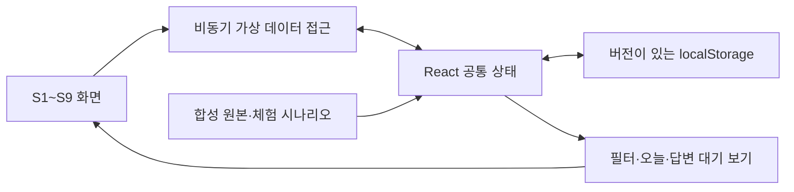

# 통합 이메일 AI 비서 — 웹 프로토타입 구현 계획서 v1.0

- 작성일: 2026-10-03
- 최신 개정일: 2026-10-04
- 문서 상태: **승인한 범위의 화면 구현·기술 검증 완료. 사용자 대상 사용성 검토 전**
- 구현 대상: [프로토타입 기획서](14-웹-프로토타입-기획서-v1.0.md)의 S1~S9와 P01~P12
- 현재 저장소: `apps/web`에 화면·가상 자료·공통 상태·검증 스크립트 구현
- 구현 결과: [웹 프로토타입 구현·검증 기록](16-웹-프로토타입-구현-검증-기록-v1.0.md)
- 관련 문서: [웹앱 기획서](07-웹앱-기획서-v1.6.md), [기술 스택 보고서](06-기술-스택-선택-비교-보고서-v1.0.md), [결정모델 구조](12-에이전트+결정모델-세부-구조-v1.0.md), [후속 결정 목록](10-후속-결정-목록-v1.0.md)

## 1. 구현 목표와 경계

가상 자료를 사용하되 화면 이동·필터·편집·업무 상태·규칙·수신 관리가 연결되는 웹 프로토타입을 만든다. 버튼을 눌렀을 때 알림만 띄우는 대신, 해당 동작의 가상 데이터와 관련 화면을 함께 갱신한다. 전체 핵심 여정을 완성한 뒤 실제 서버·AI 연결로 진행한다.

| 구분 | 기준 |
| --- | --- |
| 웹 기반 | Next.js 16.x App Router·React·TypeScript, Node.js 24 LTS |
| UI | Tailwind CSS·shadcn/ui, 밝고 간결한 업무형, 필요한 컴포넌트만 사용 |
| 자료와 응답 | 한국어 합성 자료, 정해진 비서 응답·처리 상태, 모의 발송·연결·해제 |
| 상태 | React 공통 상태, 버전이 있는 localStorage, 가상 원본으로 초기화 |
| 인터페이스 | 화면과 비동기 가상 자료 접근을 분리. 실제 서버 API 계약은 후속 설계 |
| 이번 실행 경계 | 실제 인증·메일 수집·발송·수신 해제·모델·임베딩·DB·SQS·S3 호출을 추가하지 않음 |
| 기존 서비스 구성 | Spring이 실제 상태·권한·실행을 관리하는 설계와 Python/FastAPI AI 분리는 유지 |

정확한 패치는 구현 시작 시 채택한 계열 안에서 호환성을 확인하고 잠금 파일로 고정한다. 기본 패키지 실행 도구는 Node.js에 포함된 npm으로 두고, 프로토타입만을 위해 별도 모노레포 빌드 시스템이나 상태 관리 프레임워크를 추가하지 않는다. shadcn/ui는 Next.js 공식 설치 경로를 따르며 필요한 소스와 의존성만 가져온다. [shadcn/ui Next.js 설치](https://ui.shadcn.com/docs/installation/next), [Next.js CSS 구성](https://nextjs.org/docs/app/getting-started/css)

## 2. 프로젝트 구조와 공통 화면

### 2.1 만들 구조

```text
apps/web/
  package.json                 # dev, build, start, lint, typecheck
  package-lock.json            # 구현 시 확인한 실제 의존성 고정
  src/app/                     # 화면 경로, 공통 레이아웃·스타일
  src/components/ui/           # 필요한 shadcn/ui 컴포넌트
  src/components/layout/       # 메뉴, 반응형 틀, 체험 안내
  src/features/                # 시작 설정·메일·업무·초안·비서·규칙·수신·설정
  src/lib/prototype/           # 타입, 초기 자료, 시나리오, 상태, 저장, 가상 접근
  public/demo/                 # 직접 만든 가상 첨부 등 정적 예시
```

화면 경로는 `/onboarding`, `/today`, `/mail`, `/tasks`, `/search`, `/services`, `/rules`, `/settings`로 둔다. `/`는 `/today`로 연결하고 ‘처음부터 체험’으로 시작 설정에 진입한다. 이는 웹 화면 경로이며 공용 HTTP API가 아니다.

계정·필터·선택한 대화나 업무를 URL에 식별자로 표현해 뒤로 가기와 새로고침 후 복원한다. 본문·수신자·비서 요청 내용은 URL에 넣지 않는다. 초안과 비서는 공통 패널로 열고 모바일에서는 같은 컴포넌트를 전체 화면으로 표시한다. 화면 ID는 기존 S1~S9를 유지한다.

### 2.2 공통 컴포넌트

| 영역 | 만들 요소 | 사용하는 화면 |
| --- | --- | --- |
| 기본 틀 | 탐색 메뉴, 계정 범위 선택, 페이지 제목·검색·작성 진입, 모바일 뒤로 가기 | S1~S9 |
| 데이터 표시 | 메일 행, 업무 행, 상태 배지, 원문 근거 링크, 변경 전후 표시 | S2·S3·S4·S6·S8·S9 |
| 작업 패널 | 메일·업무 상세, 초안 편집기, 비서 패널, 규칙 폼 | S3~S6·S9 |
| 피드백 | 빈 화면, 로딩·분석 진행, 오류·재시도, 적용 결과·되돌리기 | S1~S9 |
| 체험 제어 | 가상 체험 안내, 시나리오 선택, 기준 날짜, 초기화 | 공통 |

색상·여백·글자·경계선·포커스를 공통 토큰으로 정의한다. 시각적 강조는 한 가지 색을 기본으로 하고 상태는 텍스트를 함께 사용한다. 긴 제목·한글 본문·많은 수신자를 넣어 레이아웃을 확인한다. 모달·패널은 이름, 키보드 진입·닫기, 포커스 복원을 제공한다.

## 3. 가상 자료와 상태 연결

### 3.1 최소 자료 계약

다음은 프로토타입 내부 TypeScript 타입의 책임이다. 운영 DB 스키마나 최종 API 필드로 확정하지 않는다.

| 타입 | 담을 내용 | 연결·검증 기준 |
| --- | --- | --- |
| `MailAccount` | 제공사·표시 이름·용도, 연결·기본 처리·AI 허용 상태, 과거 범위·새 메일 분석 선택 | 같은 제공사여도 계정 ID로 구분. 설정 대기·수집 대기를 연결 완료와 구분 |
| `Thread`·`Message` | 계정·대화·메시지 ID, 받은/보낸 구분, 상대·제목·본문·시각·예시 첨부, 읽음·유형·중요도 | 대화 순서와 원본 계정 유지. 유형·중요도 독립 |
| `Task` | 유형·상태·기한·확인 예정일, 연결 메시지, 변경 제안·이력 | 제안·진행·답변 대기·완료·제외 유지. 한 메시지에 복수 업무 허용 |
| `Draft` | 발신 계정·수신자·본문·예시 첨부, 관련 대화·업무, 편집 버전·처리 상태 | 최신 사용자 편집 보존. 초안 저장과 모의 발송 분리 |
| `Rule` | 조건·계정·예외·동작, 적용 기간·향후 적용·활성 여부, 변경 이력 | 명시한 범위에만 적용. 되돌리기는 해당 변경의 영향만 복원 |
| `Subscription`·`ServiceRecord` | 서비스·계정·구독, 출처·확인 시각, 유지할 알림·해제 경로·처리 상태 | 마케팅·주문·보안 안내 구분. 요청 성공과 최종 확인 분리 |
| `AnalysisJob`·`AssistantTurn` | 대상·참조 범위·입력·준비된 결과·진행/실패 상태 | 선택적 요약과 필수 분석 상태 구분. 현재 대상과 허용 상태 확인 |
| `PrototypeState` | 자료 묶음·설정·시나리오·기준 시각·자료 버전 | 모든 화면이 같은 상태를 조회하고 변경 |

객체는 안정적인 ID로 연결한다. 화면별 사본 대신 공통 상태에서 오늘·중요·광고·답변 대기 보기를 계산한다. 현재 대화 선택은 계정 범위를 포함하며, 다른 계정의 같은 상대를 자동으로 하나의 업무로 합치지 않는다.

### 3.2 비동기 가상 데이터 접근



| 동작 묶음 | 입력 | 반환·상태 반영 |
| --- | --- | --- |
| 메일·업무 조회 | 계정·필터·검색어·대상 ID | 같은 범위의 목록·상세·근거와 현재 상태 |
| 사용자 변경 | 대상 ID와 읽음·중요도·업무·규칙·설정 변경값 | 변경한 객체·관련 보기·필요한 이력 갱신 |
| 비서·초안 준비 | 입력과 현재 계정·대화·업무 문맥, 초안 편집 버전 | 정해진 처리 상태·결과. 사용자 최신 편집과 충돌하면 기존 편집 보존 |
| 모의 외부 동작 | 최종 초안 또는 구독 대상·사용자 동작 | 처리 중·성공·실패·미확인 결과를 해당 항목에 반영 |
| 체험 제어 | 시나리오 ID 또는 초기화 요청 | 고정 자료·기준 날짜로 상태 재구성 |

이 경계는 Promise를 반환하는 가상 구현으로 시작한다. 프로토타입을 위해 별도 HTTP 서버·Next.js API Route·Server Action을 업무 백엔드로 만들지 않는다. 화면에 자료를 직접 복제하지 않고 가상 접근 구현을 교체할 수 있게 한다. 실제 Spring API 연결 시에는 서버의 권한·상태 검증과 계약을 별도로 구현한다.

### 3.3 저장·복원·시연 기본값

- 자료 버전과 함께 `uteum-mail.prototype.v1` 전용 키에 가상 상태를 저장한다. 다른 브라우저 저장 항목을 초기화하지 않는다.
- 브라우저 저장 접근은 클라이언트 초기화 이후에 수행한다. 복원 전 기본 자료를 덮어쓰지 않으며, 사용자 삭제로 비어 있는 상태와 처음 실행한 상태를 구분한다.
- 저장 실패 시 메모리 상태로 체험을 계속하고 새로고침 후 유지되지 않음을 안내한다. 읽을 수 없는 체험 자료는 설명 후 데모 초기화로 복구한다.
- 기준 시각은 2026-10-03 09:00 Asia/Seoul로 고정한다. 화면 시간 경과를 외부 모델 지연으로 해석하지 않는다.
- 진행 중 새로고침한 모의 작업은 다시 시도할 상태로 표시한다. 서버 백그라운드 작업의 복구가 구현됐다고 설명하지 않는다.
- 시나리오 전환은 표시된 설명에 따라 가상 자료를 재구성한다. 데모 초기화는 메일·업무·초안·규칙·설정·작업 이력을 함께 복원한다.

## 4. 단계별 작업과 완료 조건

각 단계의 완료 조건을 확인한 뒤 다음 단계로 진행한다. 기간·인원·완료일은 아직 산정하지 않았으며, 아래 순서를 일정 약속으로 해석하지 않는다.

### 4.1 1단계 — 화면 기반과 가상 데이터

| 작업 ID | 작업 | 선행 작업 | 완료 조건 |
| --- | --- | --- | --- |
| W01 | 채택 버전의 프로젝트·스크립트·잠금 파일 구성 | 이 계획과 기획서 확인 | 로컬 기동·기본 빌드·타입 검사·린트 명령 실행 가능 |
| W02 | 공통 디자인·반응형 틀·화면 경로·체험 안내 | W01 | S1~S9 진입점과 키보드 탐색 가능, 실제 기능으로 오인할 표시 없음 |
| W03 | 타입·고정 자료·시나리오·공통 상태·저장 구현 | W01 | ID 참조 일치, 기준 날짜 고정, 새로고침 유지·초기화 확인 |
| W04 | 화면을 비동기 가상 접근과 공통 상태에 연결 | W02·W03 | 계정·메일·업무를 화면 간 동일하게 조회하고 빈 상태 표시 |

**단계 완료:** 전체 화면으로 이동할 수 있고 실제 메일·모델·클라우드 계정 없이 실행된다.

### 4.2 2단계 — 메일과 업무의 핵심 흐름

| 작업 ID | 작업 | 선행 작업 | 완료 조건 |
| --- | --- | --- | --- |
| W05 | S1 시작 설정, S7 설정 재진입 | W04 | AI 사용·메일만 보기·업무용 수집 대기 분기와 과거/새 메일 선택 구분 |
| W06 | S2 오늘, S4 메일 목록·대화·필터·수동 수정 | W05 | 중요 광고 보존, 원본 계정·대화 순서·받은/보낸/초안 연결 |
| W07 | S3 후보·업무·답변 대기·변경 제안 | W06 | 후보 채택·기한 변경·부분 답변·완료·복원이 원문과 연결 |
| W08 | S5 새 메일·답장·전달·초안 편집·모의 발송 | W07 | 사용자 편집 보존, 명시적 모의 발송, 발송 후 남은 업무 유지 |

**단계 완료:** P01~P06과 초안 새로고침을 수행하고, 모의 발송 전후의 보낸 메일·업무·이력이 일치한다.

### 4.3 3단계 — 비서·규칙·수신 관리

| 작업 ID | 작업 | 선행 작업 | 완료 조건 |
| --- | --- | --- | --- |
| W09 | S6 키워드 검색·비서·추천 질문·정해진 응답 | W08 | 현재 대상·계정 확인, 모호한 범위 질문, 미지원 입력 안내, 근거 이동 |
| W10 | S9 규칙과 일회성 표시·향후 적용·중지·되돌리기 | W09 | 비서와 폼이 같은 규칙을 변경하고 S4 결과·이력에 반영 |
| W11 | S8 서비스 출처·수신 관리·부분 실패 | W09 | 요청/확인/실패/직접 설정 상태 구분, 마케팅만 대상으로 모의 처리 |
| W12 | S7 AI 중단·연결 해제·자료 삭제 연결 | W10·W11 | 각 효과와 다른 계정 보존, 관련 검색·근거·파생 자료 갱신 |

**단계 완료:** P07~P09·P12를 수행하고 비서 결과가 별도 화면에서도 동일하게 보인다.

### 4.4 4단계 — 예외 상태와 반응형 마무리

| 작업 ID | 작업 | 선행 작업 | 완료 조건 |
| --- | --- | --- | --- |
| W13 | 시나리오 선택과 분석 실패·연결 만료·발송 미확인 연결 | W12 | 무작위 오류 없이 같은 상태 재현, 기본 메일 흐름 유지·재시도 가능 |
| W14 | 1440px·768px·390px, 키보드·패널·뒤로 가기 보완 | W13 | 핵심 버튼·본문·입력에 접근 가능하고 필터·선택 문맥 복원 |
| W15 | P01~P12 전체 확인, 빌드·네트워크 검사, 검토 기록 | W14 | 5장의 기대 결과 확인, 결함 수정·재확인, 사용성 의견 정리 |

**단계 완료:** 가상 체험으로 전체 핵심 여정을 반복 실행하고, 완료·실패·미분석을 구분할 수 있다.

## 5. 검증 계획

### 5.1 시나리오 검증표

각 사례는 기획서의 같은 ID를 참조한다. 준비 상태·수행 동작·예상 결과·실제 결과·수정 및 재확인 여부를 남긴다.

| 대상 | 준비·수행 | 기대 결과 |
| --- | --- | --- |
| P01~P03 시작 설정 | 처음부터 체험에서 AI 사용·메일만 보기·업무용 미확인 각각 선택 | 인증만으로 모의 수집 시작 안 함. 기본 처리와 AI 허용 상태에 맞는 분기 |
| P04 중요 광고 | 광고 유형의 중요 메일을 수정하고 전체·중요·계정 필터 전환 | 광고와 중요도가 독립적으로 유지되고 현재 계정 범위에 표시 |
| P05 초안·업무 | 후보 채택, 초안 편집 중 늦은 모의 결과 도착, 모의 발송 | 사용자 편집 보존. 명시적 클릭 전 미전송, 발송만으로 업무 완료 안 됨 |
| P06 답변·기한 | 부분 답변과 변경된 기한 사례 확인·채택·거절 | 남은 요청 보존, 제안과 확정값 구분, 원문 근거와 이력 일치 |
| P07 규칙 | 일회성 표시·지속 규칙·중지·재개·되돌리기 | 의도한 범위만 변경, 다른 사용자 동작을 전역 초기화하지 않음 |
| P08 수신 관리 | 여러 구독 처리에서 성공·실패·직접 설정 필요 시나리오 선택 | 항목별 결과 구분, 주문·보안 안내 유지, 자동 복구·재가입을 약속하지 않음 |
| P09 비서·검색 | 지원 요청·미지원 입력·대상 없는 요청·삭제된 대상 입력 | 현재 문맥·허용 범위 확인, 필요한 확인 질문과 체험 예시 안내 |
| P10 장애 | AI 실패·연결 만료에서 열람·수동 변경·재시도 | 메일 화면 사용 가능, 실패/오래된 상태를 완료/미응답 없음으로 표시 안 함 |
| P11 지속성 | 초안·규칙 편집 후 이동·새로고침, 빈 상태 저장, 저장 차단, 초기화 | 변경·빈 상태 보존, 저장 불가 안내, 전용 자료만 초기화 |
| P12 중단·삭제 | AI 끄기, 연결 해제, 한 계정의 자료 삭제 | 중단 효과 구분, 관련 파생 참조 제거, 다른 계정의 자료 유지 |
| 발송 미확인 | 결과 미확인 상태와 중복 클릭 재현 | 중복 모의 발송 억제, 미확인 표시와 확인 동작, 자동 재발송 안 함 |

### 5.2 기술·화면 검증

- `apps/web`에서 `npm run typecheck`, `npm run lint`, `npm run build`를 실행하고 결과를 기록한다. `lint`는 실제 설치한 린터를 호출하는 스크립트로 구성한다.
- 개발 화면과 프로덕션 빌드의 실행 화면에서 주요 흐름을 확인한다. 브라우저 콘솔 오류, 잘못된 참조, 저장 복원 뒤 상태 불일치를 수정한다.
- 1440px·768px·390px에서 목록·상세·초안·비서·설정·모달을 확인하고 화면을 캡처해 겹침·잘림·가로 넘침을 점검한다.
- Tab·Enter·Escape와 폼 레이블·포커스 복원을 확인한다. 색을 보지 않아도 상태를 읽을 수 있게 한다.
- 브라우저 네트워크와 소스 검색으로 실제 메일·모델·임베딩·구독 해제 요청이 없는지 확인한다. 가상 결과를 외부 엔드포인트에서 가져오지 않는다.
- 자동화가 도움이 되는 회귀 사례는 상태 전환·초안 보존·규칙 범위·삭제 참조를 중심으로 작성한다. 색상값·컴포넌트 내부 구현을 그대로 반복하는 검사는 추가하지 않는다.

2026-10-04 기준 `apps/web`에서 타입 검사·린트·프로덕션 빌드와 상태 전환 테스트 26개를 통과했다. 브라우저 조작·반응형 확인·수정 사항과 확인 범위는 [구현·검증 기록](16-웹-프로토타입-구현-검증-기록-v1.0.md)에 남긴다. 실제 사용자 대상의 사용성 검토는 아직 수행하지 않았다.

### 5.3 화면 검토 결과의 사용

검토 결과는 화면 ID·시나리오·문제 상황·사용자 기대·수정 내용으로 정리한다. 기존 확정 정책을 유지하는 표현·배치 수정은 프로토타입 문서에 반영한다. 동작 범위·새 운영 기본값·외부 처리처럼 추가 선택이 필요한 변경은 추천안과 영향을 제시해 사용자에게 질문한다.

AI 정확도·절감률·실제 동기화·처리량·복구·가용성은 이 단계의 합격 항목으로 계산하지 않는다. 가상 지연과 준비된 응답으로 기존 기획서 13.2의 목표를 달성했다고 보고하지 않는다.

## 6. 실제 서버·AI 연결로 넘어가는 기준

| 후속 영역 | 넘길 산출물 | 연결 전에 필요한 확인·선택 |
| --- | --- | --- |
| Spring·메일 | 화면 동작·ID 관계·변경 효과·오류 표시 | 실제 인증·제공사·공용 API·자료 처리 범위·운영 권한 검증 |
| PostgreSQL·작업 처리 | 자료 관계·작업 표시·늦은 결과와 중복의 UX | 실제 스키마·작업/완료 계약·재시도·인증·호스팅·복구 |
| Luna·Sol 기준선 | 비서 요청·근거 표시·판단과 추출·초안 구분 | 호출 모델·엔드포인트·추론 설정·예산·평가 자료 |
| Jev 결과 미반영 평가 | 비교할 판단·전체 업무 흐름·실패 사례 | 합성 평가 자료·호출 경로·버전, 실제 메일 사용 전 계약·공개·안내·이전 근거 |
| Jev 제한 적용 | 기준선과 비교 결과 | 모델별 점수·임계값, 중요 메일 누락·재검토 포함 비용·전체 지연과 적용 범위 |

C안의 운영 역할은 A0·A4 Sol, A1~A3 Luna와 조건부 Sol 재검토를 유지한다. Jev 평가 호출은 운영 결과와 분리하고 운영 응답이 비교를 기다리지 않게 한다. Decisions API는 실제 이용 조건을 확인한 뒤 비교 후보로 검토하며 출시·접근을 기다리는 일정 의존성을 만들지 않는다.

공통 어댑터에서는 판단 결과·근거·모델·버전·사용량을 연결하되, 공급자별 점수 제공 여부와 의미를 보존한다. `logprobs`는 선택적인 실험 항목이며 모든 모델에 확률·confidence를 만들어 채우지 않는다. 세부 모델 계약과 임계값은 이 화면 프로토타입의 가상 접근 계약으로 확정하지 않는다.

후속 선택은 [후속 결정 목록](10-후속-결정-목록-v1.0.md)에 남은 항목만 관리한다. 실제 서버·모델 연결을 시작할 때 필요한 순서대로 추천안과 대안을 제시하고, 사용자 선택을 해당 기획·설계 문서에 반영한다.
