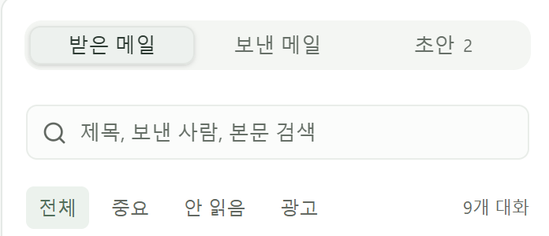
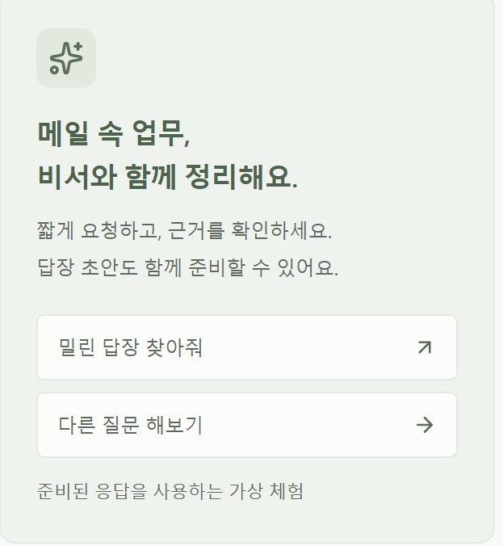

# 통합 이메일 AI 비서 — 사용자 UX·UI 설계와 요구사항 v1.0

- 작성일: 2026-10-06
- 최신 개정일: 2026-10-06
- 문서 상태: **사용자 확정 요구사항과 기존 공통 UI 원칙 정리. 2026-10-06 UX 변경의 화면 적용·재검증 전**
- 대상: 실제 프로젝트의 데스크톱·모바일 웹 화면과 상호작용 설계
- 목적: 사용자 UX·UI 요구사항, 화면 구성, 적용 상태와 확인 기준을 별도 문서에서 관리
- 관련 문서: [웹앱 기획서](07-웹앱-기획서-v1.6.md), [프로토타입 기획서](14-웹-프로토타입-기획서-v1.0.md), [구현·검증 기록](16-웹-프로토타입-구현-검증-기록-v1.0.md), [후속 결정 목록](10-후속-결정-목록-v1.0.md)

## 1. 문서의 역할과 결정 상태

이 문서는 사용자 UX·UI의 최신 요구사항을 관리한다. 웹앱 기획서에는 제품 기능·화면 목적을 요약하고, 프로토타입 문서에는 해당 시점의 구현 범위와 검증 결과를 기록한다. 사용자의 추가 화면 의견은 이 문서의 요구사항에 반영하고 관련 기획·구현 문서에서 참조한다.

| 구분 | 기록할 내용 |
| --- | --- |
| 사용자 확정 | 사용자가 선택하거나 명시한 화면 구성·표시 정보·상호작용 |
| 기존 구현 기준 | 승인된 초기 프로토타입의 공통 디자인·반응형·상태 표시 원칙 |
| 추천·미정 | 아직 사용자 선택을 받지 않은 세부 설계. 구현 전에 추천안·대안·영향을 확인 |
| 적용 상태 | 문서 반영, 화면 구현, 검증, 사용자 재확인을 각각 구분 |

2026-10-04 초기 프로토타입의 기술 검증은 [구현·검증 기록](16-웹-프로토타입-구현-검증-기록-v1.0.md)을 따른다. 아래 UX01~UX04는 2026-10-06 사용자가 실제 개발 때 적용하도록 제시한 요구사항이며 현재 화면에는 미적용이다.

## 2. 사용자 확정 요구사항

| ID | 화면 | 요구사항 | 근거·확정일 | 현재 적용 상태 |
| --- | --- | --- | --- | --- |
| UX01 | S4 통합 메일 | 스팸 보기를 추가하고 광고 보기와 구분해 접근 가능하게 표시 | 사용자 이미지 1·요청, 2026-10-06 | 문서 반영, 화면 미적용 |
| UX02 | S4 통합 메일 | 네이버·카카오·구글·다음·통합을 선택하는 탭 제공 | 사용자 이미지 1·요청, 2026-10-06 | 문서 반영, 현재는 계정 선택 메뉴 사용 |
| UX03 | S2 메인 홈 | 캘린더를 크게 표시하고 오늘 받은 메일을 보낸 사람 이름·제목만으로 나열. 본문·요약 미리보기 제거 | 사용자 요청, 2026-10-06 | 문서 반영, 화면 미적용 |
| UX04 | S2 메인 홈 | ‘메일 속 업무, 비서와 함께 정리해요’ 안내·추천 질문 카드 제거 | 사용자 이미지 2·요청, 2026-10-06 | 문서 반영, 화면 미적용 |

## 3. 화면별 상세 기준

### 3.1 통합 메일 — UX01·UX02

```text
[네이버] [카카오] [구글] [다음] [통합]
[받은 메일] [보낸 메일] [초안]
[전체] [중요] [안 읽음] [광고] [스팸]
```

- 제공사 선택을 메일 목록 가까이에 항상 보이는 탭으로 제공한다. ‘구글’은 Gmail 계정을 가리킨다.
- 개별 제공사 탭은 해당 제공사에 연결한 계정의 메일을, 통합 탭은 연결한 제공사 전체의 메일을 보여준다.
- 제공사 선택과 받은/보낸/초안·중요·안 읽음·광고·스팸 보기의 현재 범위를 함께 표시한다. 원본 계정과 답장 발신 계정을 유지한다.
- 스팸은 광고와 구분해 확인할 수 있게 한다. 실제 제공사별 스팸 상태·조회·이동·복구의 연동 범위는 별도 시험으로 확인한다.
- 자동 스팸 판정·삭제·발신자 차단의 실행 정책은 이번 조회 UX 선택으로 확정하지 않는다.

탭과 보기의 예시는 확인할 범위를 설명한다. 실제 배치·좁은 화면의 표시 방식은 반응형 구현에서 확인한다.

### 3.2 메인 홈 — UX03

```text
[홈]                                     [검색] [메일 쓰기] [비서]

┌──────────────────────────────────────────────────┐
│                                                  │
│                 크게 표시한 캘린더               │
│                                                  │
└──────────────────────────────────────────────────┘

오늘 받은 메일
보낸 사람                  제목
김서윤                     웹사이트 리뉴얼 견적 및 일정 문의
디자인 위클리              이번 주 제품 디자인 이야기
```

- 홈의 중심 영역은 큰 캘린더와 오늘 받은 메일 목록이다.
- 홈 메일 목록에는 **보낸 사람 이름과 제목만** 표시한다. 본문·요약 미리보기는 넣지 않는다.
- 메일을 선택하면 통합 메일 상세에서 원문을 확인한다. 업무·답변 대기·수신 관리는 해당 메뉴에서 확인한다.
- 달력의 월간·주간 보기, 표시할 일정, 날짜 선택 동작은 미정이다. 위 구성 예시로 세부 동작을 확정하지 않는다.
- 홈 캘린더의 배치는 화면 요구사항이다. 메일 일정 추출·외부 캘린더 등록·수정의 지원 범위는 [기획서 8.2.1](07-웹앱-기획서-v1.6.md#821-메일-일정-추출선택형-캘린더-연동--추가-검토)의 별도 검토를 따른다.

### 3.3 화면 단순화와 비서 진입 — UX04

- 사용자 이미지 2의 큰 비서 아이콘·안내 문구·추천 질문 버튼으로 구성한 홈 카드를 제거한다.
- 비서는 공통 진입점에서 필요할 때 열고, 추천 질문은 비서 내부에서 제공한다.
- 홈에 같은 기능을 반복 안내하는 카드와 큰 추천 영역을 늘리지 않는다.
- 필수 연결·처리 오류 안내는 해당 상태와 관련된 화면에서 확인할 수 있게 한다.

## 4. 기존 공통 UX·UI 원칙

다음은 기존 기획서와 승인된 초기 프로토타입의 공통 기준을 모은 것이다.

| 영역 | 기준 |
| --- | --- |
| 시각 스타일 | 밝고 간결한 업무형. 중립색과 한 가지 강조색, 공통 색상·간격·타이포그래피 사용. 정확한 브랜드 색상·다크 모드는 별도 확정 사항으로 확대하지 않음 |
| 데스크톱 | 탐색 메뉴·목록·상세 중심. 비서는 필요할 때 열고 좁은 화면에서 패널이 겹치지 않게 구성 |
| 모바일 웹 | 목록→상세 이동, 뒤로 가기에서 계정·필터·선택 문맥 복원. 초안·비서는 전체 화면 또는 별도 패널로 제공 |
| 접근과 조작 | 폼의 이름·설명 연결, 키보드 진입·닫기·포커스 복원, 색상과 함께 읽을 수 있는 상태 텍스트 |
| 용어·정보량 | ‘확인 중·초안 준비·검토 필요’처럼 결과 중심으로 표현. 고객 화면에 내부 모델·에이전트 이름을 노출하지 않음 |
| 핵심 작업 | 자연어 입력과 버튼·목록에서 같은 계정·메일·업무를 처리. 짧은 요청을 기준으로 현재 문맥을 활용하고 모호한 대상·범위만 확인 |
| 요청의 범위·권한 | 짧은 요청에서 현재 화면·허용된 계정·이전 대화·관련 자료를 활용. 모호한 대상·권한·변경 효과를 확인하고 지시를 전체 계정 조회나 임의 변경 허가로 확대하지 않음 |
| 대화만 필요한 요청 | 인사·잡담·범위 안내·의도 확인만 하는 항목은 기존 대화 정책에 따라 새 자료 조회나 전문 에이전트 호출을 시작하지 않음 |
| 서로 다른 상태 | 읽음·발송·업무 완료, 광고·중요도, AI 끄기·연결 해제·자료 삭제·마케팅 해제를 구분 |
| 빈 화면·장애 | 실제 자료 없음·분석 대기·실패·연결 만료 구분. 미분석을 업무 없음으로 확정하지 않고 AI 실패 중에도 기본 메일 경로 제공 |
| 서비스·수신 상태 | 연동·수동 확인·메일 근거를 구분하고 서비스 조회 실패·미연동을 가입 없음이나 수신 해제 완료로 표시하지 않음 |
| 편집·실행 | 늦은 초안 결과가 사용자 편집을 덮어쓰지 않게 하고 최종 발신 계정·수신자·본문을 확인한 뒤 명시적으로 발송 |
| 가상 체험 | 실제 처리와 가상 처리의 안내를 명확히 표시. 체험 결과를 운영 성능·정확도·외부 변경 완료로 설명하지 않음 |

## 5. 사용자 피드백 참고 이미지

2026-10-06 사용자가 첨부한 원본을 보관했다. 개선 대상 화면을 설명하는 자료이며 변경 후 화면이나 구현 완료의 증거가 아니다.

### 5.1 이미지 1 — 통합 메일의 보기·계정 구분

현재 메일 보기에서 스팸을 추가하고 제공사별로 바로 선택할 수 있는 탭을 요청한 근거다.



### 5.2 이미지 2 — 홈의 비서 안내 카드

사용자가 화면을 복잡하게 만드는 요소로 지정하고 제거를 요청한 카드다.



## 6. 적용 후 확인할 기준

아래 항목은 후속 화면 적용 때 확인할 조건이며 현재 통과 기록이 아니다.

| 대상 | 확인할 결과 |
| --- | --- |
| UX01 | 스팸과 광고 보기에 각각 접근할 수 있고 실제 제공사별 지원·미지원·조회 실패 상태가 구분됨 |
| UX02 | 제공사 탭과 메일 보기 조건이 함께 적용되며 통합↔제공사 전환에서 원본 계정·대상 문맥이 일치함 |
| UX03 | 캘린더가 홈의 중심 영역을 차지하고 오늘 메일 목록에 보낸 사람·제목만 표시됨. 원문 상세로 이동 가능 |
| UX04 | 지정한 홈 카드가 제거되고 공통 비서 진입점에서 기존 기능에 접근 가능 |
| 반응형·키보드 | 기존 1440px·768px·390px 확인 기준에서 글자·탭·목록·달력·패널을 조작할 수 있고 키보드 포커스가 유지됨 |

화면을 적용한 뒤 해당 ID의 상태를 갱신하고 구현·검증 근거를 연결한다. 기존 프로토타입의 테스트 결과만으로 새 요구사항을 완료 처리하지 않는다.

## 7. 추천·미정 항목

현재 사용자의 추가 선택이 필요한 UX 항목은 **홈 캘린더의 기본 보기·표시할 정보·날짜 선택 동작**이다. 추천안·대안·확인 조건과 질문은 [후속 결정 목록 1.10](10-후속-결정-목록-v1.0.md#110-홈-캘린더의-세부-표시와-날짜-선택-동작)에서 관리한다. 실제 홈 캘린더 구현 전에 선택을 확인한다.

확정된 UX01~UX04는 후속 결정 목록에 다시 넣지 않는다. 새로운 UX·UI 선택이 필요하면 추천안과 영향부터 사용자에게 질문하고, 선택을 받은 뒤 이 문서와 관련 기획을 최신화한다.

## 8. 추가 피드백과 변경 기록

- 추가 화면 의견에는 화면 ID·문제 상황·원하는 동작·참고 이미지·사용자 확인 여부를 기록한다.
- 요구사항 ID는 유지하고 내용을 바꿀 때 근거와 날짜를 남긴다. 문서 반영과 실제 화면 적용 상태를 각각 갱신한다.
- 기획서에는 기능·화면 요약을, 이 문서에는 최신 UX·UI 상세를, 검증 기록에는 수행한 확인 결과를 남긴다.

| 날짜 | 내용 |
| --- | --- |
| 2026-10-06 | 사용자의 요청으로 UX·UI 문서를 분리. UX01~UX04, 기존 공통 원칙, 피드백 이미지와 후속 확인 기준 정리 |
